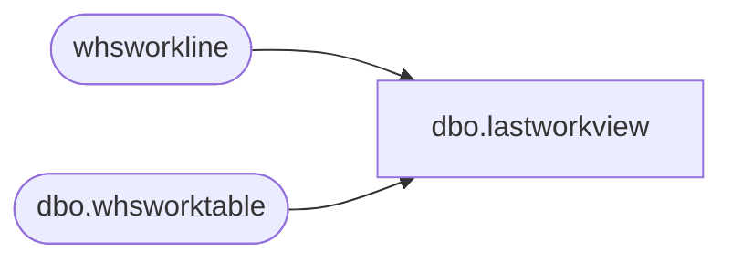

# dbo.lastworkview

**Database:** LH_D365  
**Server:** 4db76rlxaxcuvmuh5kw37wbnqq-m2o53thjetderkgqw4nc6a676e.datawarehouse.fabric.microsoft.com  

## Architecture Diagram



## Table Dependencies

| Referenced Table |
|---|
| whsworkline |
| dbo.whsworktable |

## View Code

```sql
CREATE VIEW dbo.lastworkview
    AS
    (
        SELECT
            worktable.workid,
            worktable.ordernum,
            line.inventtransid AS purchlineTransid,
            CAST(worktable.workclosedutcdatetime AS DATE) AS WorkClosedDate
        FROM
            dbo.whsworktable worktable
            JOIN whsworkline line
                ON line.workid = worktable.workid
        WHERE
            worktable.worktranstype = 1 AND worktable.workstatus = 4 AND line.inventtransid IS NOT NULL
        GROUP BY
            worktable.workid,
            worktable.ordernum,
            line.inventtransid,
            worktable.workclosedutcdatetime
    );
```

