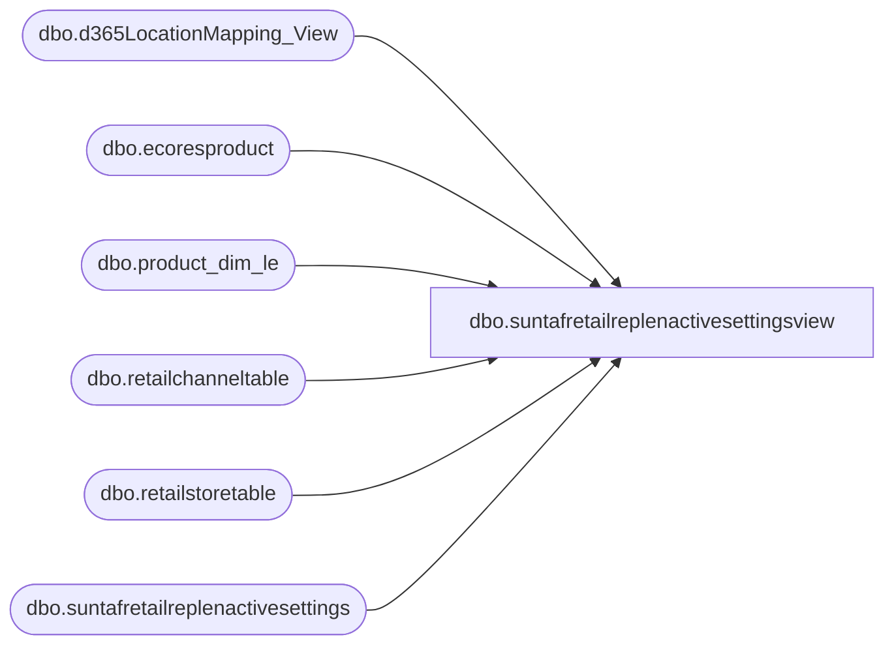

# dbo.suntafretailreplenactivesettingsview

**Database:** LH_D365  
**Server:** 4db76rlxaxcuvmuh5kw37wbnqq-m2o53thjetderkgqw4nc6a676e.datawarehouse.fabric.microsoft.com  

## Architecture Diagram



## Table Dependencies

| Referenced Table |
|---|
| dbo.d365LocationMapping_View |
| dbo.ecoresproduct |
| dbo.product_dim_le |
| dbo.retailchanneltable |
| dbo.retailstoretable |
| dbo.suntafretailreplenactivesettings |

## View Code

```sql
--Select count(*) from suntafretailreplenactivesettingsview --266207

CREATE   VIEW [dbo].[suntafretailreplenactivesettingsview]
AS
--13,35,528
    SELECT DISTINCT
        productdim.[product_key],
        productdim.[style_code],
        productdim.[style_desc] AS [Style Short Description],
        ordermultiple,
        activeSetting.babstoreproducteligible,
        retailchanneltable.inventlocation + '-' + retailchanneltable.inventlocationdataareaid AS location_key,
        CASE
            WHEN activeSetting.babstoreproducteligible = 1
                THEN 'True'
            ELSE 'False'
        END AS [Eligibility Flag]
    FROM
        dbo.suntafretailreplenactivesettings activeSetting
        JOIN dbo.ecoresproduct ecoresproduct
            ON ecoresproduct.recid = activeSetting.distinctproduct
        JOIN dbo.retailstoretable retailstoretable
            ON retailstoretable.storenumber = activeSetting.storenumber
        JOIN dbo.retailchanneltable retailchanneltable
            ON retailchanneltable.recid = retailstoretable.recid
        JOIN dbo.product_dim_le productdim
            ON ecoresproduct.displayproductnumber = productdim.style_code
            AND productdim.LegalEntity = retailstoretable.taxgroupdataareaid
        JOIN dbo.d365LocationMapping_View locationMapping
            ON locationMapping.inventlocationid = retailchanneltable.inventlocation
            AND locationMapping.legalentity = retailchanneltable.inventlocationdataareaid
            AND locationMapping.JurisidictionCode = productdim.jurisdiction_code
            AND locationMapping.legalentity = productdim.LegalEntity
    WHERE
        activeSetting.enabled = 1
        --AND productdim.style_code = '420529'  AND retailstoretable.storenumber = '2054'  -- Filter for specific Style Code
```

