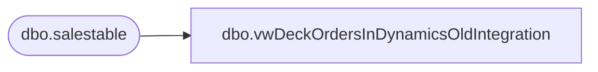

# dbo.vwDeckOrdersInDynamicsOldIntegration

**Database:** LH_D365  
**Server:** 4db76rlxaxcuvmuh5kw37wbnqq-m2o53thjetderkgqw4nc6a676e.datawarehouse.fabric.microsoft.com  

## Architecture Diagram



## Table Dependencies

| Referenced Table |
|---|
| dbo.salestable |

## View Code

```sql
CREATE VIEW [dbo].[vwDeckOrdersInDynamicsOldIntegration]
AS

with DataStage  as
( 
select
dataareaid as Entity
,salesid as SalesOrderNumber
,s.babdecksorefnumstr as DeckOrderNumberRaw
, substring (s.babdecksorefnumstr,1,(charindex('_',s.babdecksorefnumstr) - 1)) as DeckOrderNumberDerived
, charindex('_',s.babdecksorefnumstr) as CharIndexUnderscore
--,SUBSTRING(s.babdecksorefnumstr,12,8)  as DeckOrderNumberV2
,s.salesoriginid as SalesOrderOriginId
,s.salespoolid as WavePriority
, s.dlvmode as DeliveryMode
, s.babexternalorderdate  as ExternalOrderDateTime
, s.releasestatus
, s.salesstatus
, s.custaccount
,s.babecommordertype
, abs( datediff (dd, cast (s.babexternalorderdate as date), getdate())) as DateDiffz

from [dbo].[salestable] s
where 1=1 
and isnull(babdecksorefnumstr,'') <> ''
--and s.babexternalorderdate >= '2025-06-01'
and abs( datediff (dd, cast (s.babexternalorderdate as date), getdate())) <=30
and s.babdecksorefnumstr like '%[_]%'
) 
select  
Entity

--,DeckOrderNumber
--SalesOrderNumber
,DeckOrderNumberDerived as DeckOrderNumber
--,CharIndexUnderscore
--,SalesOrderOriginId
--,WavePriority
--,DeliveryMode
--,ExternalOrderDateTime
--,releasestatus
--,salesstatus
--,custaccount
--,babecommordertype
,max (SalesOrderNumber) as MaxSalesOrderNumber
, max (ExternalOrderDateTime) as MaxExternalOrderDateTime
from DataStage 
where 1=1
group by 
Entity
--,SalesOrderNumber
--,DeckOrderNumberRaw
,DeckOrderNumberDerived 
--,CharIndexUnderscore
--,SalesOrderOriginId
--,WavePriority
--,DeliveryMode
--,ExternalOrderDateTime
--,releasestatus
--,salesstatus
--,custaccount
--,babecommordertype
```

