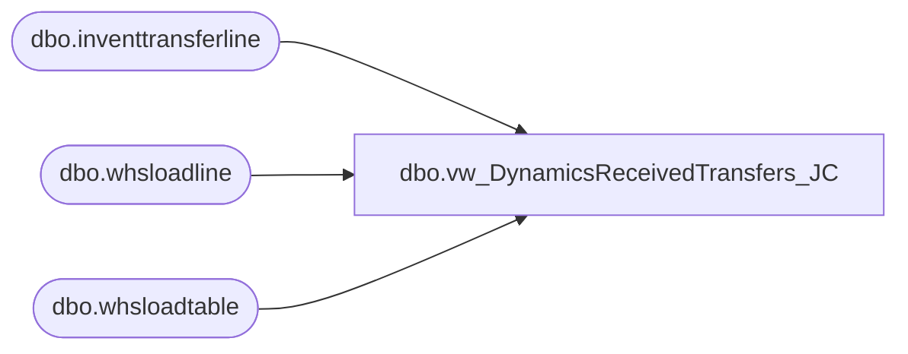

# dbo.vw_DynamicsReceivedTransfers_JC

**Database:** LH_D365  
**Server:** 4db76rlxaxcuvmuh5kw37wbnqq-m2o53thjetderkgqw4nc6a676e.datawarehouse.fabric.microsoft.com  

## Architecture Diagram



## Table Dependencies

| Referenced Table |
|---|
| dbo.inventtransferline |
| dbo.whsloadline |
| dbo.whsloadtable |

## View Code

```sql
CREATE   VIEW vw_DynamicsReceivedTransfers_JC
AS
SELECT DISTINCT
    tl.transferid,
    wt.inventlocationid         AS warehouseid,
    wt.loadid,
    wt.loadstatus,
    wt.loadreceivingcompletedutcdatetime,
    wt.loadschedshiputcdatetime,
    CASE
        WHEN wt.loadreceivingcompletedutcdatetime IS NOT NULL
             OR wt.loadstatus IN (3, 4)
        THEN 1
        ELSE 0
    END AS IsReceived
FROM dbo.inventtransferline tl
JOIN dbo.whsloadline ll
    ON ll.itemid = tl.itemid
   AND (
        ll.ordernum = tl.transferid
     OR ll.parentordernum = tl.transferid
   )
JOIN dbo.whsloadtable wt
    ON wt.loadid = ll.loadid;
```

