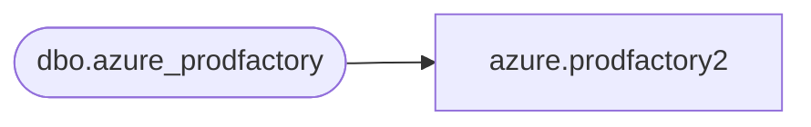

# azure.prodfactory2

**Database:** LH_Mart_CI  
**Server:** 4db76rlxaxcuvmuh5kw37wbnqq-m2o53thjetderkgqw4nc6a676e.datawarehouse.fabric.microsoft.com  

## Architecture Diagram



## Table Dependencies

| Referenced Table |
|---|
| dbo.azure_prodfactory |

## View Code

```sql
CREATE     VIEW [azure].[prodfactory2] AS SELECT ProductKey, FactoryCode COLLATE Latin1_General_100_CI_AS_KS_WS_SC_UTF8  AS [FactoryCode], FactoryName COLLATE Latin1_General_100_CI_AS_KS_WS_SC_UTF8  AS [FactoryName] FROM LH_Mart.dbo.azure_prodfactory
```

