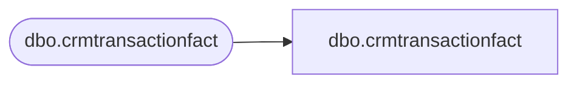

# dbo.crmtransactionfact

**Database:** LH_Mart_CI  
**Server:** 4db76rlxaxcuvmuh5kw37wbnqq-m2o53thjetderkgqw4nc6a676e.datawarehouse.fabric.microsoft.com  

## Architecture Diagram



## Table Dependencies

| Referenced Table |
|---|
| dbo.crmtransactionfact |

## View Code

```sql
;

CREATE VIEW dbo.crmtransactionfact AS SELECT TransactionID, CRMTransactionID, StoreKey, TransactionDate, TransactionPostedDate, CRMTransactionType COLLATE Latin1_General_100_CI_AS_KS_WS_SC_UTF8   AS CRMTransactionType, POSTransactionNumber COLLATE Latin1_General_100_CI_AS_KS_WS_SC_UTF8   AS POSTransactionNumber, POSRegisterNumber, CustomerNumber COLLATE Latin1_General_100_CI_AS_KS_WS_SC_UTF8   AS CustomerNumber, PointsEarned, ETLLogID, ETLEventID, InsertedDate, UpdatedDate, InsertedBy COLLATE Latin1_General_100_CI_AS_KS_WS_SC_UTF8   AS InsertedBy, UpdatedBy COLLATE Latin1_General_100_CI_AS_KS_WS_SC_UTF8   AS UpdatedBy, MNTH_01_12_VST_CNT, MNTH_01_24_VST_CNT, MNTH_01_36_VST_CNT, daysSinceLastVisit, numTransToday, lifetimeVisitNumber, GaapSales, GaapUnits, LifetimeTransactionSequence, LifetimeVisitSequence, POS COLLATE Latin1_General_100_CI_AS_KS_WS_SC_UTF8   AS POS, matchedByEmail, isWebGift FROM LH_Mart.dbo.crmtransactionfact;
```

