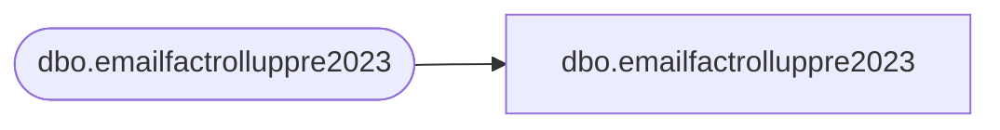

# dbo.emailfactrolluppre2023

**Database:** LH_Mart_CI  
**Server:** 4db76rlxaxcuvmuh5kw37wbnqq-m2o53thjetderkgqw4nc6a676e.datawarehouse.fabric.microsoft.com  

## Architecture Diagram



## Table Dependencies

| Referenced Table |
|---|
| dbo.emailfactrolluppre2023 |

## View Code

```sql
;

CREATE VIEW dbo.emailfactrolluppre2023 AS SELECT EmailAddress COLLATE Latin1_General_100_CI_AS_KS_WS_SC_UTF8  AS EmailAddress, LastSendDate, LastClickDate, LastOpenDate, LastBounceDate, LastUnSubscribeDate FROM LH_Mart.dbo.emailfactrolluppre2023;;
```

