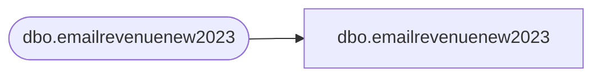

# dbo.emailrevenuenew2023

**Database:** LH_Mart_CI  
**Server:** 4db76rlxaxcuvmuh5kw37wbnqq-m2o53thjetderkgqw4nc6a676e.datawarehouse.fabric.microsoft.com  

## Architecture Diagram



## Table Dependencies

| Referenced Table |
|---|
| dbo.emailrevenuenew2023 |

## View Code

```sql
;

CREATE VIEW dbo.emailrevenuenew2023 AS SELECT JobID COLLATE Latin1_General_100_CI_AS_KS_WS_SC_UTF8   AS JobID, SubID COLLATE Latin1_General_100_CI_AS_KS_WS_SC_UTF8   AS SubID, ListID COLLATE Latin1_General_100_CI_AS_KS_WS_SC_UTF8   AS ListID, BatchID COLLATE Latin1_General_100_CI_AS_KS_WS_SC_UTF8   AS BatchID, EmailAddress COLLATE Latin1_General_100_CI_AS_KS_WS_SC_UTF8   AS EmailAddress, SubscriberKey COLLATE Latin1_General_100_CI_AS_KS_WS_SC_UTF8   AS SubscriberKey, INSERT_DATE COLLATE Latin1_General_100_CI_AS_KS_WS_SC_UTF8   AS INSERT_DATE, FrequencyCount24m COLLATE Latin1_General_100_CI_AS_KS_WS_SC_UTF8   AS FrequencyCount24m, RecencyCount24m COLLATE Latin1_General_100_CI_AS_KS_WS_SC_UTF8   AS RecencyCount24m, FrequencyCount1m COLLATE Latin1_General_100_CI_AS_KS_WS_SC_UTF8   AS FrequencyCount1m, FrequencyCount3m COLLATE Latin1_General_100_CI_AS_KS_WS_SC_UTF8   AS FrequencyCount3m, FrequencyCount6m COLLATE Latin1_General_100_CI_AS_KS_WS_SC_UTF8   AS FrequencyCount6m, FrequencyCount12m COLLATE Latin1_General_100_CI_AS_KS_WS_SC_UTF8   AS FrequencyCount12m, FrequencyCount18m COLLATE Latin1_General_100_CI_AS_KS_WS_SC_UTF8   AS FrequencyCount18m, FrequencyCountTTL COLLATE Latin1_General_100_CI_AS_KS_WS_SC_UTF8   AS FrequencyCountTTL, RecencyCount1m COLLATE Latin1_General_100_CI_AS_KS_WS_SC_UTF8   AS RecencyCount1m, RecencyCount3m COLLATE Latin1_General_100_CI_AS_KS_WS_SC_UTF8   AS RecencyCount3m, RecencyCount6m COLLATE Latin1_General_100_CI_AS_KS_WS_SC_UTF8   AS RecencyCount6m, RecencyCount12m COLLATE Latin1_General_100_CI_AS_KS_WS_SC_UTF8   AS RecencyCount12m, RecencyCountTTL COLLATE Latin1_General_100_CI_AS_KS_WS_SC_UTF8   AS RecencyCountTTL, LastTransactionDate COLLATE Latin1_General_100_CI_AS_KS_WS_SC_UTF8   AS LastTransactionDate, LastTransactionStore COLLATE Latin1_General_100_CI_AS_KS_WS_SC_UTF8   AS LastTransactionStore, MonetarySum1m COLLATE Latin1_General_100_CI_AS_KS_WS_SC_UTF8   AS MonetarySum1m, MonetarySum3m COLLATE Latin1_General_100_CI_AS_KS_WS_SC_UTF8   AS MonetarySum3m, MonetarySum6m COLLATE Latin1_General_100_CI_AS_KS_WS_SC_UTF8   AS MonetarySum6m, MonetarySum12m COLLATE Latin1_General_100_CI_AS_KS_WS_SC_UTF8   AS MonetarySum12m, MonetarySum18m COLLATE Latin1_General_100_CI_AS_KS_WS_SC_UTF8   AS MonetarySum18m, MonetarySum24m COLLATE Latin1_General_100_CI_AS_KS_WS_SC_UTF8   AS MonetarySum24m, MonetarySumTTL COLLATE Latin1_General_100_CI_AS_KS_WS_SC_UTF8   AS MonetarySumTTL, EventDate COLLATE Latin1_General_100_CI_AS_KS_WS_SC_UTF8   AS EventDate, EventType COLLATE Latin1_General_100_CI_AS_KS_WS_SC_UTF8   AS EventType, InsertDate, UpdateDate FROM LH_Mart.dbo.emailrevenuenew2023;
```

