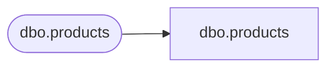

# dbo.products

**Database:** LH_Mart_CI  
**Server:** 4db76rlxaxcuvmuh5kw37wbnqq-m2o53thjetderkgqw4nc6a676e.datawarehouse.fabric.microsoft.com  

## Architecture Diagram



## Table Dependencies

| Referenced Table |
|---|
| dbo.products |

## View Code

```sql
;

-- ALTER VIEW dbo.tmpnonbc AS 
-- SELECT country COLLATE Latin1_General_100_CI_AS_KS_WS_SC_UTF8   AS country, 
-- PurchaseChannel COLLATE Latin1_General_100_CI_AS_KS_WS_SC_UTF8   AS PurchaseChannel, 
-- transaction_ID, TransactionDate, 
-- KeyStory COLLATE Latin1_General_100_CI_AS_KS_WS_SC_UTF8   AS KeyStory, 
-- GaapUnits, GaapSales, isWeb, isRetail, 
-- 2ndPurchase COLLATE Latin1_General_100_CI_AS_KS_WS_SC_UTF8   AS 2ndPurchase, 
-- 3rdPurchase COLLATE Latin1_General_100_CI_AS_KS_WS_SC_UTF8   AS 3rdPurchase, 
-- 4thPurchase COLLATE Latin1_General_100_CI_AS_KS_WS_SC_UTF8   AS 4thPurchase 
-- FROM LH_Mart.dbo.tmpnonbc;
-- GO;

-- ALTER VIEW dbo.tmpnonbc AS 
-- SELECT country   AS country, 
-- PurchaseChannel   AS PurchaseChannel, 
-- transaction_ID, TransactionDate, 
-- KeyStory   AS KeyStory, 
-- GaapUnits, GaapSales, isWeb, isRetail, 
-- 2ndPurchase   AS 2ndPurchase, 
-- 3rdPurchase   AS 3rdPurchase, 
-- 4thPurchase   AS 4thPurchase 
-- FROM LH_Mart.dbo.tmpnonbc
-- GO

CREATE VIEW dbo.products AS SELECT ProductID, ProductName COLLATE Latin1_General_100_CI_AS_KS_WS_SC_UTF8   AS ProductName, Rate FROM LH_Mart.dbo.products;
```

