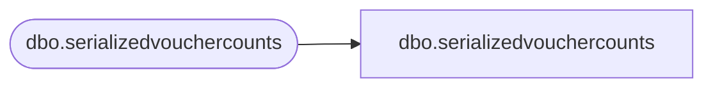

# dbo.serializedvouchercounts

**Database:** LH_Mart_CI  
**Server:** 4db76rlxaxcuvmuh5kw37wbnqq-m2o53thjetderkgqw4nc6a676e.datawarehouse.fabric.microsoft.com  

## Architecture Diagram



## Table Dependencies

| Referenced Table |
|---|
| dbo.serializedvouchercounts |

## View Code

```sql
CREATE   VIEW [dbo].[serializedvouchercounts] AS SELECT processDate, vouchersSent, vouchersProcessed, vouchersSentXML FROM LH_Mart.dbo.serializedvouchercounts;
```

