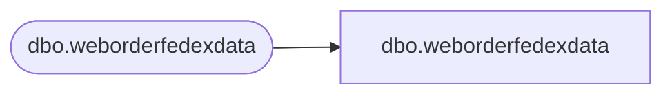

# dbo.weborderfedexdata

**Database:** LH_Mart_CI  
**Server:** 4db76rlxaxcuvmuh5kw37wbnqq-m2o53thjetderkgqw4nc6a676e.datawarehouse.fabric.microsoft.com  

## Architecture Diagram



## Table Dependencies

| Referenced Table |
|---|
| dbo.weborderfedexdata |

## View Code

```sql
;

CREATE VIEW dbo.weborderfedexdata AS SELECT ShipmentTrackingNumber COLLATE Latin1_General_100_CI_AS_KS_WS_SC_UTF8  AS ShipmentTrackingNumber, ServiceType COLLATE Latin1_General_100_CI_AS_KS_WS_SC_UTF8  AS ServiceType, ShipmentDeliveryDate COLLATE Latin1_General_100_CI_AS_KS_WS_SC_UTF8  AS ShipmentDeliveryDate, NetChargeAmountUSD COLLATE Latin1_General_100_CI_AS_KS_WS_SC_UTF8  AS NetChargeAmountUSD, Invoicedate COLLATE Latin1_General_100_CI_AS_KS_WS_SC_UTF8  AS Invoicedate, MasterTrackingNumber COLLATE Latin1_General_100_CI_AS_KS_WS_SC_UTF8  AS MasterTrackingNumber, InsertDate, UpdateDate FROM LH_Mart.dbo.weborderfedexdata;;
```

