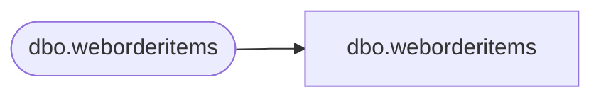

# dbo.weborderitems

**Database:** LH_Mart_CI  
**Server:** 4db76rlxaxcuvmuh5kw37wbnqq-m2o53thjetderkgqw4nc6a676e.datawarehouse.fabric.microsoft.com  

## Architecture Diagram



## Table Dependencies

| Referenced Table |
|---|
| dbo.weborderitems |

## View Code

```sql
;

CREATE VIEW dbo.weborderitems AS SELECT TransactionID, OrderID, OrderItemID, SKU COLLATE Latin1_General_100_CI_AS_KS_WS_SC_UTF8  AS SKU, Qty, ItemDescription COLLATE Latin1_General_100_CI_AS_KS_WS_SC_UTF8  AS ItemDescription, Price, DiscountedPrice, InsertDate, UpdateDate, TrackingNumber COLLATE Latin1_General_100_CI_AS_KS_WS_SC_UTF8  AS TrackingNumber, product_key FROM LH_Mart.dbo.weborderitems;;
```

