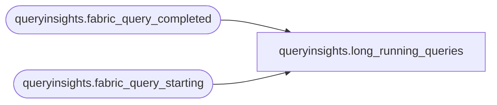

# queryinsights.long_running_queries

**Database:** LH_Mart_Prod  
**Server:** 4db76rlxaxcuvmuh5kw37wbnqq-m2o53thjetderkgqw4nc6a676e.datawarehouse.fabric.microsoft.com  

## Architecture Diagram



## Table Dependencies

| Referenced Table |
|---|
| queryinsights.fabric_query_completed |
| queryinsights.fabric_query_starting |

## View Code

```sql
CREATE VIEW queryinsights.long_running_queries AS (SELECT t.database_name, MAX(median_elapsed_time) AS median_total_elapsed_time_ms, MAX(last_run_elapsed_time) AS last_run_total_elapsed_time_ms, MAX(t.submit_time) AS last_run_start_time,  MAX(last_run_statement_id) AS last_dist_statement_id,  MAX(last_run_session_id) AS last_run_session_id, COUNT(*) AS number_of_runs, SUM(CASE WHEN ISNULL(t.is_accelerated, 0) = 1 THEN 1 ELSE 0 END) AS number_of_accelerated_runs, t.query_hash, MAX(last_run_statement) AS last_run_command FROM(SELECT  query_hash,    GREATEST(0,DATEDIFF_BIG(MILLISECOND, t1.submit_time, t2.TIMESTAMP)) AS duration,    t1.TIMESTAMP, t1.submit_time,   FIRST_VALUE(t1.distributed_statement_id) OVER (PARTITION BY t1.query_hash ORDER BY t1.submit_time DESC) AS last_run_statement_id, FIRST_VALUE(GREATEST(0,DATEDIFF_BIG(MILLISECOND, t1.submit_time, t2.TIMESTAMP))) OVER (PARTITION BY t1.query_hash ORDER BY t1.submit_time DESC) AS last_run_elapsed_time,    FIRST_VALUE(t1.session_id) OVER (PARTITION BY query_hash ORDER BY t1.submit_time DESC) AS last_run_session_id,    FIRST_VALUE(COALESCE(t1.command_lob, t1.statement)) OVER (PARTITION BY query_hash ORDER BY t1.submit_time DESC) AS last_run_statement, PERCENTILE_CONT(0.5) WITHIN GROUP (ORDER BY GREATEST(0,DATEDIFF_BIG(MILLISECOND, t1.submit_time, t2.TIMESTAMP))) OVER (PARTITION BY query_hash) AS median_elapsed_time, t2.database_name, t1.is_accelerated FROM ( SELECT CASE WHEN obfuscated_query_text_hash NOT LIKE '0x%[^A-Za-z1-9]' AND obfuscated_query_text_hash != '0x' THEN obfuscated_query_text_hash ELSE query_text_hash END AS query_hash,    session_id, TIMESTAMP, submit_time, statement, command_lob, distributed_statement_id, database_name, batch_id, is_accelerated FROM queryinsights.fabric_query_starting WHERE queryinsights.fabric_query_starting.TIMESTAMP >= CURRENT_TIMESTAMP - 30) AS t1 JOIN     queryinsights.fabric_query_completed AS t2 ON t1.distributed_statement_id = t2.distributed_statement_id     AND t1.database_name = t2.database_name     AND t1.batch_id = t2.batch_id WHERE t2.TIMESTAMP >= CURRENT_TIMESTAMP - 30 AND distributed_request_id IS NOT NULL AND distributed_request_id <> CAST(0x0 AS UNIQUEIDENTIFIER)) AS t GROUP BY query_hash, database_name)
```

