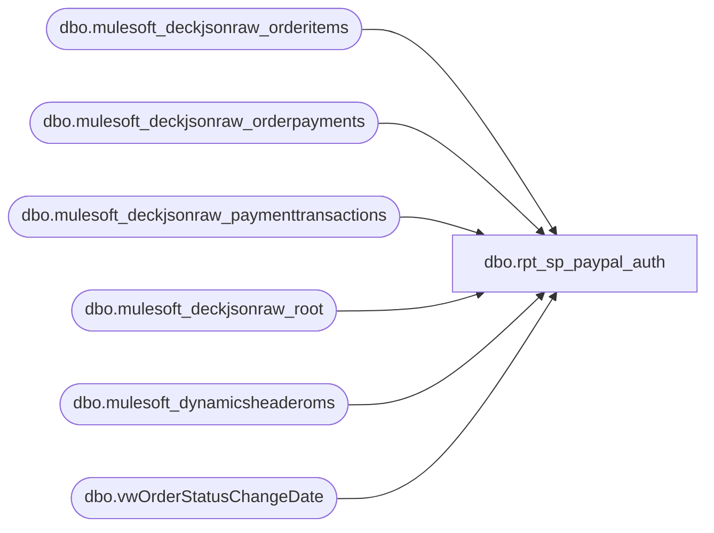

# dbo.rpt_sp_paypal_auth

**Database:** LH_Reporting  
**Server:** 4db76rlxaxcuvmuh5kw37wbnqq-m2o53thjetderkgqw4nc6a676e.datawarehouse.fabric.microsoft.com  

## Architecture Diagram



## Table Dependencies

| Referenced Table |
|---|
| dbo.mulesoft_deckjsonraw_orderitems |
| dbo.mulesoft_deckjsonraw_orderpayments |
| dbo.mulesoft_deckjsonraw_paymenttransactions |
| dbo.mulesoft_deckjsonraw_root |
| dbo.mulesoft_dynamicsheaderoms |
| dbo.vwOrderStatusChangeDate |

## View Code

```sql
CREATE   VIEW dbo.rpt_sp_paypal_auth
AS
WITH paypal_settled AS (
    SELECT
        r.OrderNumber,
        r.OrderID,
        op.EarlyCaptureAmount,
        pt.PaymentTransactionTypeId,
        CAST(pt.Generic1 AS varchar(100))                           AS reference_no,
        CAST(
            CASE WHEN pt.PaymentTransactionTypeId IN (3, 11)
                 THEN -ABS(CAST(pt.Amount AS decimal(18,6)))
                 ELSE  ABS(CAST(pt.Amount AS decimal(18,6)))
            END AS decimal(18,6))                                   AS auth_amount,
        CAST(
            DATEADD(hour, -2,
                CAST(pt.TransactionDateUTC AT TIME ZONE 'UTC'
                     AT TIME ZONE 'Central Standard Time' AS datetime2(6)))
        AS date)                                                    AS transaction_date
      FROM LH_Source.dbo.mulesoft_deckjsonraw_orderpayments     op
      JOIN LH_Source.dbo.mulesoft_deckjsonraw_root              r
           ON r.OrderID = op._ParentKeyField
      JOIN LH_Source.dbo.mulesoft_deckjsonraw_paymenttransactions pt
           ON pt.OrderPaymentId = op.ID
      LEFT JOIN LH_Source.dbo.vwOrderStatusChangeDate            v2
           ON v2.OrderNumber = r.OrderNumber
     WHERE op.PaymentSubType           = 'Adyen_PayPal'
       AND pt.PaymentTransactionTypeId IN (3, 11, 13, 14)
       AND (pt.IsDecline = 0 OR pt.IsDecline IS NULL)
       AND pt.Generic1                 IS NOT NULL
       AND pt.Generic1                 <> ''
       AND pt.Amount                   IS NOT NULL
       -- Early-capture dedup: when isEarlyCapture=1 AND isPaymentAuthorized=0,
       -- TypeId=13 is the real capture; exclude TypeId=14 (not yet confirmed).
       AND NOT (pt.PaymentTransactionTypeId = 14
                AND v2.isEarlyCapture = 1 AND v2.isPaymentAuthorized = 0)
       -- When isEarlyCapture=1 AND isPaymentAuthorized=1, TypeId=14 is the real
       -- capture; exclude TypeId=13 (early-capture auth superseded).
       AND NOT (pt.PaymentTransactionTypeId = 13
                AND v2.isEarlyCapture = 1 AND v2.isPaymentAuthorized = 1)
       -- Drop pending refund (type 11) when the confirmed refund (type 3)
       -- has already arrived for the same reference in this order payment.
       AND NOT (
               pt.PaymentTransactionTypeId = 11
               AND EXISTS (
                   SELECT 1
                     FROM LH_Source.dbo.mulesoft_deckjsonraw_paymenttransactions pt2
                    WHERE pt2.OrderPaymentId          = op.ID
                      AND CAST(pt2.Generic1 AS varchar(100)) = CAST(pt.Generic1 AS varchar(100))
                      AND pt2.PaymentTransactionTypeId = 3
               )
           )
),
warehouse_store AS (
    SELECT
        oi._ParentKeyField                                          AS OrderID,
        MIN(
            CASE WHEN oi.WarehouseCode LIKE '0%'
                 THEN STUFF(oi.WarehouseCode, 1, 1, '1')
                 ELSE oi.WarehouseCode
            END
        )                                                           AS store_code
      FROM LH_Source.dbo.mulesoft_deckjsonraw_orderitems oi
     WHERE oi.WarehouseCode IS NOT NULL AND oi.WarehouseCode <> ''
     GROUP BY oi._ParentKeyField
),
d365_header AS (
    SELECT
        CAST(RetailReceiptId AS varchar(64))                        AS receipt_txt,
        MAX(CAST(Barcode             AS varchar(64)))               AS barcode,
        MAX(CAST(TransactionKey      AS varchar(80)))               AS transaction_key,
        MAX(CAST(RetailTransactionId AS varchar(64)))               AS transaction_id,
        MAX(CAST(RetailTerminalId    AS varchar(10)))               AS register_id
      FROM LH_Source.dbo.mulesoft_dynamicsheaderoms
     WHERE RetailReceiptId IS NOT NULL AND RetailReceiptId <> ''
     GROUP BY CAST(RetailReceiptId AS varchar(64))
)
SELECT
    TRY_CONVERT(int, ws.store_code)                                 AS [Store Number],
    ps.transaction_date
```

