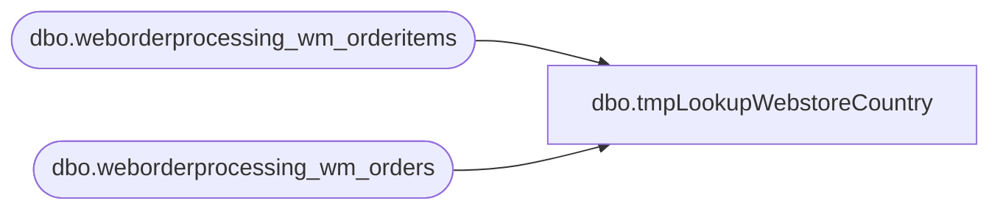

# dbo.tmpLookupWebstoreCountry

**Database:** LH_Source  
**Server:** 4db76rlxaxcuvmuh5kw37wbnqq-m2o53thjetderkgqw4nc6a676e.datawarehouse.fabric.microsoft.com  

## Architecture Diagram



## Table Dependencies

| Referenced Table |
|---|
| dbo.weborderprocessing_wm_orderitems |
| dbo.weborderprocessing_wm_orders |

## View Code

```sql
CREATE VIEW tmpLookupWebstoreCountry
AS
SELECT o.TransactionID, 
CASE WHEN LOWER(o.SourceSite) = 'babw-uk'
	THEN 'UK'
	WHEN LOWER(o.SourceSite) = 'babw-us'
	THEN 'US'
	ELSE o.SourceSite END AS Country, 
MAX(o.OrderId) as MaxOrderId, 
MAX(OrderNum) as MaxOrderNum
FROM LH_Source.dbo.weborderprocessing_wm_orders o
INNER JOIN LH_Source.dbo.weborderprocessing_wm_orderitems oi 
on o.TransactionID=oi.TransactionID 
WHERE  OrderDate < getdate()-3
GROUP BY o.TransactionID, 
CASE WHEN LOWER(o.SourceSite) = 'babw-uk'
	THEN 'UK'
	WHEN LOWER(o.SourceSite) = 'babw-us'
	THEN 'US'
	ELSE o.SourceSite END
```

