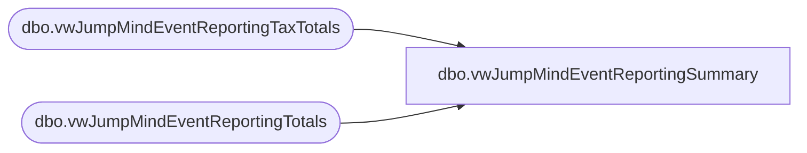

# dbo.vwJumpMindEventReportingSummary

**Database:** LH_Source  
**Server:** 4db76rlxaxcuvmuh5kw37wbnqq-m2o53thjetderkgqw4nc6a676e.datawarehouse.fabric.microsoft.com  

## Architecture Diagram



## Table Dependencies

| Referenced Table |
|---|
| dbo.vwJumpMindEventReportingTaxTotals |
| dbo.vwJumpMindEventReportingTotals |

## View Code

```sql
CREATE view [dbo].[vwJumpMindEventReportingSummary] ---see postgres vwbab_sls_trans used for storeforce
as

select 
 e.TransactionKey
,e.StoreNumber
,e.StoreName
,e.TransactionDate
,e.PosBusinessDate
,e.EventId
--,e.EventInvoice
,e.SubTotal as SalesBeforeSalesTax
,e.TotalSalesTax 
,e.TransactionTotal as TotalSalesIncludeSalesTax
,e.SumPrepaid as AmountAlreadyPaid
, e.TransactionTotal - e.SumPrepaid as AmountOwed
, t.TaxRuleName as TaxName
, t.MoneyTaxAmount as SalesTaxAmount
, t.TaxPercentage as SalesTaxPercentage

from [dbo].[vwJumpMindEventReportingTotals] e
left join [dbo].[vwJumpMindEventReportingTaxTotals] t on e.TransactionKey =  t.TransactionKey
where 1=1
```

