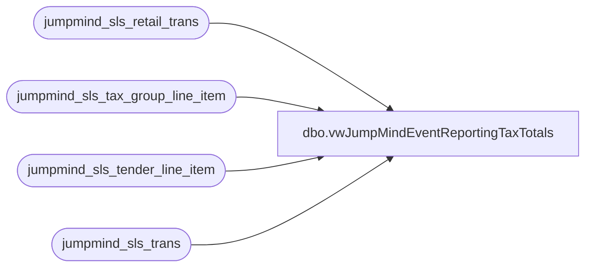

# dbo.vwJumpMindEventReportingTaxTotals

**Database:** LH_Source  
**Server:** 4db76rlxaxcuvmuh5kw37wbnqq-m2o53thjetderkgqw4nc6a676e.datawarehouse.fabric.microsoft.com  

## Architecture Diagram



## Table Dependencies

| Referenced Table |
|---|
| jumpmind_sls_retail_trans |
| jumpmind_sls_tax_group_line_item |
| jumpmind_sls_tender_line_item |
| jumpmind_sls_trans |

## View Code

```sql
CREATE view [dbo].[vwJumpMindEventReportingTaxTotals] ---see postgres vwbab_sls_trans used for storeforce
as
select 
concat(s.device_id,'-',s.business_date,'-',s.sequence_number) as TransactionKey
, s.event_id as EventId
, cast (s.create_time as date) as TransactionDate
, tg.rule_name  as TaxRuleName 
, tg.money_tax_amount as MoneyTaxAmount
, tg.tax_percentage as TaxPercentage

from jumpmind_sls_retail_trans s
join jumpmind_sls_trans st on st.device_id  = s.device_id  and st.business_date = s.business_date  and st.sequence_number  = s.sequence_number
left join jumpmind_sls_tax_group_line_item tg  on s.device_id  = tg.device_id  and s.business_date  = tg.business_date  and s.sequence_number  = tg.sequence_number 
join jumpmind_sls_tender_line_item t on t.device_id = s.device_id  and t.business_date  = s.business_date and t.sequence_number = s.sequence_number and cast (s.create_time as date) = cast (t.create_time as date)		
where 1=1
and st.training_mode  = 0 
and st.trans_status  in ('COMPLETED') -- case sensitive  
and st.barcode  is not null  
and s.event_id is not null  
and t.tender_code = 'EVENT_INVOICE' -- only Interested in events that were tendered to pay later
--and cast (st.create_time as date) >= current_date -30 -- only Capture last x days
--order by 1
```

