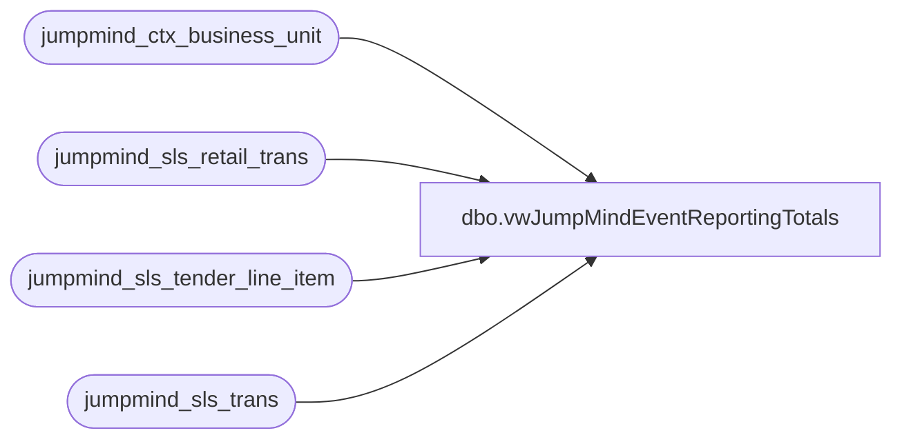

# dbo.vwJumpMindEventReportingTotals

**Database:** LH_Source  
**Server:** 4db76rlxaxcuvmuh5kw37wbnqq-m2o53thjetderkgqw4nc6a676e.datawarehouse.fabric.microsoft.com  

## Architecture Diagram



## Table Dependencies

| Referenced Table |
|---|
| jumpmind_ctx_business_unit |
| jumpmind_sls_retail_trans |
| jumpmind_sls_tender_line_item |
| jumpmind_sls_trans |

## View Code

```sql
CREATE view [dbo].[vwJumpMindEventReportingTotals] ---see postgres vwbab_sls_trans used for storeforce
as

with EventsRoot as 
(
select 
concat(s.device_id,'-',s.business_date,'-',s.sequence_number) as Transaction_Key
, cast (s.create_time as date) as TransactionDate
from jumpmind_sls_retail_trans s
join jumpmind_sls_trans st on st.device_id  = s.device_id  and st.business_date = s.business_date  and st.sequence_number  = s.sequence_number
join jumpmind_ctx_business_unit cbu on cbu.business_unit_id = left(s.device_id,4)
join jumpmind_sls_tender_line_item t on t.device_id = s.device_id  
							and t.sequence_number = s.sequence_number 
							and cast (s.create_time as date) = cast (t.create_time as date)							
where 1=1
and st.training_mode  = 0 
and st.trans_status  in ('COMPLETED') -- case sensitive  
and st.barcode  is not null  
and s.event_id is not null  
and t.tender_code = 'EVENT_INVOICE' -- only Interested in events that were tendered to pay later
--and cast (st.create_time as date) >= getdate() -7 -- only Capture last x days

group by 
concat(s.device_id,'-',s.business_date,'-',s.sequence_number)
, cast (s.create_time as date)

) 

, EventTotals as (

select 
concat
(s.device_id,'-',s.business_date,'-',s.sequence_number) as Transaction_key
, cbu.business_unit_id  as StoreNumber
, business_unit_name as StoreName 
, s.business_date 
, s.event_id  as EventId
, s.event_invoice  as EventInvoice
, s.subtotal
, s.tax_total as TotalSalesTax
, s.total as TransactionTotal 
from jumpmind_sls_retail_trans s
join jumpmind_sls_trans st on st.device_id  = s.device_id  and st.business_date = s.business_date  and st.sequence_number  = s.sequence_number
join jumpmind_ctx_business_unit cbu on cbu.business_unit_id = left(s.device_id,4)
join jumpmind_sls_tender_line_item t on t.device_id = s.device_id  
							and t.sequence_number = s.sequence_number 
							and cast (s.create_time as date) = cast (t.create_time as date)							
where 1=1
and st.training_mode  = 0 
and st.trans_status  in ('COMPLETED') -- case sensitive  
and st.barcode  is not null  
and s.event_id is not null  
and t.tender_code = 'EVENT_INVOICE' -- only Interested in events that were tendered to pay later
--and cast (st.create_time as date) >= current_date -7 -- only Capture last x days
--and cast (st.create_time as date) >= getdate() -7 -- only Capture last x days
) , 

prepaid as (
select 
concat(s.device_id,'-',s.business_date,'-',s.sequence_number) as Transaction_key
, s.event_id 
--, t.tender_code
,sum (t.tender_amount) as Sum_Prepaid
from jumpmind_sls_retail_trans s
join jumpmind_sls_trans st on st.device_id  = s.device_id  and st.business_date = s.business_date  and st.sequence_number  = s.sequence_number
join jumpmind_ctx_business_unit cbu on cbu.business_unit_id = left(s.device_id,4)
join jumpmind_sls_tender_line_item t on t.device_id = s.device_id  
							and t.sequence_number = s.sequence_number 
							and cast (s.create_time as date) = cast (t.create_time as date)			
where 1=1
and st.training_mode  = 0 
and st.trans_status  in ('COMPLETED') -- case sensitive  
and st.barcode  is not null  
and s.event_id is not null  
and t.tender_code <> 'EVENT_INVOICE' -- only Interested in events that were tendered to pay later
--and cast (st.create_time as date) >= current_date -7 -- only Capture last x days
--and cast (st.create_time as date) >= getdate() -7 -- only Capture last x days
group by
concat (s.device_id,'-',s.business_date,'-',s.sequence_number)
, s.event_id 
) 

select 
et.StoreNumber
,et.StoreName
,et.Transaction_key as TransactionKey
,e.TransactionDate
,et.business_date as PosBusinessDate
,et.EventId
,et.EventInvoice
,et.subtotal as SubTotal
,et.TotalSalesTax
,et.TransactionTotal
, coalesce (p.Sum_Prepaid,'0.00') as SumPrepaid
from EventsRoot e
join EventTotals et on e.Transaction_Key = et.Transaction_key
left join prepaid p on e.Transaction_Key = p.Tran
```

