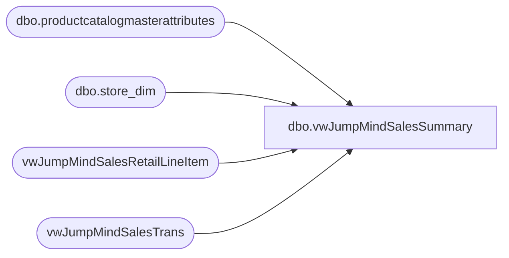

# dbo.vwJumpMindSalesSummary

**Database:** LH_Source  
**Server:** 4db76rlxaxcuvmuh5kw37wbnqq-m2o53thjetderkgqw4nc6a676e.datawarehouse.fabric.microsoft.com  

## Architecture Diagram



## Table Dependencies

| Referenced Table |
|---|
| dbo.productcatalogmasterattributes |
| dbo.store_dim |
| vwJumpMindSalesRetailLineItem |
| vwJumpMindSalesTrans |

## View Code

```sql
CREATE view vwJumpMindSalesSummary 

as

with 
Stores as
	(
		select 
			store_id as StoreID,
			case when store_id between 1 and 999 then 1000 + store_id else store_id end as StoreCode,
			store_name as StoreName,
			bearritory as District,
			region as Region,
			country as Country
		from LH_Mart.dbo.store_dim
		where store_id between 1 and 999
		or store_id between 2000 and 2999
	),
Products as 
	(
		select 
			a.ProductNumber, a.ProductDescription, a.Department, a.DepartmentCode, a.ProductSellingGeography, a.ItemType, a.KeyStory,
			case 
				when a.ProductNumber in ('427634','427582','427152','426821','426749','426378','426369','426286','426259','426219','426132','425617','425354','425152','424965','424685','424443','424286','424244','422963','422962','422824','422823','422049','421816','421815','420551','420550','415836','127634','127582','127152','126821','126749','126378','126286','126132','125617','125354','125152','124965','124685','124443','124244','122824','122823','122049','121816','121815','120551','120550','027634','027582','027217','027152','026980','026838','026821','026749','026603','026378','026369','026286','026166','026132','025617','025354','025152','024965','024685','024443','024290','024286','024244','023842','023834','022889','022888','022887','022886','022831','022830','022829','022828','022824','022823','022141','022049','021816','021815','020559','020558','020557','020556','020555','020554','020553','020552','020551','020550','018194','017295','015833','015831','015830','015281','014258','031829','027765','026378','025617','030306','031696','031659','028925','028552','025354','028895','022831','022830','022888','030394','027217','026603','022829','030418','028855','022886','026166','031977','022887','031451','031510','031408','031059','026915','024290','030174','028741','032063','028559','029984','026749','022824','028403','026980','027910','024244','021815','022141','032078','032096','032008','028473','027582','028405','027893','027634','029842','024965','026838','030548','131829','127765','126378','125617','130306','131696','131659','128925','128552','125354','128895','130394','130418','131977','131451','131408','131059','130174','128741','132063','129984','126749','122824','128403','127910','124244','121815','132078','132008','128473','127582','128405','127893','127634','129842','124965','130548','431829','427765','426378','425617','430306','431696','431659','428925','428552','425354','428895','430394','430418','431977','431451','431408','431059','430174','428741','432063','429984','426749','422824','428403','427910','424244','421815','432078','432008','428473','427582','428405','427893','427634','429842','424965','430548','426369','422963','422962','432067')
					then 1
				else 0
			end as isBackpack,
			case when Department='Stuffers' then 1 else 0 end as isStuffer,
			case when Department in ('Unstuffed','Stuffed') then 1 else 0 end as isSkin
		from LH_Mart.dbo.productcatalogmasterattributes a 
		group by a.ProductNumber, a.ProductDescription, a.Department, a.DepartmentCode, a.ProductSellingGeography, a.ItemType,a.KeyStory
	)
select 
	cast(d.create_time as date) TransactionDate,
	datepart(hh, d.create_time) as TransactionHour,
	sd.StoreID,
	sd.StoreCode,
	sd.StoreName,
	sd.District,
	sd.Country,
	p.ProductNumber,
	p.ProductDescription,
	p.KeyStory,
	case 
		when h.trans_type in ('SALE','REDEEM') and d.line_item_type ='STORE_SALE'
			then count(distinct h.TransactionKey)
		else 0
	end as SaleTrans,
	case 
		when h.trans_type in ('SALE','REDEEM') and d.line_item_type ='STORE_SALE'
			and d.item_type  in ('STOCK')
			and p.DepartmentCode not in ('R-B-D-47') -- Transaction Flags Department Includes Donations, GCs as well 
			then 
				case 
					when p.ProductSellingGeography in ('UK','IE') 
						then sum(d.extended_discounted_amount-d.tax_amount) 
					else sum(d.extended_discounted_amount) 
				end
		else 0
	end as SaleValue,
	case
```

