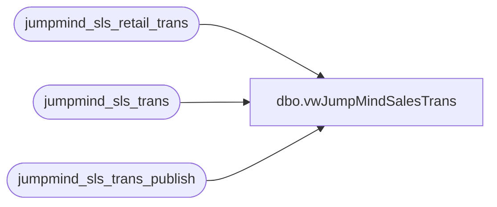

# dbo.vwJumpMindSalesTrans

**Database:** LH_Source  
**Server:** 4db76rlxaxcuvmuh5kw37wbnqq-m2o53thjetderkgqw4nc6a676e.datawarehouse.fabric.microsoft.com  

## Architecture Diagram



## Table Dependencies

| Referenced Table |
|---|
| jumpmind_sls_retail_trans |
| jumpmind_sls_trans |
| jumpmind_sls_trans_publish |

## View Code

```sql
CREATE view vwJumpMindSalesTrans ---see postgres vwbab_sls_trans used for storeforce
as
	SELECT 
		left(t.device_id, 4) AS StoreID,
	    right(t.device_id, 3) AS RegisterNumber,
		cast(t.create_time as date) AS BusinessDate,
        t.business_unit_id,
        t.username,
        t.device_id,
        t.sequence_number AS trans_nbr,
        rt.customer_id,
        rt.loyalty_card_number,
        t.trans_type,
        stp.trans_status,
        cast(sum(rt.total) as numeric(20,2)) AS total,
        cast(sum(rt.subtotal) as numeric(20,2)) AS subtotal,
        cast(sum(rt.tax_total) as numeric(20,2)) AS tax_total,
        cast(sum(rt.discount_total) as numeric(20,2)) AS discount_total,
        t.create_time,
        t.last_update_time,
        rt.event_id,
        rt.event_invoice,
        rt.party_id,
        concat(cast(t.create_time as date), t.device_id, t.sequence_number) AS TransactionKey
        FROM jumpmind_sls_trans t
            JOIN jumpmind_sls_retail_trans rt 
				ON rt.device_id = t.device_id
				AND rt.business_date = t.business_date
				AND rt.sequence_number = t.sequence_number
            JOIN jumpmind_sls_trans_publish stp 
				ON stp.device_id = t.device_id 
				AND stp.business_date = t.business_date 
				AND stp.sequence_number = t.sequence_number
        WHERE t.device_id not like '%customerdisplay%'
		AND t.training_mode = 0 
		AND t.trans_status = 'COMPLETED'
		AND left(t.device_id, 1) <> '-'
		AND stp.trans_status = 'COMPLETED'
		AND t.business_date <> ''
		AND t.business_date IS NOT NULL 
		AND t.trans_type in ('SALE', 'REDEEM', 'RETURN') 
		AND cast(t.create_time as date) = cast(dateadd(hh, -7, getdate()) as date) ---ensures the date is always 'today' from perspective of west coast US
        GROUP BY 
			cast(t.create_time as date),
			t.business_unit_id,
			t.username,
			t.device_id,
			t.sequence_number,
			rt.customer_id,
			rt.loyalty_card_number,
			t.trans_type,
			stp.trans_status,
			t.create_time,
			t.last_update_time,
			rt.event_id,
			rt.event_invoice,
			rt.party_id,
			concat(cast(t.create_time as date), t.device_id, t.sequence_number)
```

