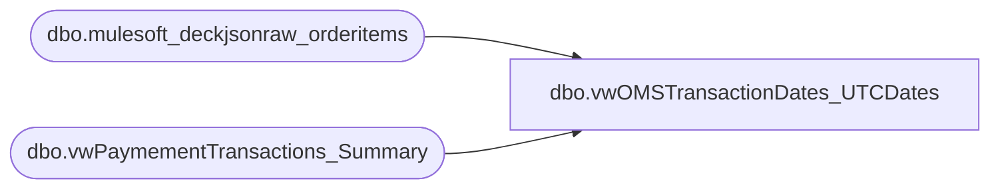

# dbo.vwOMSTransactionDates_UTCDates

**Database:** LH_Source  
**Server:** 4db76rlxaxcuvmuh5kw37wbnqq-m2o53thjetderkgqw4nc6a676e.datawarehouse.fabric.microsoft.com  

## Architecture Diagram



## Table Dependencies

| Referenced Table |
|---|
| dbo.mulesoft_deckjsonraw_orderitems |
| dbo.vwPaymementTransactions_Summary |

## View Code

```sql
CREATE view   [dbo].[vwOMSTransactionDates_UTCDates]

as
WITH warehouseCode
AS
(
SELECT [OrderNumber]
      ,v.[OrderID]
	  ,CASE
	    WHEN SiteCode = 'BABUK' AND PaymentTransactionTypeId IN (2) AND v.PaymentProcessor = 'Cash' THEN 10
		ELSE PaymentTransactionTypeId
	  END AS PaymentTransactionTypeId
	  ,oi.WarehouseCode
	  ,oi.StyleNumber
      ,[GroupID]
	  ,SiteCode
      ,[GroupStart]
	  ,[GroupEnd]
	  ,CASE 
	    WHEN SiteCode = 'BAB' and oi.WarehouseCode = '0013' THEN 'Webstore'
		WHEN SiteCode = 'BABUK' and oi.WarehouseCode = '2013' THEN 'UkWebStore'
		WHEN oi.ShippingMethodDescription in ('InStore','Pickup','sameDay') THEN 'BOPIS'
		ELSE 'BOSFS'
	   END AS ECommOrderType
  FROM [dbo].[vwPaymementTransactions_Summary] v
  INNER JOIN [dbo].[mulesoft_deckjsonraw_orderitems] oi ON v.OrderID = oi.OrderID
  WHERE SiteCode = 'BABUK' AND PaymentTransactionTypeId IN (0, 3, 10, 13, 11, 15, 16)							--// Limit data to the payment
  OR SiteCode = 'BABUK' AND PaymentTransactionTypeId IN (2) AND v.PaymentProcessor = 'Cash'
  OR SiteCode = 'BAB' AND WarehouseCode <> '0013' AND PaymentTransactionTypeId IN (0, 3, 10, 13, 11, 15)		--// events that we care about.
  OR SiteCode = 'BAB' AND WarehouseCode = '0013' AND PaymentTransactionTypeId IN (0, 1, 3, 13, 11, 15, 16)
), warehouseCodeRecalc1
AS
(
SELECT [OrderNumber]
      ,[OrderID]
	  ,CASE 
	    WHEN SiteCode = 'BAB' AND WarehouseCode = '0013'														--// This is necessary for eGift/Gift Card
		  AND LAG(WarehouseCode) OVER (PARTITION BY OrderNumber ORDER BY StyleNumber) <> '0013'					--// split orders.  This combines the orders
		  THEN LAG(WarehouseCode) OVER (PARTITION BY OrderNumber ORDER BY StyleNumber)							--// back into one transaction for D365.
	    ELSE WarehouseCode
	   END AS WarehouseCode
      ,[GroupID]
	  ,PaymentTransactionTypeId
	  ,SiteCode
      ,[GroupStart]
	  ,[GroupEnd]
	  ,ECommOrderType
  FROM warehouseCode
), warehouseCodeRecalc2
AS
(
SELECT [OrderNumber]
      ,[OrderID]
	  ,CASE 
	    WHEN SiteCode = 'BAB' THEN CONCAT('1', right(WarehouseCode,3),'')
	    ELSE WarehouseCode
	   END AS WarehouseCode
      ,[GroupID]
	  ,PaymentTransactionTypeId
	  ,SiteCode
      ,[GroupStart]
	  ,[GroupEnd]
	  ,ECommOrderType
  FROM warehouseCodeRecalc1
  WHERE SiteCode = 'BABUK' AND PaymentTransactionTypeId IN (0, 3, 10, 13, 11, 15, 16)							--// Need to limit the dataset again
  OR SiteCode = 'BAB' AND WarehouseCode <> '0013' AND PaymentTransactionTypeId IN (0, 3, 10, 13, 11, 15)		--// becuase split orders have been
  OR SiteCode = 'BAB' AND WarehouseCode = '0013' AND PaymentTransactionTypeId IN (0, 1, 3, 13, 11, 15, 16)		--// combined back into one transaction.
), piv1
AS
(
SELECT piv.OrderNumber, OrderID, SUM([0]) isCancelled, SUM([1]) isAuthorized, SUM([10]) isPaymentCaptured, SUM([13]) isEarlyCapture, SUM([3]) isRefund, SUM([11]) isPendingRefund, SUM([15]) isPendingCreditReversal, SUM([16]) isPendinAuthReversal, WarehouseCode, GroupID, SiteCode, MIN(GroupStart) GroupStart, MAX(GroupEnd) GroupEnd, ECommOrderType
FROM
(
  SELECT OrderNumber, 
         OrderID, 
         PaymentTransactionTypeId, 
		 WarehouseCode, 
		 GroupID, 
		 SiteCode,
		 --(MIN(GroupStart) AT TIME ZONE 'UTC') AT TIME ZONE 'Central Standard Time' AS GroupStart,
		 --(MAX(GroupEnd) AT TIME ZONE 'UTC') AT TIME ZONE 'Central Standard Time' AS GroupEnd
		 MIN(GroupStart) AS GroupStart,
		 MAX(GroupEnd) AS GroupEnd
		 ,ECommOrderType
  FROM warehouseCodeRecalc2
  GROUP BY OrderNumber, OrderID, PaymentTransactionTypeId, WarehouseCode, GroupID, SiteCode, ECommOrderType
) src
PIVOT
(
	COUNT(PaymentTransactionTypeId)
	FOR PaymentTransactionTypeId IN ([0], [1], [3], [10], [13], [11], [15], [16])
) piv
GROUP BY OrderNumber, OrderID, WarehouseCode, GroupID, SiteCode, ECommOrderType
), withTransaction_No
AS
(
SELECT OrderNumber
      ,OrderID
	  ,isCancelled
	  ,isAuthorized
	  ,isPayme
```

