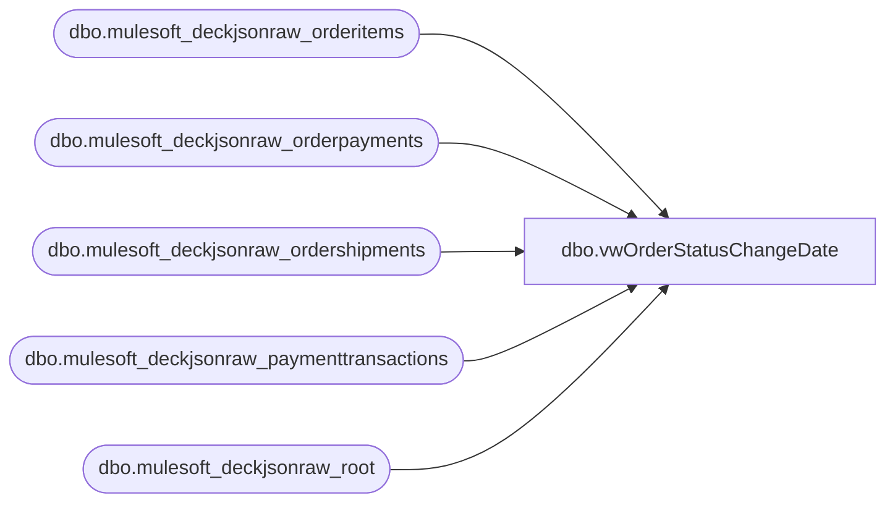

# dbo.vwOrderStatusChangeDate

**Database:** LH_Source  
**Server:** 4db76rlxaxcuvmuh5kw37wbnqq-m2o53thjetderkgqw4nc6a676e.datawarehouse.fabric.microsoft.com  

## Architecture Diagram



## Table Dependencies

| Referenced Table |
|---|
| dbo.mulesoft_deckjsonraw_orderitems |
| dbo.mulesoft_deckjsonraw_orderpayments |
| dbo.mulesoft_deckjsonraw_ordershipments |
| dbo.mulesoft_deckjsonraw_paymenttransactions |
| dbo.mulesoft_deckjsonraw_root |

## View Code

```sql
CREATE view   [dbo].[vwOrderStatusChangeDate]

as 



WITH paymentTransactions
AS
(
SELECT DISTINCT pt.Generic1 AS GiftCardNumber
    ,pt.Generic2
	,pt.Generic3
	,pt.Generic4
	,pt.Generic5
    ,pt.Amount 
    ,r.OrderNumber
	,r.OrderID
    ,case when r.SiteCode = 'BAB' 
	 	then cast( r.OrderDateUTC as date)
	    else cast( r.OrderStatusChangeDateUTC as date) -- BABUK we dont send to Dyn until shipped so OrderDate will not be in alignment with payment capture date but Status Date should be alignment with payment capture
	 end as TransDate
	,case when r.SiteCode = 'BAB' 
	    then CONCAT('1', right(oi.WarehouseCode,3))
	    else oi.WarehouseCode 
	end as InventLocationId
    ,case when r.SiteCode = 'BAB' 
	    then '1013'
	    else '2013'
	end as SiteWarehouse
   ,pt.PaymentTransactionTypeId
   ,OrderStatusCode
   ,CAST(pt.TransactionDateUTC AS DATE) TransactionDateUTC
   ,pt.TransactionDateUTC TransactionDateTimeUTC
   --,COUNT(pt.PaymentTransactionTypeId)
  FROM [dbo].[mulesoft_deckjsonraw_paymenttransactions] pt
  INNER JOIN [dbo].[mulesoft_deckjsonraw_orderpayments] op ON pt._ParentKeyField = op._ParentKeyField AND op.ID = pt.OrderPaymentId
  INNER JOIN [dbo].[mulesoft_deckjsonraw_orderitems] oi ON op._ParentKeyField  = oi._ParentKeyField --AND oi.ItemTypeLocalizeName NOT IN ('eGift')
  INNER JOIN [dbo].[mulesoft_deckjsonraw_root] r ON oi._ParentKeyField = r.OrderID
  LEFT join [dbo].[mulesoft_deckjsonraw_ordershipments] os on r.OrderID = os._ParentKeyField
  --WHERE r.OrderNumber = 'U2948442'
   --WHERE (CAST(r.ExportCreatedUTC AS DATE) BETWEEN @startDate AND @endDate 

   --WHERE datediff(dd, CAST(r.ExportCreatedUTC AS DATE), getdate ()) <= 45

   --AND pt.PaymentTransactionTypeId IN (13) 
   --AND op.PaymentSubType = 'Adyen_GiftCard') 
   )
   --AND SiteCode = CASE WHEN @siteWarehouse = '1013' THEN 'BAB' ELSE 'BABUK' END
   --GROUP BY pt.Generic1, pt.Generic2, pt.Generic3, pt.Generic4, pt.Generic5, pt.Amount, r.OrderNumber, r.SiteCode, r.OrderDateUTC, r.OrderStatusChangeDateUTC, oi.WarehouseCode, pt.PaymentTransactionTypeId
--)
SELECT piv.OrderNumber, piv.OrderID, SUM([1]) isPaymentAuthorized, SUM([10]) isPaymentCaptured, SUM([13]) isEarlyCapture,  SUM([14]) isCaptureFromEarly, CAST(SWITCHOFFSET(MIN(minTransactionDateTimeUTC) AT TIME ZONE 'UTC', DATENAME(TzOffset, MIN(minTransactionDateTimeUTC) AT TIME ZONE 'Central Standard Time'))AS DATETIME) minTransactionDateTime, CAST(SWITCHOFFSET(MAX(minTransactionDateTimeUTC) AT TIME ZONE 'UTC', DATENAME(TzOffset, MAX(minTransactionDateTimeUTC) AT TIME ZONE 'Central Standard Time'))AS DATETIME)  maxTransactionDateTime
FROM
(
  SELECT OrderNumber, OrderID, PaymentTransactionTypeId, MIN(TransactionDateTimeUTC) minTransactionDateTimeUTC, MAX(TransactionDateTimeUTC) maxTransactionDateTimeUTC
  FROM paymentTransactions
  GROUP BY OrderNumber, OrderID, PaymentTransactionTypeId
) src
PIVOT
(
	COUNT(PaymentTransactionTypeId)
	FOR PaymentTransactionTypeId IN ([1], [10], [13], [14])
) piv
GROUP BY OrderNumber, OrderID
--ORDER BY OrderNumber
```

