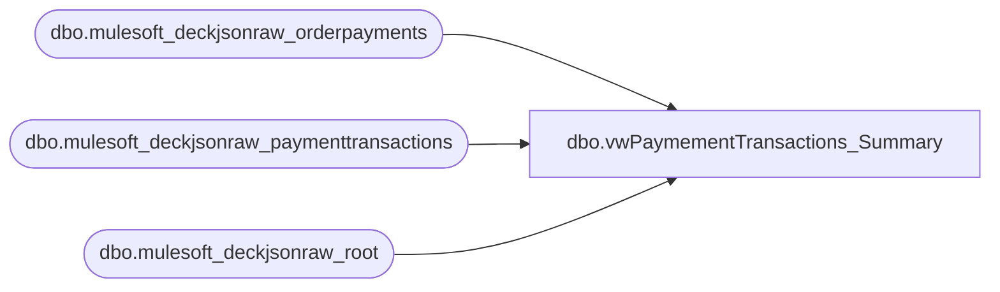

# dbo.vwPaymementTransactions_Summary

**Database:** LH_Source  
**Server:** 4db76rlxaxcuvmuh5kw37wbnqq-m2o53thjetderkgqw4nc6a676e.datawarehouse.fabric.microsoft.com  

## Architecture Diagram



## Table Dependencies

| Referenced Table |
|---|
| dbo.mulesoft_deckjsonraw_orderpayments |
| dbo.mulesoft_deckjsonraw_paymenttransactions |
| dbo.mulesoft_deckjsonraw_root |

## View Code

```sql
CREATE view   [dbo].[vwPaymementTransactions_Summary]

as
WITH Marked AS (
  SELECT r.OrderNumber, r.OrderID, PaymentTransactionTypeId, PaymentProcessor, PaymentSubType, TransactionDateUTC, SiteCode,
  CASE 
			WHEN LAG(PaymentTransactionTypeId) OVER (PARTITION BY OrderNumber ORDER BY TransactionDateUTC, PaymentTransactionTypeId) IN (13) AND PaymentTransactionTypeId IN (10, 14) THEN 0 
			--WHEN LAG(PaymentTransactionTypeID) OVER (PARTITION BY OrderNumber ORDER BY TransactionDateUTC, PaymentTransactionTypeId) = 13 AND PaymentTransactionTypeID = 13 THEN 0 
            WHEN LAG(TransactionDateUTC) OVER (ORDER BY TransactionDateUTC) IS NULL 
				 OR DATEDIFF(SECOND, LAG(TransactionDateUTC) OVER (PARTITION BY OrderNumber ORDER BY TransactionDateUTC, PaymentTransactionTypeId), TransactionDateUTC)> 60 THEN 1
            ELSE 0
        END AS NewGroupFlag
  FROM [dbo].[mulesoft_deckjsonraw_paymenttransactions] p
  INNER JOIN [dbo].[mulesoft_deckjsonraw_orderpayments] op ON p.OrderPaymentId = op.ID
  INNER JOIN [dbo].[mulesoft_deckjsonraw_root] r ON p._ParentKeyField = r.OrderID
  --WHERE PaymentTransactionTypeId IN (0, 3, 10, 13, 15, 16)
    WHERE PaymentTransactionTypeId IN (0, 1, 2, 3, 10, 11, 13, 14, 15, 16)
   --AND OrderNumber = 'U2977671'
  -- AND OrderNumber = 'W9435003'
  --ORDER BY OrderNumber, TransactionDateUTC, PaymentTransactionTypeId
),
Grouped AS (
    SELECT
        OrderNumber, OrderID, PaymentTransactionTypeId, PaymentProcessor, PaymentSubType, TransactionDateUTC, SiteCode,
        SUM(NewGroupFlag) OVER (PARTITION BY OrderNumber ORDER BY TransactionDateUTC ROWS UNBOUNDED PRECEDING) AS GroupID
    FROM Marked
)
SELECT OrderNumber
      ,PaymentTransactionTypeId
	  ,PaymentProcessor
	  ,PaymentSubType
	  ,OrderID
	  ,GroupID
	  ,SiteCode
	  ,MIN(TransactionDateUTC) AS GroupStart
	  ,MAX(TransactionDateUTC) AS GroupEnd
	  ,COUNT(*) AS TransactionCount
FROM Grouped
--WHERE OrderNumber = 'U2977671'
GROUP BY OrderNumber
	   ,OrderID
       ,PaymentTransactionTypeId
	   ,PaymentProcessor
	   ,PaymentSubType
	   ,GroupID
	   ,SiteCode
--ORDER BY GroupStart DESC;
```

