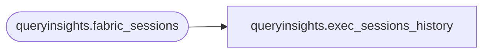

# queryinsights.exec_sessions_history

**Database:** LH_Source  
**Server:** 4db76rlxaxcuvmuh5kw37wbnqq-m2o53thjetderkgqw4nc6a676e.datawarehouse.fabric.microsoft.com  

## Architecture Diagram



## Table Dependencies

| Referenced Table |
|---|
| queryinsights.fabric_sessions |

## View Code

```sql
CREATE VIEW queryinsights.exec_sessions_history AS SELECT session_id, connection_id, login_time as session_start_time, logout_time as session_end_time, program_name, login_name, status, context_info, total_elapsed_time as total_query_elapsed_time_ms, last_request_start_time, last_request_end_time, is_user_process, prev_error, group_id, database_id, authenticating_database_id, open_transaction_count, text_size, language, date_format, date_first, quoted_identifier, arithabort, ansi_null_dflt_on, ansi_defaults, ansi_warnings, ansi_padding, ansi_nulls, concat_null_yields_null, transaction_isolation_level, lock_timeout, deadlock_priority, original_security_id, database_name from queryinsights.fabric_sessions AS t1 WHERE t1.TIMESTAMP > DATEADD(DAY, -30, GETDATE())
```

