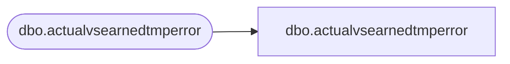

# dbo.actualvsearnedtmperror

**Database:** LH_Staging_CI  
**Server:** 4db76rlxaxcuvmuh5kw37wbnqq-m2o53thjetderkgqw4nc6a676e.datawarehouse.fabric.microsoft.com  

## Architecture Diagram



## Table Dependencies

| Referenced Table |
|---|
| dbo.actualvsearnedtmperror |

## View Code

```sql
;
CREATE   VIEW [dbo].[actualvsearnedtmperror]
AS
    SELECT [dpc], [law], [hoo], [eqv], [spp], [msc], [ffh], [StoreID], [Year], [Week], [StartDate], [EndDate], [store_key], [week_id], [date_key], [period_id], [StoreSales], [StoreSalez], [ErrorCode], [ErrorColumn]
    FROM LH_Staging.[dbo].[actualvsearnedtmperror]
```

