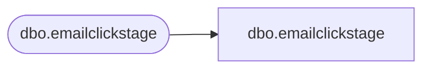

# dbo.emailclickstage

**Database:** LH_Staging_CI  
**Server:** 4db76rlxaxcuvmuh5kw37wbnqq-m2o53thjetderkgqw4nc6a676e.datawarehouse.fabric.microsoft.com  

## Architecture Diagram



## Table Dependencies

| Referenced Table |
|---|
| dbo.emailclickstage |

## View Code

```sql
;
CREATE   VIEW [dbo].[emailclickstage]
AS
    SELECT [ClientID], [SendID], [SubscriberKey] COLLATE Latin1_General_CI_AS AS [SubscriberKey], [EmailAddress] COLLATE Latin1_General_CI_AS AS [EmailAddress], [ClickDate], [clickCount]
    FROM LH_Staging.[dbo].[emailclickstage]
```

