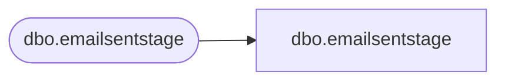

# dbo.emailsentstage

**Database:** LH_Staging_CI  
**Server:** 4db76rlxaxcuvmuh5kw37wbnqq-m2o53thjetderkgqw4nc6a676e.datawarehouse.fabric.microsoft.com  

## Architecture Diagram



## Table Dependencies

| Referenced Table |
|---|
| dbo.emailsentstage |

## View Code

```sql
;
CREATE   VIEW [dbo].[emailsentstage]
AS
    SELECT [ClientID], [SendID], [SubscriberKey] COLLATE Latin1_General_CI_AS AS [SubscriberKey], [SendDate], [EmailAddress] COLLATE Latin1_General_CI_AS AS [EmailAddress], [FirstName] COLLATE Latin1_General_CI_AS AS [FirstName], [LastName] COLLATE Latin1_General_CI_AS AS [LastName], [PromoCode] COLLATE Latin1_General_CI_AS AS [PromoCode], [ExprDate], [Coupon] COLLATE Latin1_General_CI_AS AS [Coupon], [StoreName] COLLATE Latin1_General_CI_AS AS [StoreName], [LoyaltyMonth], [DataSourceName] COLLATE Latin1_General_CI_AS AS [DataSourceName], [FrequencyCount1m], [FrequencyCount3m], [FrequencyCount6m], [FrequencyCount12m], [FrequencyCount18m], [FrequencyCount24m], [FrequencyCountTtl], [RecencyCount1m], [RecencyCount3m], [RecencyCount6m], [RecencyCount12m], [RecencyCount24m], [RecencyCountTtl], [MonetarySum1m], [MonetarySum3m], [MonetarySum6m], [MonetarySum12m], [MonetarySum18m], [MonetarySum24m], [MonetarySumTtl], [AudienceSeg] COLLATE Latin1_General_CI_AS AS [AudienceSeg], [LastPurchaseDate], [LastPurchaseChan], [PreferredStory] COLLATE Latin1_General_CI_AS AS [PreferredStory], [SubscriberID]
    FROM LH_Staging.[dbo].[emailsentstage]
```

