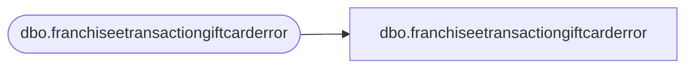

# dbo.franchiseetransactiongiftcarderror

**Database:** LH_Staging_CI  
**Server:** 4db76rlxaxcuvmuh5kw37wbnqq-m2o53thjetderkgqw4nc6a676e.datawarehouse.fabric.microsoft.com  

## Architecture Diagram



## Table Dependencies

| Referenced Table |
|---|
| dbo.franchiseetransactiongiftcarderror |

## View Code

```sql
;
CREATE   VIEW [dbo].[franchiseetransactiongiftcarderror]
AS
    SELECT [TransactionID] COLLATE Latin1_General_CI_AS AS [TransactionID], [Units] COLLATE Latin1_General_CI_AS AS [Units], [GiftCardAmount] COLLATE Latin1_General_CI_AS AS [GiftCardAmount], [Discount] COLLATE Latin1_General_CI_AS AS [Discount], [InsertDate] COLLATE Latin1_General_CI_AS AS [InsertDate], [Franchisee] COLLATE Latin1_General_CI_AS AS [Franchisee], [ErrorDesc] COLLATE Latin1_General_CI_AS AS [ErrorDesc], [ErrorSource] COLLATE Latin1_General_CI_AS AS [ErrorSource]
    FROM LH_Staging.[dbo].[franchiseetransactiongiftcarderror]
```

