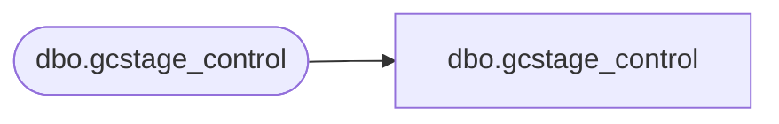

# dbo.gcstage_control

**Database:** LH_Staging_CI  
**Server:** 4db76rlxaxcuvmuh5kw37wbnqq-m2o53thjetderkgqw4nc6a676e.datawarehouse.fabric.microsoft.com  

## Architecture Diagram



## Table Dependencies

| Referenced Table |
|---|
| dbo.gcstage_control |

## View Code

```sql
;
CREATE   VIEW [dbo].[gcstage_control]
AS
    SELECT [maxDate], [maxDateKey], [minAnalysisDate], [minAnalysisDateKey], [minExtractDate], [minExtractDateKey]
    FROM LH_Staging.[dbo].[gcstage_control]
```

