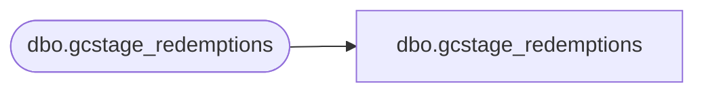

# dbo.gcstage_redemptions

**Database:** LH_Staging_CI  
**Server:** 4db76rlxaxcuvmuh5kw37wbnqq-m2o53thjetderkgqw4nc6a676e.datawarehouse.fabric.microsoft.com  

## Architecture Diagram



## Table Dependencies

| Referenced Table |
|---|
| dbo.gcstage_redemptions |

## View Code

```sql
;
CREATE   VIEW [dbo].[gcstage_redemptions]
AS
    SELECT [recID], [store_key], [transaction_id], [date_key], [redemption_amount], [discount_amount], [giftcard_no] COLLATE Latin1_General_CI_AS AS [giftcard_no], [currency_key], [MID] COLLATE Latin1_General_CI_AS AS [MID], [daysSinceLastActivation], [lift_amount], [activation_discount_amount], [source] COLLATE Latin1_General_CI_AS AS [source], [VLVerified], [register_no], [transaction_no], [postedPhase], [vlLineID]
    FROM LH_Staging.[dbo].[gcstage_redemptions]
```

