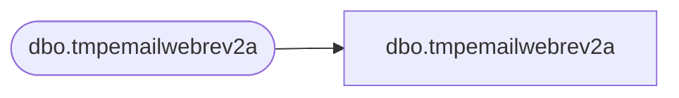

# dbo.tmpemailwebrev2a

**Database:** LH_Staging_CI  
**Server:** 4db76rlxaxcuvmuh5kw37wbnqq-m2o53thjetderkgqw4nc6a676e.datawarehouse.fabric.microsoft.com  

## Architecture Diagram



## Table Dependencies

| Referenced Table |
|---|
| dbo.tmpemailwebrev2a |

## View Code

```sql
;
CREATE   VIEW [dbo].[tmpemailwebrev2a]
AS
    SELECT [OpenDate], [emailAddress] COLLATE Latin1_General_CI_AS AS [emailAddress], [rev]
    FROM LH_Staging.[dbo].[tmpemailwebrev2a]
```

