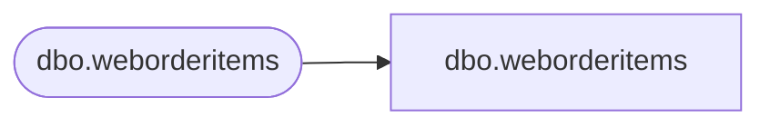

# dbo.weborderitems

**Database:** LH_Staging_CI  
**Server:** 4db76rlxaxcuvmuh5kw37wbnqq-m2o53thjetderkgqw4nc6a676e.datawarehouse.fabric.microsoft.com  

## Architecture Diagram



## Table Dependencies

| Referenced Table |
|---|
| dbo.weborderitems |

## View Code

```sql
;
CREATE   VIEW [dbo].[weborderitems]
AS
    SELECT [TransactionID], [OrderID], [OrderItemID], [SKU] COLLATE Latin1_General_CI_AS AS [SKU], [Qty], [ItemDescription] COLLATE Latin1_General_CI_AS AS [ItemDescription], [Price], [DiscountedPrice], [TrackingNumber] COLLATE Latin1_General_CI_AS AS [TrackingNumber], [ProductKey]
    FROM LH_Staging.[dbo].[weborderitems]
```

