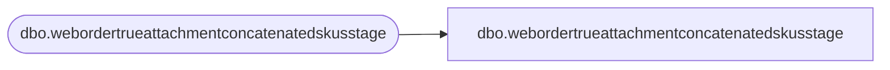

# dbo.webordertrueattachmentconcatenatedskusstage

**Database:** LH_Staging_CI  
**Server:** 4db76rlxaxcuvmuh5kw37wbnqq-m2o53thjetderkgqw4nc6a676e.datawarehouse.fabric.microsoft.com  

## Architecture Diagram



## Table Dependencies

| Referenced Table |
|---|
| dbo.webordertrueattachmentconcatenatedskusstage |

## View Code

```sql
;
CREATE   VIEW [dbo].[webordertrueattachmentconcatenatedskusstage]
AS
    SELECT [OrderNum] COLLATE Latin1_General_CI_AS AS [OrderNum], [OrderDate], [SkuString] COLLATE Latin1_General_CI_AS AS [SkuString], [DescriptionString] COLLATE Latin1_General_CI_AS AS [DescriptionString], [Quantity], [Price], [KeyStoryString] COLLATE Latin1_General_CI_AS AS [KeyStoryString], [MstatString] COLLATE Latin1_General_CI_AS AS [MstatString], [Country] COLLATE Latin1_General_CI_AS AS [Country]
    FROM LH_Staging.[dbo].[webordertrueattachmentconcatenatedskusstage]
```

