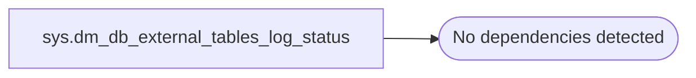

# sys.dm_db_external_tables_log_status

**Database:** LH_Staging_CI  
**Server:** 4db76rlxaxcuvmuh5kw37wbnqq-m2o53thjetderkgqw4nc6a676e.datawarehouse.fabric.microsoft.com  

## Architecture Diagram



## Table Dependencies

_No table dependencies detected._

## View Code

```sql
CREATE   VIEW sys.dm_db_external_tables_log_status
AS
SELECT f.sql_object_id AS object_id, IIF(t.latest_manifest_version > -1, t.latest_manifest_version, NULL) AS latest_log_version, IIF(t.latest_checkpoint_version > -1, t.latest_checkpoint_version, NULL) AS latest_checkpoint_version, t.last_update_time AS last_update_time_utc, t.is_blocked
FROM sys.externaldeltatables t
JOIN sys.manageddeltatables f
ON t.table_id = f.table_id and f.drop_commit_time <= '1900-01-01T00:00:00'
JOIN sys.objects o
ON f.sql_object_id = o.object_id;
```

