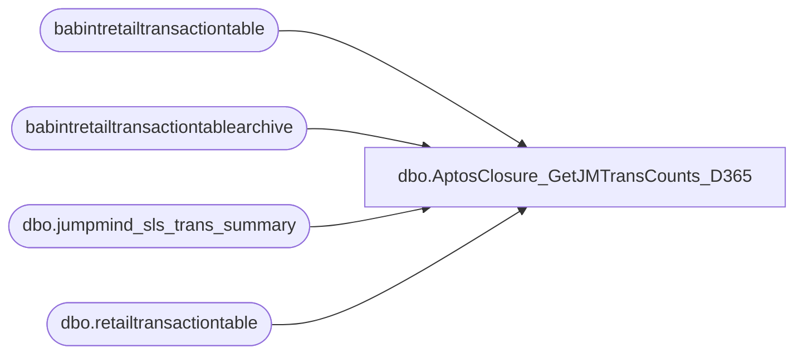

# dbo.AptosClosure_GetJMTransCounts_D365

**Database:** LH_D365  
**Server:** 4db76rlxaxcuvmuh5kw37wbnqq-ovsykae43znuhlmnflcdwm4ohu.datawarehouse.fabric.microsoft.com  

## Architecture Diagram



## Table Dependencies

| Referenced Table |
|---|
| babintretailtransactiontable |
| babintretailtransactiontablearchive |
| dbo.jumpmind_sls_trans_summary |
| dbo.retailtransactiontable |

## Stored Procedure Code

```sql
-- ============================================= -- Author:      Brandon Hickey -- Create Date: 2025-11-04 -- Description: Cross-database transaction count summary from JM and D365 sources -- =============================================  CREATE PROCEDURE AptosClosure_GetJMTransCounts_D365     @BusinessUnitIds NVARCHAR(MAX), -- comma-separated list of business unit IDs     @StartDate DATE,     @EndDate DATE,     @DataAreaId NVARCHAR(10) AS BEGIN     SET NOCOUNT ON;      -- Parse business unit list     ;WITH BusinessUnits AS (         SELECT TRY_CAST(TRIM(value) AS NVARCHAR(10)) AS business_unit_id         FROM STRING_SPLIT(@BusinessUnitIds, ',')         WHERE TRY_CAST(TRIM(value) AS NVARCHAR(10)) IS NOT NULL     ),     BaseJM AS (         SELECT               s.business_unit_id,             s.business_date,             s.device_id,             s.sequence_number,             s.trans_type_code,             CASE                 WHEN s.trans_type_code IN ('PAY_IN','PAY_OUT') THEN 'SALE'                 ELSE s.trans_type_code             END AS trans_typeMapped,             CASE                  WHEN s.trans_type_code IN ('PAY_IN','PAY_OUT','SALE') THEN 'SALE'                 ELSE 'CONTROL'             END AS TransCategory         FROM LH_Source.dbo.jumpmind_sls_trans_summary s         INNER JOIN BusinessUnits bu ON s.business_unit_id = bu.business_unit_id         WHERE TRY_CONVERT(DATE, s.business_date) BETWEEN @StartDate AND @EndDate     )     SELECT 'JM - Sales + PAY IN/OUT' AS [Source], COUNT(*) AS [TransCount]     FROM BaseJM      WHERE TransCategory = 'SALE'      UNION      SELECT 'JM - SALES ONLY' AS [Source], COUNT(*) AS [TransCount]     FROM BaseJM      WHERE trans_type_code = 'SALE'      UNION      SELECT 'BAB - RetailTrans' AS [Source], COUNT(*) AS [TransCount]     FROM babintretailtransactiontable b     INNER JOIN BusinessUnits bu ON b.inventlocationid = bu.business_unit_id     WHERE b.dataareaid = @DataAreaId       AND TRY_CONVERT(DATE, b.transdate) BETWEEN @StartDate AND @EndDate      UNION      SELECT 'RetailTrans' AS [Source], COUNT(*) AS [TransCount]     FROM dbo.retailtransactiontable r     INNER JOIN BusinessUnits bu ON r.inventlocationid = bu.business_unit_id     WHERE r.dataareaid = @DataAreaId       AND TRY_CONVERT(DATE, r.transdate) BETWEEN @StartDate AND @EndDate      UNION      SELECT 'Archive' AS [Source], COUNT(*) AS [TransCount]     FROM babintretailtransactiontablearchive a     INNER JOIN BusinessUnits bu ON a.inventlocationid = bu.business_unit_id     WHERE a.dataareaid = @DataAreaId       AND TRY_CONVERT(DATE, a.transdate) BETWEEN @StartDate AND @EndDate END
```

