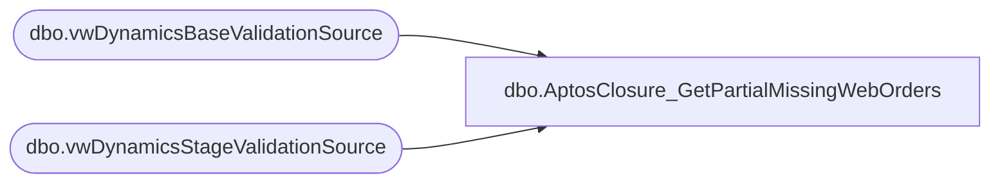

# dbo.AptosClosure_GetPartialMissingWebOrders

**Database:** LH_D365  
**Server:** 4db76rlxaxcuvmuh5kw37wbnqq-ovsykae43znuhlmnflcdwm4ohu.datawarehouse.fabric.microsoft.com  

## Architecture Diagram



## Table Dependencies

| Referenced Table |
|---|
| dbo.vwDynamicsBaseValidationSource |
| dbo.vwDynamicsStageValidationSource |

## Stored Procedure Code

```sql
-- ============================================= -- Author:      Brandon Hickey -- Create Date: 2025-11-06 -- Description: Returns missing web orders from bens #tmp2 query -- =============================================  CREATE PROCEDURE [dbo].[AptosClosure_GetPartialMissingWebOrders]     @StartDate DATE,     @EndDate DATE AS BEGIN     SET NOCOUNT ON;      select store 			,TransDate 			,sequence_number 			,',''' + RetailTransactionId + '''' AS RetailTransactionIdText 			,RetailTransactionId 			,babintretailprocessed 			,SourceTable 	   --from LH_D365.dbo.vwDynamicsStageValidationSource where TransDate >= '10/05/2025' 	   from LH_D365.dbo.vwDynamicsStageValidationSource where TransDate >= @StartDate and TransDate <= @EndDate        and RetailTransactionId not in (select RetailTransactionId  from LH_D365.dbo.vwDynamicsBaseValidationSource)        order by  TransDate, store, sequence_number asc END
```

