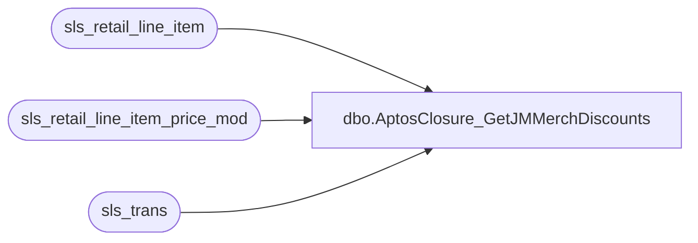

# dbo.AptosClosure_GetJMMerchDiscounts

**Database:** LH_Source  
**Server:** 4db76rlxaxcuvmuh5kw37wbnqq-ovsykae43znuhlmnflcdwm4ohu.datawarehouse.fabric.microsoft.com  

## Architecture Diagram



## Table Dependencies

| Referenced Table |
|---|
| sls_retail_line_item |
| sls_retail_line_item_price_mod |
| sls_trans |

## Stored Procedure Code

```sql
-- ============================================= -- Author:      Brandon Hickey -- Create Date: 2025-11-06 -- Description: Returns discount line item data from JM -- =============================================  CREATE PROCEDURE [dbo].[AptosClosure_GetJMMerchDiscounts]     @BusinessUnitIds NVARCHAR(MAX), -- comma-separated list of IDs     @StartDate DATE,     @EndDate DATE AS BEGIN     SET NOCOUNT ON;      -- Split the comma-separated string into a table     ;WITH BusinessUnitList AS (         SELECT value AS business_unit_id         FROM STRING_SPLIT(@BusinessUnitIds, ',')         WHERE value IS NOT NULL     )      SELECT          T.business_unit_id,          T.business_date,          T.sequence_number,          LIPM.description,          LIPM.modification_total     FROM sls_retail_line_item LI     JOIN sls_retail_line_item_price_mod LIPM         ON LI.business_date = LIPM.business_date         AND LI.sequence_number = LIPM.sequence_number         AND LI.line_sequence_number = LIPM.line_sequence_number         AND LI.device_id = LIPM.device_id     JOIN sls_trans T         ON T.business_date = LIPM.business_date         AND T.sequence_number = LIPM.sequence_number         AND T.device_id = LIPM.device_id     INNER JOIN BusinessUnitList B ON T.business_unit_id = B.business_unit_id     WHERE T.trans_status = 'COMPLETED'       AND LI.item_type <> 'GIFTCARD'       AND LI.voided = 0       AND TRY_CONVERT(DATE, T.business_date) BETWEEN @StartDate AND @EndDate; END
```

