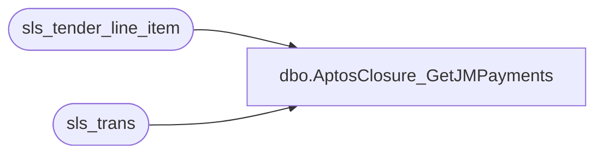

# dbo.AptosClosure_GetJMPayments

**Database:** LH_Source  
**Server:** 4db76rlxaxcuvmuh5kw37wbnqq-ovsykae43znuhlmnflcdwm4ohu.datawarehouse.fabric.microsoft.com  

## Architecture Diagram



## Table Dependencies

| Referenced Table |
|---|
| sls_tender_line_item |
| sls_trans |

## Stored Procedure Code

```sql
-- ============================================= -- Author:      Brandon Hickey -- Create Date: 2025-11-06 -- Description: Returns payment line items from JM -- =============================================  CREATE PROCEDURE [dbo].[AptosClosure_GetJMPayments]     @BusinessUnitIds NVARCHAR(MAX), -- comma-separated list of IDs     @StartDate DATE,     @EndDate DATE AS BEGIN     SET NOCOUNT ON;      -- Split the comma-separated string into a table     ;WITH BusinessUnitList AS (         SELECT value AS business_unit_id         FROM STRING_SPLIT(@BusinessUnitIds, ',')         WHERE value IS NOT NULL     )      SELECT          T.business_unit_id,          TLI.business_date,          T.sequence_number,          TLI.device_id,          TLI.tender_code,          TLI.tender_amount     FROM sls_tender_line_item TLI     INNER JOIN sls_trans T          ON T.device_id = TLI.device_id         AND T.business_date = TLI.business_date         AND T.sequence_number = TLI.sequence_number     INNER JOIN BusinessUnitList B ON T.business_unit_id = B.business_unit_id     WHERE TLI.voided = 0       AND T.trans_type IN ('SALE', 'RETURN')       AND T.trans_status = 'COMPLETED'       AND TRY_CONVERT(DATE, T.business_date) BETWEEN @StartDate AND @EndDate; END
```

