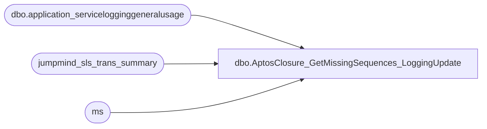

# dbo.AptosClosure_GetMissingSequences_LoggingUpdate

**Database:** LH_Source  
**Server:** 4db76rlxaxcuvmuh5kw37wbnqq-ovsykae43znuhlmnflcdwm4ohu.datawarehouse.fabric.microsoft.com  

## Architecture Diagram



## Table Dependencies

| Referenced Table |
|---|
| dbo.application_servicelogginggeneralusage |
| jumpmind_sls_trans_summary |
| ms |

## Stored Procedure Code

```sql
CREATE PROCEDURE [dbo].[AptosClosure_GetMissingSequences_LoggingUpdate]     @BusinessUnitIds NVARCHAR(MAX), -- comma-separated list of IDs     @StartDate DATE,     @EndDate DATE AS BEGIN     SET NOCOUNT ON;      /* If rerun inside the same session */     IF OBJECT_ID('tempdb..#MissingSequences') IS NOT NULL         DROP TABLE #MissingSequences;      WITH BusinessUnitList AS (         SELECT TRY_CAST(TRIM(value) AS INT) AS business_unit_id         FROM STRING_SPLIT(@BusinessUnitIds, ',')         WHERE TRY_CAST(TRIM(value) AS INT) IS NOT NULL     ),     filtered_data AS (         SELECT DISTINCT             s.business_unit_id,             /* Normalize business_date into DATE once for the pipeline */             TRY_CONVERT(DATE,                 CASE                      WHEN TRY_CONVERT(INT, s.business_date) IS NOT NULL                           AND LEN(CONVERT(VARCHAR(20), s.business_date)) = 8                     THEN STUFF(STUFF(CONVERT(VARCHAR(8), s.business_date),5,0,'-'),8,0,'-')  -- YYYYMMDD -> YYYY-MM-DD                     ELSE CONVERT(VARCHAR(50), s.business_date) -- fallback; TRY_CONVERT handles it                 END             ) AS business_date,             s.device_id,             s.sequence_number,             s.begin_time,             s.end_time         FROM jumpmind_sls_trans_summary AS s         WHERE TRY_CONVERT(DATE,                 CASE                      WHEN TRY_CONVERT(INT, s.business_date) IS NOT NULL                           AND LEN(CONVERT(VARCHAR(20), s.business_date)) = 8                     THEN STUFF(STUFF(CONVERT(VARCHAR(8), s.business_date),5,0,'-'),8,0,'-')                     ELSE CONVERT(VARCHAR(50), s.business_date)                 END             ) BETWEEN @StartDate AND @EndDate           AND (                 @BusinessUnitIds IS NULL OR LTRIM(RTRIM(@BusinessUnitIds)) = N''                  OR s.business_unit_id IN (SELECT business_unit_id FROM BusinessUnitList)               )     ),     ordered AS (         SELECT             d.*,             COALESCE(d.end_time, d.begin_time) AS txn_time,             LAG(d.sequence_number) OVER (                 PARTITION BY d.business_unit_id, d.business_date, d.device_id                 ORDER BY COALESCE(d.end_time, d.begin_time), d.sequence_number             ) AS prev_seq_in_time         FROM filtered_data AS d     ),     segmented AS (         SELECT             *,             CASE                 WHEN prev_seq_in_time IS NOT NULL AND sequence_number < prev_seq_in_time THEN 1                 ELSE 0             END AS is_reset         FROM ordered     ),     segmented_with_id AS (         SELECT             *,             SUM(is_reset) OVER (                 PARTITION BY business_unit_id, business_date, device_id                 ORDER BY txn_time, sequence_number                 ROWS UNBOUNDED PRECEDING             ) AS seg_id         FROM segmented     ),     within_segment AS (         SELECT             business_unit_id,             business_date,             device_id,             seg_id,             sequence_number,             LEAD(sequence_number) OVER (                 PARTITION BY business_unit_id, business_date, device_id, seg_id                 ORDER BY sequence_number             ) AS next_seq         FROM segmented_with_id     ),     missing_sequences AS (         SELECT             business_unit_id,             business_date,             device_id,             seg_id,             sequence_number + 1 AS missing_sequence_start,             next_seq - 1        AS missing_sequence_end         FROM within_segment         WHERE next_seq IS NOT NULL           AND next_seq - sequence_number > 1     )     /* 1) Dump original result set into a temp table */     SELECT         business_unit_id,         CONVERT(char(8), business_date, 112) AS business_date,         device_id,         missing_sequence_start,         missing_sequence_end,         seg_id     INTO #MissingSequences     FROM missing_sequences;      /*       2) Delete any temp-table rows where:          - business_unit_id matches, AND          - a logged sequence number from JSON is within the missing range                 JSON parsing supports either:         - array: ["11530","1345"] (BU at [0], seq at [1])         - object: {"businessUnitId":11530,"sequenceNumber":1345}     */      	;WITH LoggedPairs AS ( 		SELECT 			bu  = TRY_CONVERT(INT, j.[key]), 			seq = TRY_CONVERT(INT, j.[value]) 		FROM dbo.application_servicelogginggeneralusage AS l 		CROSS APPLY OPENJSON(l.[message]) AS j 		WHERE l.[message] IS NOT NULL 		AND ISJSON(l.[message]) = 1 		-- optional: only keep rows that successfully convert 		AND TRY_CONVERT(INT, j.[key])  IS NOT NULL 		AND TRY_CONVERT(INT, j.[value]) IS NOT NULL 	) 	 	DELETE ms 	FROM #MissingSequences AS ms 	WHERE EXISTS ( 		SELECT 1 		FROM LoggedPairs AS lp 		WHERE lp.bu = ms.business_unit_id 		AND lp.seq BETWEEN ms.missing_sequence_start AND ms.missing_sequence_end 	);       /* 3) Return remaining rows */     SELECT         business_unit_id,         business_date,         device_id,         missing_sequence_start,         missing_sequence_end     FROM #MissingSequences     ORDER BY business_unit_id, business_date, device_id, seg_id, missing_sequence_start;  END
```

