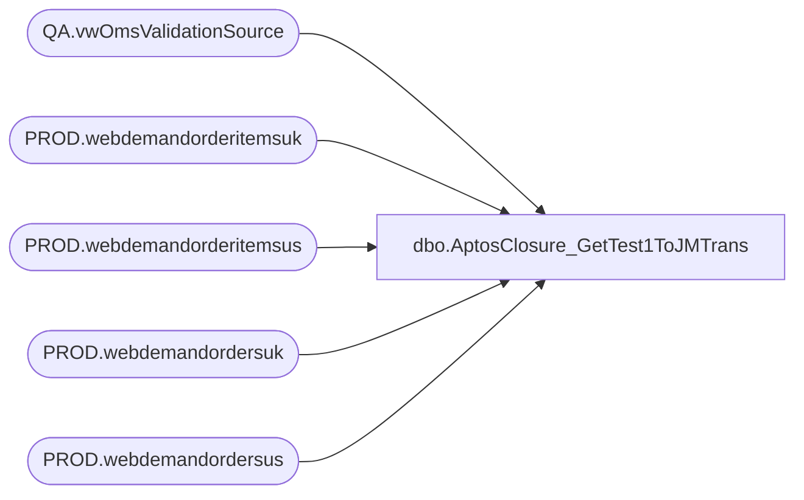

# dbo.AptosClosure_GetTest1ToJMTrans

**Database:** LH_Source  
**Server:** 4db76rlxaxcuvmuh5kw37wbnqq-ovsykae43znuhlmnflcdwm4ohu.datawarehouse.fabric.microsoft.com  

## Architecture Diagram



## Table Dependencies

| Referenced Table |
|---|
| QA.vwOmsValidationSource |
| PROD.webdemandorderitemsuk |
| PROD.webdemandorderitemsus |
| PROD.webdemandordersuk |
| PROD.webdemandordersus |

## Stored Procedure Code

```sql
-- ============================================= -- Author:      Brandon Hickey -- Create Date: 2025-11-04 -- Description: Returns transaction counts by category from Aptos -- Notes: --   - PAY_IN and PAY_OUT are counted under SALE --   - CONTROL is everything else -- =============================================  CREATE   PROCEDURE [dbo].[AptosClosure_GetTest1ToJMTrans]     @startDate DATE,     @endDate   DATE, 	@Country VARCHAR(5)  AS BEGIN     SET NOCOUNT ON;  		  --W8798070  		--SET @Country = 'USA'; 		--SET @Country = 'GBR'; 		--SET @startDate = '2026-1-04'; 		--SET @endDate = '2026-1-03'; 		SELECT @endDate = CAST(GETDATE() AS DATE);  		WITH IncludedOrderItems AS ( 			SELECT DISTINCT OrderNumber 			FROM PROD.webdemandorderitemsus 			WHERE ItemStatus IN ( 				--'Shipped','Store Shipped','Ready For Pickup','Picked Up', 				--'Ready for Delivery Pickup','Gift Card Processed','Delivered (Same Day)','Cancelled' 		  'Pending Wave' 			) 			UNION 			SELECT DISTINCT OrderNumber 			FROM PROD.webdemandorderitemsuk 			WHERE ItemStatus IN ( 				--'Shipped','Store Shipped','Ready For Pickup','Picked Up', 				--'Ready for Delivery Pickup','Gift Card Processed','Delivered (Same Day)','Cancelled' 		  'Pending Wave' 			) 		), 		IncludedOrders AS ( 			SELECT DISTINCT OrderNumber 			FROM PROD.webdemandordersus 			--WHERE OrderStatus = 'Completed' 		 WHERE OrderStatus = 'Pending' 			UNION 			SELECT DISTINCT OrderNumber 			FROM PROD.webdemandordersuk 			--WHERE OrderStatus = 'Completed' 		 WHERE OrderStatus = 'Pending' 		), 		JoinedOrders AS ( 			SELECT DISTINCT i.OrderNumber 			FROM IncludedOrderItems i 			JOIN IncludedOrders o ON i.OrderNumber = o.OrderNumber 		), 		ValidationSource AS ( 			SELECT DISTINCT SequenceNumber 			FROM QA.vwOmsValidationSource 		), 		MissingOrders AS ( 			SELECT j.OrderNumber 			FROM JoinedOrders j 			LEFT JOIN ValidationSource v ON j.OrderNumber = v.SequenceNumber 			WHERE v.SequenceNumber IS NULL 		) 		SELECT DISTINCT CAST(us.OrderDateUTC AS DATE) AS OrderDateUTC, 			   us.ShippingCountry, 			   us.OrderNumber, 			'"' + us.OrderNumber + '",' AS OrderNumberText 		FROM PROD.webdemandordersus us 		JOIN MissingOrders m ON us.OrderNumber = m.OrderNumber 		WHERE (@startDate IS NULL OR @endDate IS NULL OR CAST(us.OrderDateUTC AS DATE) BETWEEN @startDate AND @endDate) 		  AND (@Country IS NULL OR us.ShippingCountry = @Country) AND us.OrderNumber NOT LIKE ('7%')  		UNION ALL  		SELECT DISTINCT CAST(uk.OrderDateUTC AS DATE) AS OrderDateUTC, 			   uk.ShippingCountry, 			   uk.OrderNumber, 			'"' + uk.OrderNumber + '",' AS OrderNumberText 		FROM PROD.webdemandordersuk uk 		JOIN MissingOrders m ON uk.OrderNumber = m.OrderNumber 		WHERE (@startDate IS NULL OR @endDate IS NULL OR CAST(uk.OrderDateUTC AS DATE) BETWEEN @startDate AND @endDate) 		  AND (@Country IS NULL OR uk.ShippingCountry = @Country) AND uk.OrderNumber NOT LIKE ('7%') 		 order by 1 desc,3; END
```

