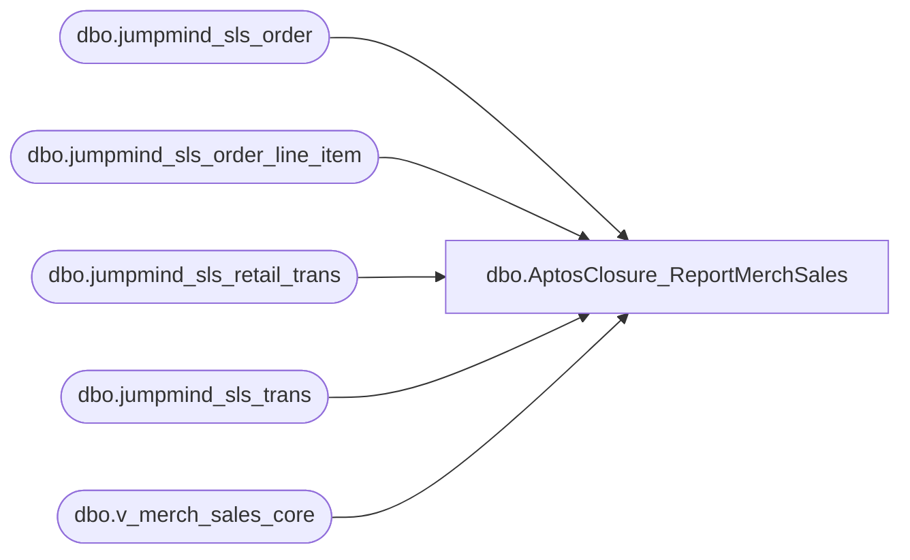

# dbo.AptosClosure_ReportMerchSales

**Database:** LH_Source  
**Server:** 4db76rlxaxcuvmuh5kw37wbnqq-ovsykae43znuhlmnflcdwm4ohu.datawarehouse.fabric.microsoft.com  

## Architecture Diagram



## Table Dependencies

| Referenced Table |
|---|
| dbo.jumpmind_sls_order |
| dbo.jumpmind_sls_order_line_item |
| dbo.jumpmind_sls_retail_trans |
| dbo.jumpmind_sls_trans |
| dbo.v_merch_sales_core |

## Stored Procedure Code

```sql
CREATE   PROCEDURE dbo.AptosClosure_ReportMerchSales    @startDate        DATE,    @endDate          DATE,    @businessUnitIDs  VARCHAR(MAX),    @delimiter        CHAR(1),    @eurExchangeRate  DECIMAL(12, 6) AS BEGIN     SET NOCOUNT ON;      -- Business Unit list as a CTE (no temp objects, no constraints)     WITH bu AS (         SELECT LTRIM(value) AS business_unit_id         FROM STRING_SPLIT(@businessUnitIDs, @delimiter)     )     SELECT         ms.business_unit_id,         ms.business_date,         ms.sequence_number,         ms.device_id,         ms.item_description,         ms.item_id,         ms.item_type,         CASE             WHEN ms.country_id IN ('US','CA')                 THEN ms.extended_amount             WHEN ms.country_id = 'UK'                 THEN ms.extended_amount - ms.tax_amount             WHEN ms.country_id = 'IE'                 THEN ROUND(@eurExchangeRate * ms.extended_amount, 4)                    - ROUND(@eurExchangeRate * ms.tax_amount,   4)             ELSE ms.extended_amount         END AS OriginalPrice     FROM dbo.v_merch_sales_core AS ms     INNER JOIN bu         ON ms.business_unit_id = bu.business_unit_id     WHERE         -- Sargable date range (no CAST on column; allows segment pruning)         ms.create_time >= @startDate         AND ms.create_time < DATEADD(day, 1, @endDate)         -- Mirror the LEFT JOIN salesOrders ... WHERE s.sequence_number IS NULL         AND NOT EXISTS (             SELECT 1             FROM dbo.jumpmind_sls_order AS so             INNER JOIN dbo.jumpmind_sls_order_line_item AS soli                 ON so.order_id = soli.order_id             INNER JOIN dbo.jumpmind_sls_retail_trans AS rt                 ON rt.order_id        = soli.order_id                AND rt.business_date   = soli.orig_business_date                AND rt.sequence_number = soli.orig_sequence_number             INNER JOIN dbo.jumpmind_sls_trans AS t2                 ON t2.device_id       = rt.device_id                AND t2.business_date   = rt.business_date                AND t2.sequence_number = rt.sequence_number             WHERE                 -- Keep filters sargable and aligned to the proc                 t2.create_time >= @startDate                 AND t2.create_time < DATEADD(day, 1, @endDate)                 AND so.business_unit_id IN (SELECT business_unit_id FROM bu)                  -- Join keys matching the original anti-join                 AND so.business_unit_id      = ms.business_unit_id                 AND so.business_date         = ms.business_date                 AND so.device_id             = ms.device_id                 AND soli.orig_sequence_number= ms.sequence_number                 AND soli.orig_line_sequence_number = ms.line_sequence_number         ); END
```

