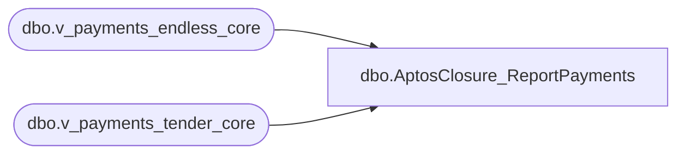

# dbo.AptosClosure_ReportPayments

**Database:** LH_Source  
**Server:** 4db76rlxaxcuvmuh5kw37wbnqq-ovsykae43znuhlmnflcdwm4ohu.datawarehouse.fabric.microsoft.com  

## Architecture Diagram



## Table Dependencies

| Referenced Table |
|---|
| dbo.v_payments_endless_core |
| dbo.v_payments_tender_core |

## Stored Procedure Code

```sql
CREATE   PROCEDURE dbo.AptosClosure_ReportPayments    @startDate        DATE,    @endDate          DATE,    @businessUnitIDs  VARCHAR(MAX),    @delimiter        CHAR(1),    @eurExchangeRate  DECIMAL(12, 6) AS BEGIN     SET NOCOUNT ON;      -- Business unit list via CTE (no temp tables / constraints)     WITH bu AS (         SELECT LTRIM(value) AS business_unit_id         FROM STRING_SPLIT(@businessUnitIDs, @delimiter)     )     -- POS Tenders     SELECT         p.business_unit_id,         p.business_date,         p.sequence_number,         p.device_id,         p.tender_code,         CASE WHEN p.country_id = 'IE' THEN @eurExchangeRate * p.tender_amount              ELSE p.tender_amount         END AS tender_amount     FROM dbo.v_payments_tender_core AS p     INNER JOIN bu         ON p.business_unit_id = bu.business_unit_id     WHERE         p.create_time >= @startDate         AND p.create_time < DATEADD(day, 1, @endDate)      UNION ALL      -- Endless Aisle     SELECT         e.business_unit_id,         e.business_date,         e.sequence_number,         e.device_id,         e.tender_code,         CASE WHEN e.country_id = 'IE' THEN @eurExchangeRate * e.tender_amount              ELSE e.tender_amount         END AS tender_amount     FROM dbo.v_payments_endless_core AS e     INNER JOIN bu         ON e.business_unit_id = bu.business_unit_id     WHERE         e.create_time >= @startDate         AND e.create_time < DATEADD(day, 1, @endDate); END
```

