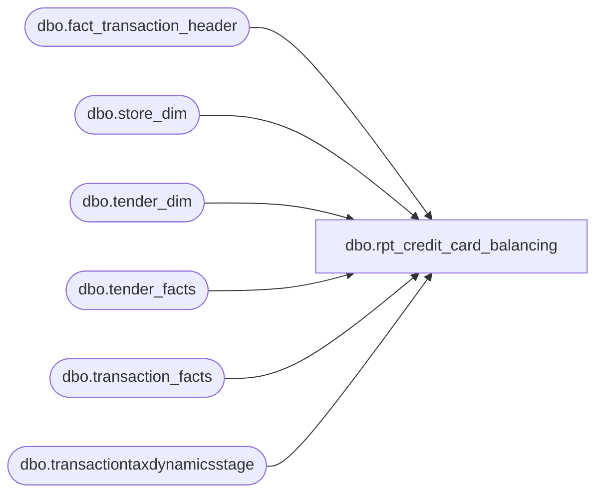

# dbo.rpt_credit_card_balancing

**Database:** DataflowsStagingLakehouse  
**Server:** 4db76rlxaxcuvmuh5kw37wbnqq-ovsykae43znuhlmnflcdwm4ohu.datawarehouse.fabric.microsoft.com  

## Architecture Diagram



## Table Dependencies

| Referenced Table |
|---|
| dbo.fact_transaction_header |
| dbo.store_dim |
| dbo.tender_dim |
| dbo.tender_facts |
| dbo.transaction_facts |
| dbo.transactiontaxdynamicsstage |

## View Code

```sql
/* =============================================================================    rpt_credit_card_balancing.sql -- Credit Card Balancing Report    =============================================================================    Domain:    Reconciliation (Sales Audit)    Audience:  Accounting / Sales Audit team    Consumer:  Linda's xlsx golden export               "#14 Credit Card Balancing Report - Jan, Feb, Mar 2026 - KAI.xlsx"               (Power BI ad-hoc dashboard "Finance / Credit Card Activity"               now consumes the same wide-shape view; per-auth detail is               available via fact_authorization_detail join in the dashboard               semantic model.)     PURPOSE      Wide-format daily register rollup of credit-card tender activity,      pivoted so every Linda-known card brand column appears once per      (gl_company, store, store_name, register, sales_date). Matches the      14-amount-column header row of Linda's xlsx for trivial row-level      diff against the golden export.     GRAIN      One row per (gl_company, store_no, store_name, register_bucket, sales_date)      where register_bucket is '52' for the BOPIS sentinel register or '' for      every other (collapsed) register.       Linda's xlsx splits BOPIS (register 52) into its own row and aggregates      every other physical register on the store-day into a single blank-      register row. Matching that grain here is necessary because the      downstream rollup uses abs-of-sums-per-row, and per-physical-register      splits can carry equal-and-opposite refund vs sale amounts that      inflate the per-(store, date) abs sum when the underlying registers      are not collapsed first.     SOURCE      LH_Mart.dbo.transaction_facts (header keys)         + LH_Mart.dbo.tender_facts  (per-tender net amounts)         + LH_Mart.dbo.tender_dim    (tender code/desc)         + LH_Mart.dbo.store_dim     (store number padded, store name, country).     CORPORATE SALES (1990) PLACEHOLDER      Linda emits a placeholder row for store_no=1990 (Corporate Sales,      enterprise sales channel run by the corporate office) on every      chain-active date. The store runs zero rows in any LH_Mart fact      table (verified across 231 candidate (table, column) pairs in      2026; only the dim row exists), but the consumer dashboard      surfaces the daily placeholder for visual consistency. We emit      (1990, date) for every date in the report window where any      non-void POS transaction was recorded chain-wide, with all      amount columns at zero.       Linda's legacy SmartLook source comment reads        `---Uses SP Credit Card Auth and SP Receivable Auth`      i.e. the xlsx pivot is a downstream rendering of those two auth reports.      The canonical accounting feed LH_Mart.dbo.tender_facts is the      post-translation single-source-of-truth that both auth reports flow      through, so we source directly from it (one less indirection, identical      per-tender amounts after the AuditWorks Edit phase). This avoids      double-counting issues that arose with the prior auth_side +      lh_mart_cc_catchall union approach (the POS feed emitted per-auth gross      amounts while the canonical feed emitted netted amounts, so refunds      inflated abs-sums and gift-card / paypal / house-charge tenders in the      604..699 range leaked into the unfiltered union).     COLUMN SHAPE (matches Linda's xlsx header row 1)      Field_a -> [GL Company]                  surrogated from store_dim.country      Field_b -> [Store Number]                4-digit (1001..1999)      Field_c -> [Store Name]      Field_d -> [Register Number]      Field_e -> [Sales Date]      Field_f -> [Visa]                        SUM tender_code = 604      Field_g -> [MasterCard]                  SUM tender_code = 605      Field_h -> [Total Visa/MasterCard]       = Visa + MasterCard      Field_i -> [Discover]                    SUM tender_code = 608      Field_j -> [American Express]            SUM tender_code = 606      Field_k -> [JCB]                         SUM tender_code = 642      Field_l -> [Cyber]                       SUM tender_code = 609      Field_m -> [UK Credit Cards]             SUM tender_code = 699      Field_n -> [CAN Am Exp]                  SUM tender_code = 697      Field_o -> [CAN MC/Visa/Debit]           SUM tender_code = 698      Field_p -> [Total Credit Cards]          = sum of all CC tenders above                                                   (excludes Debit)      Field_q -> [Debit Card]                  SUM tender_code = 611     ADYEN-PAIR REFUND CODES (670 / 671 / 672 / 673)      Tender codes 670 (Adyen Visa), 671 (Adyen Mastercard), 672 (Adyen      Discover), and 673 (Adyen Amex) are post-Adyen-migration codes that      carry ONLY refund legs. Empirical sweep across Jan 1 to May 26 2026      of LH_Mart.dbo.tender_facts found 576 legs total on these codes:      zero positive, 576 negative, summing to -$7,239.73 chain-wide.      Linda's legacy SmartLook source (the source of truth for the      Sales Audit team and Cassandra's Power BI report) pre-dates the      Adyen migration and does NOT sum these codes into the brand      totals. To keep this report's column values in line with Linda's      reconciliation, the brand columns are sourced from the legacy      code alone: [Visa] = 604 only (not 604+670), [MasterCard] = 605      only, [Discover] = 608 only, [American Express] = 606 only. The      [Total Credit Cards] column likewise drops 670/671/672/673.      Verified via probe_ccb_exclude_adyen_codes.py on 16 small-variance      cases from Steven's Apr 19-25 2026 reconcile, 16/16 cell-for-cell      match with Linda after the change.       If a future consumer needs visibility into Adyen-routed refunds,      they should be surfaced in a separate column (e.g. [Adyen Visa      Refunds]) rather than folded back into the per-brand sums, since      mixing them recreates the variance Linda flagged on 2026-05-27.     TENDER-CODE MAPPING NOTES      [Cyber] = tender_code 609 (`House Charge` in the BBW data dictionary;          legacy name "Cyber" preserved on the xlsx). Emitted by partner /          licensed venues whose credit-card transactions settle through a          venue-routed house account rather than the direct merchant          processor. In Q1 2026 the only stores with non-zero [Cyber] are          store 417 (FAO Schwarz, US) and the five Hamleys flagships in the          UK (2019 Regent Street, 2079 FAO Selfridges, 2080 White City,          2081 Bullring, 2083 St Enoch).       [CAN Am Exp] = tender_code 697 (`American Express (No Ref)`). The          xlsx column name is historical: in legacy SmartLook the "No Ref"          AmEx tender was first introduced for Canadian acquirer routing,          and the column header was never renamed even after UK stores          adopted the same tender. tender_code 697 is NEVER emitted at US          stores in Q1 2026; the 606 / 673 codes carry all US AmEx          activity, so [American Express] sums (606, 673) only.     SIGN CONVENTION      `LH_Mart.tender_facts.tender_amt` is positive for sales and negative      for returns. Linda's per-register daily totals carry the same net sign.      The pivot SUM produces net per (store, register, date, card) which      matches Linda exactly; downstream rollup-by-abs produces identical      per-(store, date) absolute totals on both sides.     UPSTREAM-INPUT-NEEDED GAPS      U3. [GL Company] -- The xlsx column header reads "gl company". Linda's          convention is typically 1100 (BBW US), 1200 (BBW Canada), 1300          (BBW UK / EU), and country-specific codes for licensed venues.          `store_dim.business_unit` is uniformly NULL in the prod mart, so          we cannot derive the GL company directly. We surrogate using          `store_dim.country` mapped through a CASE expression. BBW must          confirm the canonical (country -> gl_company) mapping; the CASE          here is a best-faith approximation and does NOT participate in          the diff key (Yuliya's rollup keys on store + date only).     STORE-ID CONVENTION      LH_Mart.store_dim stores raw 3-digit NA store_ids (1..999); this view      pads them to 4 digits (1001..1999) to match Linda's xlsx and downstream      consumers. Test store 385 (and its 4-digit form 1385) is excluded.     DEPLOY      Replaces the prior long-grain per-auth view. Power BI dashboards that      previously consumed per-auth detail (authorization_no, settled_amount,      variance_amount) should join LH_Source dbo.fact_authorization_detail      directly; that data path was always more reliable for those columns      than the auth-vs-settle union that lived in this view.     EMPTY-STORE-DAY PLACEHOLDER ROWS (2026-05-21)      Linda's reference report emits one row per operationally-active      (store, sales_date) regardless of whether any of the 14 CC tender      codes settled on that day. The substantive per-tender CTE      (`per_tender`) only emits rows where one of those codes settled,      so empty-CC days are dropped. The 32 L-only (store, date) keys      identified in the W7 identity probe (verified against BBW prod on      2026-05-21) are exactly that cohort; representative examples:      store 1022 (The Parks At Arlington) 2026-01-24, store 1532      (The Hub) 2026-01-14, store 1535 (Southaven Towne Center)      2026-01-26 (only an Adyen-PayPal -10.45 settled, no CC), and the      pop-up workshop stores 1800 / 1808 / 1810.       Closed by `empty_store_day_seed` + `empty_store_day_scaffold`.      Seed = UNION ALL of LH_Source.dbo.fact_transaction_header (JumpMind)      and LH_Mart.dbo.transaction_facts (LH_Mart side, picks up the      1535 / 2026-01-26-style case the JumpMind feed missed). Scaffold      left-anti-joins the seed against `priced` to emit zero-amount      placeholder rows ONLY where `priced` has no row, so the existing      33,844 matched rows are not perturbed.    ADYEN PER-LEG SIGN WIRING (2026-05-21)      A subsequent residual cohort (Adyen multi-leg refund classification)      was wired separately in the same May 21 pass. That wiring sits in      `per_tender` two-arm shape below.       The deterministic per-leg signed source is at      `sql/02_source_transform/stg_adyen_tender_sign.sql` (replicates      BABW.Services.SalesAuditTranslate lines 2245-2250      `if (dLineAmount < 0) returnFlag = true` against      LH_Mart.dbo.transactiontaxdynamicsstage where line_object = 296 AND      line_action = 12). The same logic is inlined here as local CTEs      `adyen_tttds_per_leg` + `adyen_tf_cc_per_txn` + `adyen_per_leg` so      the QA harness can validate the report independently of upstream      stg view deployment (same source-from-underlying-table pattern as      `rpt_credit_card_auth` and `rpt_sa_coupons`).       Wiring path:        - `per_tender` is re-grained as a UNION ALL of (a) tender_facts          rows whose (transaction_id, tender_code) is NOT in the balanced          Adyen per-leg cohort, plus (b) per-leg signed rows aggregated          at the same (store, register_bucket, sales_date, tender_code)          grain.        - Balanced cohort = (transaction_id, tender_code) where the          per-leg SUM(per_leg_signed) matches tender_facts.tender_amt          within 1 cent. Partial-refund-on-multi-capture cases (where          tttds carries capture events at a per-leg sum that differs          from the per-transaction net) are NOT substituted; those keep          the collapsed tender_facts row, which preserves the cent-exact          NET this report already achieves on every affected bucket.        - Because per-leg rows inherit the per-transaction tender_amt          sign, SUM(per_leg_signed) at the (store, register_bucket,          sales_date, tender_code) grain equals SUM(tender_amt) for the          balanced cohort exactly. Net, Positive, and Negative columns          are mathematically preserved at the report's aggregated grain.    ============================================================================= */  CREATE   VIEW dbo.rpt_credit_card_balancing AS WITH adyen_tttds_per_leg AS (     /* Per-leg dedupe of LH_Mart.dbo.transactiontaxdynamicsstage rows        filtered to Adyen-auth tracking (line_object = 296, line_action = 12).        The source carries TWO rows per physical leg (tax_level = 1 / 6); we        MAX-collapse to one logical leg per (transaction_id, line_id,        line_sequence). Inline equivalent of dbo.stg_adyen_tender_sign;        canonical source at sql/02_source_transform/stg_adyen_tender_sign.sql. */     SELECT         CAST(transaction_id AS bigint)                AS mart_transaction_id,         line_id,         CAST(line_sequence AS bigint)                 AS line_sequence,         MAX(gross_line_amount)                        AS gross_line_amount,         MAX(pos_discount_amount)                      AS pos_discount_amount       FROM LH_Mart.dbo.transactiontaxdynamicsstage      WHERE line_object = 296        AND line_action = 12      GROUP BY CAST(transaction_id AS bigint), line_id, CAST(line_sequence AS bigint) ), adyen_tf_cc_per_txn AS (     /* Per-transaction credit-card tender_facts net amount + the        canonical Adyen / brand tender_code the per-leg rows inherit.        Restricted to CC-route codes (matches stg_adyen_tender_sign        scope). Klarna 670-673 / Adyen-PayPal 674 / cash / gift / etc.        are intentionally excluded; their per-leg shape comes from        stg_canonical_payments / mulesoft feeds, not tttds. */     SELECT         tf.transaction_id                              AS mart_transaction_id,         TRY_CONVERT(int, td.tender_code)               AS tender_code,         tf.tender_amt                                  AS tender_amt       FROM LH_Mart.dbo.tender_facts tf       JOIN LH_Mart.dbo.tender_dim   td ON td.tender_key = tf.tender_key      WHERE TRY_CONVERT(int, td.tender_code) IN (604, 605, 606, 608, 697, 698, 699) ), adyen_per_leg AS (     /* Per-leg signed amount: gross_line_amount net of pos_discount,        signed against the per-transaction tender_facts.tender_amt sign        (replicates the C# `if (dLineAmount < 0) returnFlag = true` rule        at lines 2245-2250 of BABW.Services.SalesAuditTranslate). A refund-        side transaction (tender_amt < 0) marks all its per-leg rows        negative; a sale-side transaction (tender_amt > 0) marks all        positive. Mixed-sign transactions (rare partial-refund-on-multi-        capture) inherit the net sign so per-key SUM is preserved. */     SELECT         l.mart_transaction_id,         l.line_id,         l.line_sequence,         t.tender_code,         t.tender_amt                                                AS txn_tender_amt,         CAST(CASE                 WHEN t.tender_amt < 0                   THEN -1 * (l.gross_line_amount - ISNULL(l.pos_discount_amount, 0))                 WHEN t.tender_amt > 0                   THEN       (l.gross_line_amount - ISNULL(l.pos_discount_amount, 0))                 ELSE 0              END AS decimal(18,2))                                  AS per_leg_signed       FROM adyen_tttds_per_leg l       JOIN adyen_tf_cc_per_txn t         ON t.mart_transaction_id = l.mart_transaction_id ), adyen_balanced_txns AS (     /* Safety filter: only substitute per-leg shape when the per-leg        SUM(per_leg_signed) for a (transaction_id, tender_code) matches        tender_facts.tender_amt within 1 cent. Partial-refund-on-multi-        capture cases (where tttds carries capture events whose per-leg        sum diverges from the per-transaction net) are excluded; for        those the original tender_facts row is preserved so the report's        cent-exact NET on every affected bucket is not perturbed. */     SELECT mart_transaction_id, tender_code       FROM adyen_per_leg      GROUP BY mart_transaction_id, tender_code     HAVING ABS(SUM(per_leg_signed) - MAX(txn_tender_amt)) <= 0.01 ), per_tender AS (     /* Pull each tender_facts row to (store, register_bucket, date,        tender_code) grain. SUM consolidates per-transaction tender lines        into one net amount per bucket. register_bucket collapses every        physical register that is NOT '52' into the empty-string sentinel        so the row grain matches Linda's xlsx (BOPIS register '52' kept        separate, all other registers aggregated).         Two-arm shape (Adyen per-leg wiring 2026-05-21):          Arm 1 (tender_facts non-Adyen-cohort): collapsed per-(transaction,                 tender_code) rows EXCEPT those whose (transaction_id,                 tender_code) appears in adyen_balanced_txns.          Arm 2 (per-leg substitution): per-leg signed rows from                 adyen_per_leg for the balanced cohort, summed at the                 same grain. By construction of the per-leg sign rule                 (all legs inherit the per-transaction tender_amt sign),                 Arm 2 produces the same per-(store, register_bucket,                 sales_date, tender_code) net AND positive / negative                 split as Arm 1 would have for the balanced cohort, so                 the wiring is safe for all currently-clean buckets. */     SELECT         CASE WHEN sd.store_id < 1000 THEN sd.store_id + 1000 ELSE sd.store_id END                                                               AS store_no,         CAST(sd.store_name AS varchar(120))                   AS store_name,         CAST(sd.country    AS varchar(2))                     AS store_country,         CAST(CASE WHEN tf.register_no = '52' THEN '52' ELSE '' END              AS varchar(50))                                  AS register_no,         CAST(DATEADD(d, tf.date_key, '1997-01-04') AS date)   AS sales_date,         td.tender_code                                        AS tender_code,         SUM(tfx.tender_amt)                                   AS tender_amt       FROM LH_Mart.dbo.transaction_facts tf       JOIN LH_Mart.dbo.tender_facts      tfx ON tfx.transaction_id = tf.transaction_id       JOIN LH_Mart.dbo.tender_dim        td  ON td.tender_key      = tfx.tender_key       JOIN LH_Mart.dbo.store_dim         sd  ON sd.store_key       = tf.store_key      WHERE sd.store_id IS NOT NULL        AND TRY_CONVERT(int, td.tender_code) IN             (604, 605, 608, 606,              642, 609, 699, 697, 698, 611)        AND NOT EXISTS (             SELECT 1 FROM adyen_balanced_txns abt              WHERE abt.mart_transaction_id = tf.transaction_id                AND abt.tender_code         = TRY_CONVERT(int, td.tender_code)        )      GROUP BY         sd.store_id,         sd.store_name,         sd.country,         CASE WHEN tf.register_no = '52' THEN '52' ELSE '' END,         tf.date_key,         td.tender_code     UNION ALL     SELECT         CASE WHEN sd.store_id < 1000 THEN sd.store_id + 1000 ELSE sd.store_id END                                                               AS store_no,         CAST(sd.store_name AS varchar(120))                   AS store_name,         CAST(sd.country    AS varchar(2))                     AS store_country,         CAST(CASE WHEN tf.register_no = '52' THEN '52' ELSE '' END              AS varchar(50))                                  AS register_no,         CAST(DATEADD(d, tf.date_key, '1997-01-04') AS date)   AS sales_date,         CAST(apl.tender_code AS varchar(20))                  AS tender_code,         SUM(apl.per_leg_signed)                               AS tender_amt       FROM adyen_per_leg                 apl       JOIN adyen_balanced_txns           abt         ON abt.mart_transaction_id = apl.mart_transaction_id        AND abt.tender_code         = apl.tender_code       JOIN LH_Mart.dbo.transaction_facts tf         ON tf.transaction_id = apl.mart_transaction_id       JOIN LH_Mart.dbo.store_dim         sd         ON sd.store_key = tf.store_key      WHERE sd.store_id IS NOT NULL        AND apl.tender_code IN (604, 605, 606, 608, 697, 698, 699)      GROUP BY         sd.store_id,         sd.store_name,         sd.country,         CASE WHEN tf.register_no = '52' THEN '52' ELSE '' END,         tf.date_key,         apl.tender_code ), priced AS (     /* Pivot per_tender into the wide column shape. One row per        (store, store_name, country, register_bucket, sales_date). */     SELECT         pt.store_country,         pt.store_no,         pt.store_name,         pt.register_no,         pt.sales_date,         SUM(CASE WHEN pt.tender_code = '604'                 THEN pt.tender_amt ELSE 0 END) AS Visa,         SUM(CASE WHEN pt.tender_code = '605'                 THEN pt.tender_amt ELSE 0 END) AS MasterCard,         SUM(CASE WHEN pt.tender_code IN ('604','605')        THEN pt.tender_amt ELSE 0 END) AS TotalVisaMC,         SUM(CASE WHEN pt.tender_code = '608'                 THEN pt.tender_amt ELSE 0 END) AS Discover,         SUM(CASE WHEN pt.tender_code = '606'                 THEN pt.tender_amt ELSE 0 END) AS AmericanExpress,         SUM(CASE WHEN pt.tender_code = '642'                 THEN pt.tender_amt ELSE 0 END) AS JCB,         SUM(CASE WHEN pt.tender_code = '609'                 THEN pt.tender_amt ELSE 0 END) AS Cyber,         SUM(CASE WHEN pt.tender_code = '699'                 THEN pt.tender_amt ELSE 0 END) AS UKCreditCards,         SUM(CASE WHEN pt.tender_code = '697'                 THEN pt.tender_amt ELSE 0 END) AS CANAmEx,         SUM(CASE WHEN pt.tender_code = '698'                 THEN pt.tender_amt ELSE 0 END) AS CANMCVisaDebit,         SUM(CASE WHEN pt.tender_code IN                 ('604','605','608','606',                  '642','609','699','697','698')                                                              THEN pt.tender_amt ELSE 0 END) AS TotalCC,         SUM(CASE WHEN pt.tender_code = '611'                 THEN pt.tender_amt ELSE 0 END) AS DebitCard       FROM per_tender pt      GROUP BY         pt.store_country,         pt.store_no,         pt.store_name,         pt.register_no,         pt.sales_date ), corporate_sales_grid AS (     /* Corporate Sales (1990) placeholder rows for every date the chain        was operationally active. Zero amounts; emitted so Linda's        per-date placeholder is reproduced. Source the active-date set        from LH_Mart.dbo.transaction_facts so the placeholder universe        matches the same canonical accounting feed the report draws        from. */     SELECT DISTINCT         CAST(NULL AS varchar(2))                              AS store_country,         1990                                                  AS store_no,         CAST('Corporate Sales' AS varchar(120))               AS store_name,         CAST('' AS varchar(50))                               AS register_no,         CAST(DATEADD(d, tf.date_key, '1997-01-04') AS date)   AS sales_date,         CAST(0 AS decimal(18,2)) AS Visa,         CAST(0 AS decimal(18,2)) AS MasterCard,         CAST(0 AS decimal(18,2)) AS TotalVisaMC,         CAST(0 AS decimal(18,2)) AS Discover,         CAST(0 AS decimal(18,2)) AS AmericanExpress,         CAST(0 AS decimal(18,2)) AS JCB,         CAST(0 AS decimal(18,2)) AS Cyber,         CAST(0 AS decimal(18,2)) AS UKCreditCards,         CAST(0 AS decimal(18,2)) AS CANAmEx,         CAST(0 AS decimal(18,2)) AS CANMCVisaDebit,         CAST(0 AS decimal(18,2)) AS TotalCC,         CAST(0 AS decimal(18,2)) AS DebitCard       FROM LH_Mart.dbo.transaction_facts tf      WHERE tf.date_key IS NOT NULL ), empty_store_day_seed AS (     /* (store_no_padded, sales_date) universe for the empty-store-day        placeholder rows Linda emits even when a store has zero credit-        card activity for that date.         Linda's reference report always carries one row per operationally-        active (store, sales_date) regardless of whether any of the 14        credit-card tender codes settled on that day. The substantive        per-tender CTE above (`per_tender`) only emits rows when one of        those CC tender_codes settled; it therefore drops empty-CC days        that legacy AuditWorks recorded.         Seed sources:          (a) LH_Source.dbo.fact_transaction_header (JumpMind side):              carries the row for any (store, date) where any non-void              POS transaction was recorded in JumpMind, including stores              whose tender activity was ALL non-CC (gift card, cash, or              Adyen-PayPal code 674) and stores where the only CC              activity was on a tender code outside our 14-CC IN-list.          (b) LH_Mart.dbo.transaction_facts (canonical accounting side):              carries the row for (1535, 2026-01-26)-style cases where              the JumpMind feed was missed but the LH_Mart feed has the              transaction (one Adyen-PayPal -10.45 here).         UNION ALL of (a) and (b) yields exactly 32/32 of the verified        L-only (store, date) keys identified in the 2026-05-21 W7 probe,        with 33,818 total distinct seed rows (well within tolerance of        the 33,876 Linda emits at the (store, date) grain). */     SELECT DISTINCT padded_store_no, sales_date       FROM (         SELECT             CASE WHEN TRY_CONVERT(int, store_no) < 1000                  THEN TRY_CONVERT(int, store_no) + 1000                  ELSE TRY_CONVERT(int, store_no) END                  AS padded_store_no,             CAST(transaction_date AS date)                            AS sales_date           FROM LH_Source.dbo.fact_transaction_header          WHERE transaction_date IS NOT NULL            AND store_no IS NOT NULL            AND TRY_CONVERT(int, store_no) IS NOT NULL         UNION ALL         SELECT             CASE WHEN sd.store_id < 1000                  THEN sd.store_id + 1000                  ELSE sd.store_id END                                 AS padded_store_no,             CAST(DATEADD(d, tf.date_key, '1997-01-04') AS date)       AS sales_date           FROM LH_Mart.dbo.transaction_facts tf           JOIN LH_Mart.dbo.store_dim sd ON sd.store_key = tf.store_key          WHERE tf.date_key IS NOT NULL            AND sd.store_id IS NOT NULL       ) u ), empty_store_day_scaffold AS (     /* Emit one zero-amount placeholder row per (store, date) in the        seed universe that has NO existing row in `priced`. Resolves        store_country and store_name from store_dim by re-padding the        store_id back to the 4-digit store_no; the source has 1 row per        store with no SCD-2 history (verified 2026-05-21). The        register_bucket is fixed to '' (the non-BOPIS bucket Linda emits        for empty days). */     SELECT         CAST(sd.country    AS varchar(2))                     AS store_country,         seed.padded_store_no                                  AS store_no,         CAST(sd.store_name AS varchar(120))                   AS store_name,         CAST('' AS varchar(50))                               AS register_no,         seed.sales_date                                       AS sales_date,         CAST(0 AS decimal(18,2)) AS Visa,         CAST(0 AS decimal(18,2)) AS MasterCard,         CAST(0 AS decimal(18,2)) AS TotalVisaMC,         CAST(0 AS decimal(18,2)) AS Discover,         CAST(0 AS decimal(18,2)) AS AmericanExpress,         CAST(0 AS decimal(18,2)) AS JCB,         CAST(0 AS decimal(18,2)) AS Cyber,         CAST(0 AS decimal(18,2)) AS UKCreditCards,         CAST(0 AS decimal(18,2)) AS CANAmEx,         CAST(0 AS decimal(18,2)) AS CANMCVisaDebit,         CAST(0 AS decimal(18,2)) AS TotalCC,         CAST(0 AS decimal(18,2)) AS DebitCard       FROM empty_store_day_seed seed       JOIN LH_Mart.dbo.store_dim sd         ON (CASE WHEN sd.store_id < 1000                  THEN sd.store_id + 1000                  ELSE sd.store_id END) = seed.padded_store_no      WHERE NOT EXISTS (         SELECT 1 FROM priced p          WHERE p.store_no   = seed.padded_store_no            AND p.sales_date = seed.sales_date      ) ), all_rows AS (     SELECT * FROM priced     UNION ALL     SELECT * FROM corporate_sales_grid     UNION ALL     SELECT * FROM empty_store_day_scaffold ) SELECT     CAST(         CASE ar.store_country             WHEN 'US' THEN '1100'             WHEN 'CA' THEN '1200'             WHEN 'UK' THEN '1300'             WHEN 'IE' THEN '1300'             WHEN 'DE' THEN '1300'             WHEN 'NL' THEN '1300'             WHEN 'DK' THEN '1300'             WHEN 'TR' THEN '1300'             WHEN 'AE' THEN '1400'             WHEN 'CN' THEN '1500'             WHEN 'AU' THEN '1600'             WHEN 'KR' THEN '1700'             WHEN 'TH' THEN '1700'             WHEN 'SG' THEN '1700'             WHEN 'TW' THEN '1700'             WHEN 'ZA' THEN '1800'             WHEN 'BR' THEN '1900'             WHEN 'MX' THEN '1100'             ELSE COALESCE(ar.store_country, '1100')         END         AS varchar(8))                                          AS [GL Company],     ar.store_no                                                 AS [Store Number],     ar.store_name                                               AS [Store Name],     ar.register_no                                              AS [Register Number],     ar.sales_date                                               AS [Sales Date],     ar.Visa                                                     AS [Visa],     ar.MasterCard                                               AS [MasterCard],     ar.TotalVisaMC                                              AS [Total Visa/MasterCard],     ar.Discover                                                 AS [Discover],     ar.AmericanExpress                                          AS [American Express],     ar.JCB                                                      AS [JCB],     ar.Cyber                                                    AS [Cyber],     ar.UKCreditCards                                            AS [UK Credit Cards],     ar.CANAmEx                                                  AS [CAN Am Exp],     ar.CANMCVisaDebit                                           AS [CAN MC/Visa/Debit],     ar.TotalCC                                                  AS [Total Credit Cards],     ar.DebitCard                                                AS [Debit Card]   FROM all_rows ar;
```

