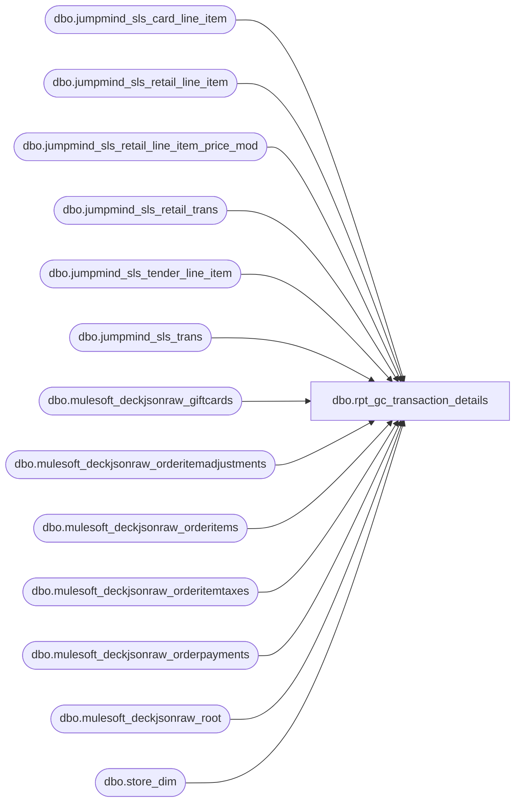

# dbo.rpt_gc_transaction_details

**Database:** DataflowsStagingLakehouse  
**Server:** 4db76rlxaxcuvmuh5kw37wbnqq-ovsykae43znuhlmnflcdwm4ohu.datawarehouse.fabric.microsoft.com  

## Architecture Diagram



## Table Dependencies

| Referenced Table |
|---|
| dbo.jumpmind_sls_card_line_item |
| dbo.jumpmind_sls_retail_line_item |
| dbo.jumpmind_sls_retail_line_item_price_mod |
| dbo.jumpmind_sls_retail_trans |
| dbo.jumpmind_sls_tender_line_item |
| dbo.jumpmind_sls_trans |
| dbo.mulesoft_deckjsonraw_giftcards |
| dbo.mulesoft_deckjsonraw_orderitemadjustments |
| dbo.mulesoft_deckjsonraw_orderitems |
| dbo.mulesoft_deckjsonraw_orderitemtaxes |
| dbo.mulesoft_deckjsonraw_orderpayments |
| dbo.mulesoft_deckjsonraw_root |
| dbo.store_dim |

## View Code

```sql
CREATE   VIEW dbo.rpt_gc_transaction_details AS WITH /* ── POS header (one row per transaction) ─────────────────────────────────── */ pos_hdr AS (     SELECT         CONCAT(t.device_id, '|', t.business_date, '|', t.sequence_number)   AS transaction_key,         TRY_CONVERT(int, LEFT(t.business_unit_id, 4))                       AS store_no,         TRY_CONVERT(int, RIGHT(t.device_id, 3))                             AS workstation_no,         t.sequence_number                                                   AS trans_no,         TRY_CONVERT(date, t.business_date, 112)                             AS business_date,         t.begin_time                                                        AS entry_datetime,         CAST(t.username       AS varchar(64))                               AS associate_no,         CAST(t.trans_type     AS varchar(64))                               AS trans_category_raw,         CAST(t.trans_status   AS varchar(32))                               AS trans_status,         TRY_CONVERT(int, t.training_mode)                                   AS training_mode,         CAST(rt.total              AS decimal(18,2))                        AS trans_total,         CAST(rt.iso_currency_code  AS varchar(8))                           AS currency_code,         CAST(rt.customer_name        AS varchar(200))                       AS customer_name,         CAST(rt.loyalty_card_number  AS varchar(100))                       AS loyalty_card_number,         CAST('POS' AS varchar(8))                                           AS source_system       FROM LH_Source.dbo.jumpmind_sls_trans              t       LEFT JOIN LH_Source.dbo.jumpmind_sls_retail_trans  rt         ON  rt.device_id       = t.device_id         AND rt.business_date   = t.business_date         AND rt.sequence_number = t.sequence_number      WHERE t.business_unit_id IS NOT NULL        AND t.create_time >= DATEADD(month, -12, SYSUTCDATETIME())        AND ISNULL(t.training_mode, 0) = 0 ), /* ── Per-transaction GC numbers (concatenated for filter use) ─────────────── */ pos_txn_gc AS (     SELECT         CONCAT(c.device_id, '|', c.business_date, '|', c.sequence_number)   AS transaction_key,         STRING_AGG(CAST(c.card_number AS varchar(32)), ',')                 AS transaction_gc_numbers       FROM LH_Source.dbo.jumpmind_sls_card_line_item c      WHERE c.type_code = 'GIFTCARD'        AND c.create_time >= DATEADD(month, -12, SYSUTCDATETIME())      GROUP BY c.device_id, c.business_date, c.sequence_number ), /* ── POS merchandise lines (sold / returned) ──────────────────────────────── */ pos_lines_merch AS (     SELECT         CONCAT(r.device_id, '|', r.business_date, '|', r.sequence_number)   AS transaction_key,         r.line_sequence_number                                              AS line_seq,         CAST(CASE WHEN r.quantity >= 0 THEN 'Merchandise sold'                   ELSE                       'Merchandise returned' END AS varchar(64)) AS object_action,         CAST(r.extended_amount             AS decimal(18,2))                AS gross,         CAST(r.extended_discounted_amount  AS decimal(18,2))                AS net,         CAST('cr' AS varchar(4))                                            AS gl_flag,         CAST(COALESCE(r.item_id, r.pos_item_id) AS varchar(64))             AS reference_no,         CAST(r.item_description AS varchar(512))                            AS attachment_summary,         CAST(r.item_id          AS varchar(64))                             AS upc,         CAST(r.quantity         AS decimal(18,4))                           AS units,         CAST(r.actual_unit_price AS decimal(18,2))                          AS sold_at_price,         TRY_CONVERT(int, ISNULL(r.voided, 0))                               AS line_voided       FROM LH_Source.dbo.jumpmind_sls_retail_line_item r      WHERE r.create_time >= DATEADD(month, -12, SYSUTCDATETIME())        AND r.item_type = 'STOCK' ), /* ── POS gift card lines (sold / cashout only) ────────────────────────────── */ -- Activation / cashout events. Redemption events are NOT emitted from this CTE -- because they double-count with the tender_line_item GIFT_CARD row that -- already covers the financial movement. Redemption labels are produced by -- pos_lines_tender below. The three observed gift_card_action_code values in -- the 12-month window are: --    'Issue'    (2.2M rows) -- activation / sold --    NULL       (1.5M rows) -- redemption (covered by tender row, skip here) --    'Cashout'  (1.1k rows) -- gift-card cashout pos_lines_gc AS (     SELECT         CONCAT(c.device_id, '|', c.business_date, '|', c.sequence_number)   AS transaction_key,         c.line_sequence_number                                              AS line_seq,         CAST(CASE                  WHEN UPPER(c.gift_card_action_code) IN ('ISSUE','ACTIVATE','RELOAD')                      THEN 'BABW Gift Card sold'                  WHEN UPPER(c.gift_card_action_code) = 'CASHOUT'                      THEN 'BABW Gift Card cashout'                  ELSE CONCAT('BABW Gift Card ', LOWER(c.gift_card_action_code))              END AS varchar(64))                                            AS object_action,         CAST(r.extended_amount             AS decimal(18,2))                AS gross,         CAST(r.extended_discounted_amount  AS decimal(18,2))                AS net,         CAST('cr' AS varchar(4))                                            AS gl_flag,         CAST(c.card_number      AS varchar(64))                             AS reference_no,         CAST(c.card_name        AS varchar(512))                            AS attachment_summary,         CAST(NULL               AS varchar(64))                             AS upc,         CAST(NULL               AS decimal(18,4))                           AS units,         CAST(NULL               AS decimal(18,2))                           AS sold_at_price,         TRY_CONVERT(int, ISNULL(r.voided, 0))                               AS line_voided       FROM LH_Source.dbo.jumpmind_sls_card_line_item c       LEFT JOIN LH_Source.dbo.jumpmind_sls_retail_line_item r         ON  r.device_id           = c.device_id         AND r.business_date       = c.business_date         AND r.sequence_number     = c.sequence_number         AND r.line_sequence_number = c.ref_line_sequence_number  -- card.line points back at retail via ref      WHERE c.create_time >= DATEADD(month, -12, SYSUTCDATETIME())        AND c.type_code = 'GIFTCARD'        AND c.gift_card_action_code IS NOT NULL          -- skip NULL = redemption (handled by tender CTE) ), /* ── POS tender lines (charged / refunded / GC redeemed) ──────────────────── */ -- For GIFT_CARD tender_type_code, the line represents a gift-card redemption: -- emit it as "BABW Gift Card redeemed" (or "refunded" for negative amount) and -- pull the actual card number from the paired card_line_item row (matched on -- ref_line_sequence_number = this tender line's line_sequence_number). -- For CREDIT_CARD / DEBIT_CARD, the same join pulls the masked PAN (e.g. -- "515527******2713") from card_line_item.masked_card_number for any tender -- type. For all other tender types, label by (tender_type_code, -- iso_currency_code) with the canonical AuditWorks brand names; reference_no -- falls back to tender_account_number where the card line is absent. pos_lines_tender AS (     SELECT         CONCAT(tl.device_id, '|', tl.business_date, '|', tl.sequence_number) AS transaction_key,         tl.line_sequence_number                                              AS line_seq,         CAST(CONCAT(                 CASE                     WHEN tl.tender_type_code IN ('GIFTCARD','GIFT_CARD')                      THEN 'BABW Gift Card'                     WHEN tl.tender_type_code = 'CASH'                                         THEN 'Cash'                     WHEN tl.tender_type_code = 'CHECK'                                        THEN 'Check'                     WHEN tl.tender_type_code = 'CREDIT_CARD' AND tl.iso_currency_code = 'GBP' THEN 'UK Credit Card'                     WHEN tl.tender_type_code = 'CREDIT_CARD' AND tl.iso_currency_code = 'EUR' THEN 'EU Credit Card'                     WHEN tl.tender_type_code = 'CREDIT_CARD' AND tl.iso_currency_code = 'CAD' THEN 'Canadian Credit Card'                     WHEN tl.tender_type_code = 'CREDIT_CARD'                                  THEN 'Credit Card'                     WHEN tl.tender_type_code = 'DEBIT_CARD'  AND tl.iso_currency_code = 'GBP' THEN 'UK Debit Card'                     WHEN tl.tender_type_code = 'DEBIT_CARD'  AND tl.iso_currency_code = 'CAD' THEN 'Canadian Debit Card'                     WHEN tl.tender_type_code = 'DEBIT_CARD'                                   THEN 'Debit Card'                     WHEN tl.tender_type_code = 'CHARGE_ACCT'                                  THEN 'BAB Charge'                     WHEN tl.tender_type_code = 'STORE_CREDIT'                                 THEN 'Store Credit'                     WHEN tl.tender_type_code = 'COUPON'                                       THEN 'Coupon Tender'                     ELSE COALESCE(tl.tender_type_code, tl.tender_code, 'Unknown Tender')                 END,                 CASE                     WHEN tl.tender_type_code IN ('GIFTCARD','GIFT_CARD') AND tl.tender_amount >= 0                                                                                               THEN ' redeemed'                     WHEN tl.tender_type_code IN ('GIFTCARD','GIFT_CARD') AND tl.tender_amount <  0                                                                                               THEN ' refunded'                     WHEN tl.tender_amount >= 0                                                THEN ' charged'                     ELSE                                                                           ' refunded'                 END             ) AS varchar(64))                                                  AS object_action,         CAST(ABS(tl.tender_amount) AS decimal(18,2))                          AS gross,         CAST(NULL                  AS decimal(18,2))                          AS net,         CAST('db' AS varchar(4))                                              AS gl_flag,         CAST(COALESCE(cgc.masked_card_number, cgc.card_number, tl.tender_account_number) AS varchar(64))  AS reference_no,         CAST(COALESCE(tl.entry_method_code, cgc.brand) AS varchar(512))       AS attachment_summary,         CAST(NULL AS varchar(64))                                             AS upc,         CAST(NULL AS decimal(18,4))                                           AS units,         CAST(NULL AS decimal(18,2))                                           AS sold_at_price,         TRY_CONVERT(int, ISNULL(tl.voided, 0))                                AS line_voided       FROM LH_Source.dbo.jumpmind_sls_tender_line_item tl       LEFT JOIN LH_Source.dbo.jumpmind_sls_card_line_item cgc         ON  cgc.device_id              = tl.device_id         AND cgc.business_date          = tl.business_date         AND cgc.sequence_number        = tl.sequence_number         AND cgc.ref_line_sequence_number = tl.line_sequence_number      WHERE tl.create_time >= DATEADD(month, -12, SYSUTCDATETIME()) ), /* ── POS tax (one row per transaction, summed) ────────────────────────────── */ pos_lines_tax AS (     SELECT         CONCAT(r.device_id, '|', r.business_date, '|', r.sequence_number)     AS transaction_key,         CAST(0 AS int)                                                        AS line_seq,         CAST(CASE                  WHEN MAX(r.iso_currency_code) IN ('GBP','EUR') THEN 'Vat Tax received'                  ELSE                                                'Sales Tax received'              END AS varchar(64))                                              AS object_action,         CAST(SUM(r.tax_amount) AS decimal(18,2))                              AS gross,         CAST(NULL AS decimal(18,2))                                           AS net,         CAST('No' AS varchar(4))                                              AS gl_flag,         CAST(NULL AS varchar(64))                                             AS reference_no,         CAST(NULL AS varchar(512))                                            AS attachment_summary,         CAST(NULL AS varchar(64))                                             AS upc,         CAST(NULL AS decimal(18,4))                                           AS units,         CAST(NULL AS decimal(18,2))                                           AS sold_at_price,         CAST(0    AS int)                                                     AS line_voided       FROM LH_Source.dbo.jumpmind_sls_retail_line_item r      WHERE r.create_time >= DATEADD(month, -12, SYSUTCDATETIME())        AND ISNULL(r.voided, 0) = 0      GROUP BY r.device_id, r.business_date, r.sequence_number     HAVING SUM(r.tax_amount) <> 0 ), /* ── POS discounts (one row per line that carries a discount) ─────────────── */ -- AuditWorks distinguishes "Item Bear Bucks Markdown deducted" (cashier-applied -- manual discount) from "Item $ Off Promotions Markdown deducted" (system- -- applied promo). The discriminator lives in -- jumpmind_sls_retail_line_item_price_mod.promotion_type: --   'MANUAL_ITEM_DISCOUNT' (or any MANUAL_* prefix) -> Bear Bucks --   anything else (BIRTHDAY, APR, LOYALTY, etc.)    -> $ Off Promotions -- Reference No comes from promotion_id; the attachment surfaces the -- promotion description (e.g. "UK - Happy 2nd Birthday"). pos_lines_discount AS (     SELECT         CONCAT(r.device_id, '|', r.business_date, '|', r.sequence_number)     AS transaction_key,         r.line_sequence_number                                                AS line_seq,         CAST(CASE                  WHEN pm.promotion_type LIKE 'MANUAL%'                                                        THEN 'Item Bear Bucks Markdown deducted'                  WHEN pm.promotion_type IS NOT NULL                                                        THEN 'Item $ Off Promotions Markdown deducted'                  WHEN r.reason_code = 'BEAR_BUCKS'     THEN 'Item Bear Bucks Markdown deducted'                  WHEN r.serialized_coupon_barcode IS NOT NULL                                                        THEN 'Item $ Off Promotions Markdown deducted'                  WHEN r.reason_code IS NOT NULL        THEN CONCAT('Item ', r.reason_code, ' Markdown deducted')                  ELSE                                       'Item Discount deducted'              END AS varchar(64))                                              AS object_action,         CAST(r.discount_amount AS decimal(18,2))                              AS gross,         CAST(NULL AS decimal(18,2))                                           AS net,         CAST('No' AS varchar(4))                                              AS gl_flag,         CAST(COALESCE(pm.promotion_id, r.serialized_coupon_barcode, r.reason_code) AS varchar(64))  AS reference_no,         CAST(COALESCE(pm.description, r.reason_code_group_id) AS varchar(512)) AS attachment_summary,         CAST(NULL AS varchar(64))                                             AS upc,         CAST(NULL AS decimal(18,4))                                           AS units,         CAST(NULL AS decimal(18,2))                                           AS sold_at_price,         TRY_CONVERT(int, ISNULL(r.voided, 0))                                 AS line_voided       FROM LH_Source.dbo.jumpmind_sls_retail_line_item r       LEFT JOIN LH_Source.dbo.jumpmind_sls_retail_line_item_price_mod pm         ON  pm.device_id            = r.device_id         AND pm.business_date        = r.business_date         AND pm.sequence_number      = r.sequence_number         AND pm.line_sequence_number = r.line_sequence_number         AND pm.price_mod_type_code  = 'ITEM'         AND ISNULL(pm.voided, 0)    = 0      WHERE r.create_time >= DATEADD(month, -12, SYSUTCDATETIME())        AND r.discount_amount IS NOT NULL        AND r.discount_amount <> 0 ), /* ── OMS header (one row per web order) ───────────────────────────────────── */ oms_hdr AS (     SELECT         CONCAT('OMS|', CAST(r.OrderID AS varchar(32)))                        AS transaction_key,         CASE WHEN r.SiteCode = 'BAB'   THEN 1013              WHEN r.SiteCode = 'BABUK' THEN 2013              ELSE 9999 END                                                    AS store_no,         CAST(52 AS int)                                                       AS workstation_no,         TRY_CONVERT(bigint, r.OrderID)                                        AS trans_no,         CAST(COALESCE(r.OrderDateUTC, r.DateCreatedUTC) AS date)              AS business_date,         r.DateCreatedUTC                                                      AS entry_datetime,         CAST(r.UserID AS varchar(64))                                         AS associate_no,         CAST('Web Sale' AS varchar(64))                                       AS trans_category_raw,         CAST('COMPLETED' AS varchar(32))                                      AS trans_status,         CAST(0 AS int)                                                        AS training_mode,         CAST(NULL AS decimal(18,2))                                           AS trans_total,         CASE WHEN r.SiteCode = 'BABUK' THEN 'GBP'              WHEN r.SiteCode = 'BAB'   THEN 'USD'              ELSE 'USD' END                                                   AS currency_code,         CAST(TRIM(CONCAT(ISNULL(r.FirstName1,''), ' ', ISNULL(r.LastName1,''))) AS varchar(200)) AS customer_name,         CAST(r.Custom3 AS varchar(100))                                       AS loyalty_card_number,         CAST('OMS' AS varchar(8))                                             AS source_system       FROM LH_Source.dbo.mulesoft_deckjsonraw_root r      WHERE r.DateCreatedUTC >= DATEADD(month, -12, SYSUTCDATETIME())        AND r.OrderID IS NOT NULL ), /* ── OMS GC numbers per order ─────────────────────────────────────────────── */ oms_txn_gc AS (     SELECT         CONCAT('OMS|', CAST(g.OrderID AS varchar(32)))                        AS transaction_key,         STRING_AGG(CAST(g.GiftCardNumber AS varchar(32)), ',')                AS transaction_gc_numbers       FROM LH_Source.dbo.mulesoft_deckjsonraw_giftcards g      WHERE g.GiftCardNumber IS NOT NULL      GROUP BY g.OrderID ), /* ── OMS merchandise lines ────────────────────────────────────────────────── */ oms_lines_merch AS (     SELECT         CONCAT('OMS|', CAST(oi.OrderID AS varchar(32)))                       AS transaction_key,         TRY_CONVERT(int, oi._RowIndex)                                        AS line_seq,         CAST('Merchandise sold' AS varchar(64))                               AS object_action,         CAST(oi.GrossPrice AS decimal(18,2))                                  AS gross,         CAST(oi.NetPrice   AS decimal(18,2))                                  AS net,         CAST('cr' AS varchar(4))                                              AS gl_flag,         CAST(COALESCE(oi.DeckSKU, oi.GTIN, oi.ExternalItemID) AS varchar(64)) AS reference_no,         CAST(oi.Custom1 AS varchar(512))                                      AS attachment_summary,         CAST(oi.DeckSKU AS varchar(64))                                       AS upc,         CAST(1.0 AS decimal(18,4))                                            AS units,         CAST(oi.GrossPrice AS decimal(18,2))                                  AS sold_at_price,         CAST(0 AS int)                                                        AS line_voided       FROM LH_Source.dbo.mulesoft_deckjsonraw_orderitems oi      WHERE oi.Custom1 <> 'Activate - Gift Card'         OR oi.Custom1 IS NULL ), /* ── OMS gift card lines ──────────────────────────────────────────────────── */ oms_lines_gc AS (     SELECT         CONCAT('OMS|', CAST(g.OrderID AS varchar(32)))                        AS transaction_key,         TRY_CONVERT(int, g._RowIndex)                                         AS line_seq,         CAST('BABW Gift Card sold' AS varchar(64))                            AS object_action,         CAST(g.TotalGrossTotal AS decimal(18,2))                              AS gross,         CAST(g.TotalNetTotal   AS decimal(18,2))                              AS net,         CAST('cr' AS varchar(4))                                              AS gl_flag,         CAST(g.GiftCardNumber AS varchar(64))                                 AS reference_no,         CAST(g.Message        AS varchar(512))                                AS attachment_summary,         CAST(NULL AS varchar(64))                                             AS upc,         CAST(NULL AS decimal(18,4))                                           AS units,         CAST(NULL AS decimal(18,2))                                           AS sold_at_price,         CAST(0    AS int)                                                     AS line_voided       FROM LH_Source.dbo.mulesoft_deckjsonraw_giftcards g      WHERE g.GiftCardNumber IS NOT NULL ), /* ── OMS tender lines ─────────────────────────────────────────────────────── */ oms_lines_tender AS (     SELECT         CONCAT('OMS|', CAST(op.OrderID AS varchar(32)))                       AS transaction_key,         TRY_CONVERT(int, op._RowIndex)                                        AS line_seq,         CAST(CASE                  WHEN op.PaymentProcessor LIKE '%Adyen%PayPal%' THEN 'Pay Pal charged'                  WHEN op.PaymentProcessor LIKE '%Klarna%'       THEN 'Klarna Receivable charged'                  WHEN op.PaymentProcessor LIKE '%Adyen%'        AND op.CardType IS NOT NULL                                                                 THEN CONCAT('Adyen ', op.CardType, ' charged')                  WHEN op.PaymentProcessor LIKE '%Gift%'         THEN 'BABW Gift Card Tender charged'                  WHEN op.CardType IS NOT NULL                   THEN CONCAT(op.CardType, ' charged')                  ELSE 'Web Tender charged'              END AS varchar(64))                                              AS object_action,         CAST(ABS(COALESCE(op.CapturedAmount, op.AuthorizedAmount, 0)) AS decimal(18,2)) AS gross,         CAST(NULL AS decimal(18,2))                                           AS net,         CAST('db' AS varchar(4))                                              AS gl_flag,         CAST(op.CardNumber AS varchar(64))                                    AS reference_no,         CAST(op.PaymentProcessor AS varchar(512))                             AS attachment_summary,         CAST(NULL AS varchar(64))                                             AS upc,         CAST(NULL AS decimal(18,4))                                           AS units,         CAST(NULL AS decimal(18,2))                                           AS sold_at_price,         CAST(0    AS int)                                                     AS line_voided       FROM LH_Source.dbo.mulesoft_deckjsonraw_orderpayments op      WHERE COALESCE(op.CapturedAmount, op.AuthorizedAmount, 0) <> 0 ), /* ── OMS tax (one row per order, summed) ──────────────────────────────────── */ oms_lines_tax AS (     SELECT         CONCAT('OMS|', CAST(oi.OrderID AS varchar(32)))                       AS transaction_key,         CAST(0 AS int)                                                        AS line_seq,         CAST(CASE WHEN MAX(CAST(oit.IsVAT AS int)) = 1                   THEN 'Vat Tax received'                   ELSE 'Sales Tax received' END AS varchar(64))               AS object_action,         CAST(SUM(oit.Amount) AS decimal(18,2))                                AS gross,         CAST(NULL AS decimal(18,2))                                           AS net,         CAST('No' AS varchar(4))                                              AS gl_flag,         CAST(NULL AS varchar(64))                                             AS reference_no,         CAST(NULL AS varchar(512))                                            AS attachment_summary,         CAST(NULL AS varchar(64))                                             AS upc,         CAST(NULL AS decimal(18,4))                                           AS units,         CAST(NULL AS decimal(18,2))                                           AS sold_at_price,         CAST(0    AS int)                                                     AS line_voided       FROM LH_Source.dbo.mulesoft_deckjsonraw_orderitemtaxes oit       JOIN LH_Source.dbo.mulesoft_deckjsonraw_orderitems oi         ON oi._ParentKeyField = oit._ParentKeyField      GROUP BY oi.OrderID     HAVING SUM(oit.Amount) <> 0 ), /* ── OMS discounts ────────────────────────────────────────────────────────── */ oms_lines_discount AS (     SELECT         CONCAT('OMS|', CAST(oi.OrderID AS varchar(32)))                       AS transaction_key,         TRY_CONVERT(int, oia._RowIndex)                                       AS line_seq,         CAST(CASE                  WHEN oia.AdjustmentClassificationText LIKE '%Promotion%'                      THEN 'Item $ Off Promotions Markdown deducted'                  WHEN oia.AdjustmentClassificationText LIKE '%Bear%'                      THEN 'Item Bear Bucks Markdown deducted'                  WHEN oia.AdjustmentClassificationText IS NOT NULL                      THEN CONCAT('Item ', oia.AdjustmentClassificationText, ' Markdown deducted')                  ELSE 'Item Discount deducted'              END AS varchar(64))                                              AS object_action,         CAST(ABS(oia.GrossPrice - oia.NetPrice) AS decimal(18,2))             AS gross,         CAST(NULL AS decimal(18,2))                                           AS net,         CAST('No' AS varchar(4))                                              AS gl_flag,         CAST(COALESCE(oia.CouponCode, oia.PromotionID, oia.DiscountText) AS varchar(64))  AS reference_no,         CAST(oia.DiscountText AS varchar(512))                                AS attachment_summary,         CAST(NULL AS varchar(64))                                             AS upc,         CAST(NULL AS decimal(18,4))                                           AS units,         CAST(NULL AS decimal(18,2))                                           AS sold_at_price,         CAST(0    AS int)                                                     AS line_voided       FROM LH_Source.dbo.mulesoft_deckjsonraw_orderitemadjustments oia       JOIN LH_Source.dbo.mulesoft_deckjsonraw_orderitems oi         ON oi._ParentKeyField = oia._ParentKeyField      WHERE (oia.GrossPrice - oia.NetPrice) <> 0 ), /* ── Union all lines ──────────────────────────────────────────────────────── */ all_lines AS (     SELECT * FROM pos_lines_merch     UNION ALL     SELECT * FROM pos_lines_gc     UNION ALL     SELECT * FROM pos_lines_tender     UNION ALL     SELECT * FROM pos_lines_tax     UNION ALL     SELECT * FROM pos_lines_discount     UNION ALL     SELECT * FROM oms_lines_merch     UNION ALL     SELECT * FROM oms_lines_gc     UNION ALL     SELECT * FROM oms_lines_tender     UNION ALL     SELECT * FROM oms_lines_tax     UNION ALL     SELECT * FROM oms_lines_discount ), /* ── Header union ─────────────────────────────────────────────────────────── */ all_hdr AS (     SELECT * FROM pos_hdr     UNION ALL     SELECT * FROM oms_hdr ), all_txn_gc AS (     SELECT * FROM pos_txn_gc     UNION ALL     SELECT * FROM oms_txn_gc ) SELECT     h.source_system                          AS [Source System],     h.store_no                                AS [Store No],     s.store_name                              AS [Store Name],     h.currency_code                           AS [Currency],     h.workstation_no                          AS [Workstation No],     CAST(NULL AS int)                         AS [Tray No],     h.trans_no                                AS [Trans No],     h.business_date                           AS [Business Date],     h.entry_datetime                          AS [Entry DateTime],     h.associate_no                            AS [Associate No],     CASE WHEN h.trans_status = 'COMPLETED' AND COALESCE(l.line_voided, 0) = 0 THEN 'Valid'          WHEN COALESCE(l.line_voided, 0) = 1                                  THEN 'Voided'          WHEN h.trans_status IS NULL                                          THEN 'Unknown'          ELSE h.trans_status END               AS [Void Status],     CAST(h.trans_category_raw AS varchar(64)) AS [Trans Category],     h.trans_total                             AS [Total],     l.line_seq                                AS [Line Seq],     l.object_action                           AS [Object Action],     l.gross                                   AS [Gross],     l.net                                     AS [Net],     l.gl_flag                                 AS [GL],     l.reference_no                            AS [Reference No],     l.attachment_summary                      AS [Attachment],     l.upc                                     AS [UPC],     l.units                                   AS [Units],     l.sold_at_price                           AS [Sold At Price],     g.transaction_gc_numbers                  AS [Transaction GC Numbers],     h.customer_name                           AS [Customer Name],     h.loyalty_card_number                     AS [Loyalty Card Number],     h.transaction_key                         AS [Transaction Key]   FROM all_hdr     h   JOIN all_lines   l ON l.transaction_key = h.transaction_key   LEFT JOIN all_txn_gc g ON g.transaction_key = h.transaction_key   LEFT JOIN LH_Mart.dbo.store_dim s ON s.store_id = h.store_no;
```

