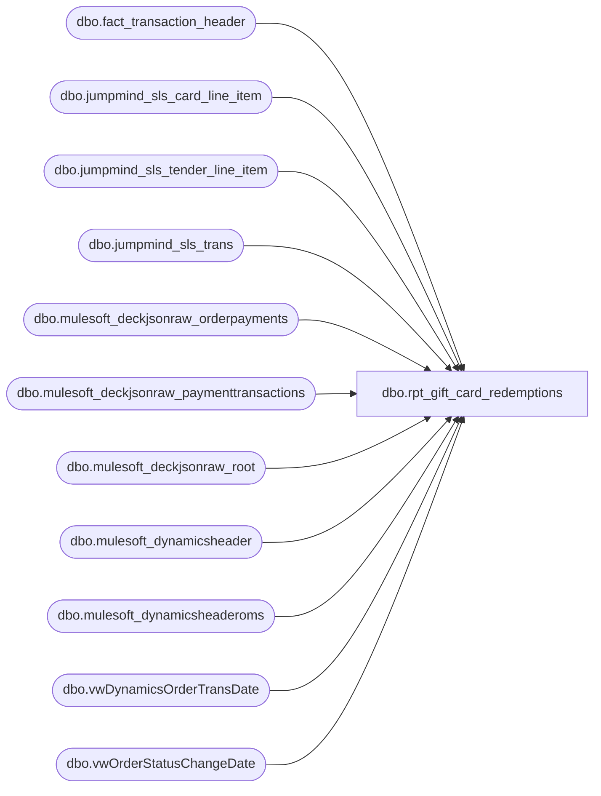

# dbo.rpt_gift_card_redemptions

**Database:** DataflowsStagingLakehouse  
**Server:** 4db76rlxaxcuvmuh5kw37wbnqq-ovsykae43znuhlmnflcdwm4ohu.datawarehouse.fabric.microsoft.com  

## Architecture Diagram



## Table Dependencies

| Referenced Table |
|---|
| dbo.fact_transaction_header |
| dbo.jumpmind_sls_card_line_item |
| dbo.jumpmind_sls_tender_line_item |
| dbo.jumpmind_sls_trans |
| dbo.mulesoft_deckjsonraw_orderpayments |
| dbo.mulesoft_deckjsonraw_paymenttransactions |
| dbo.mulesoft_deckjsonraw_root |
| dbo.mulesoft_dynamicsheader |
| dbo.mulesoft_dynamicsheaderoms |
| dbo.vwDynamicsOrderTransDate |
| dbo.vwOrderStatusChangeDate |

## View Code

```sql
/* =============================================================================    rpt_gift_card_redemptions.sql: Gift Card Redemptions Report    =============================================================================    Domain:        Reconciliation (Sales Audit)    Audience:      Accounting / Sales Audit team    Consumer:      Power BI dashboard "Finance, Gift Card Activity, Ad Hoc"    Status:        LH_Source-native (LH_Mart removed 2026-06-15).     PURPOSE      Surface every accounting transaction that tendered a non-zero amount      against a gift card (in-store POS, customer-service registers, and web /      OMS checkout). Lets Sales Audit reconcile against the daily gift-card      processor settlement extract.     LH_MART REMOVAL (2026-06-15)      The report previously sourced its universe and amount from      LH_Mart.dbo.transaction_facts.redemption_amount (an AW-precomputed      field) plus per-card detail from LH_Mart.dbo.queries_giftcards_redeemed,      with store_dim / time_dim lookups. All four LH_Mart objects are removed.       The redemption universe is now built directly from the same LH_Source      feeds the blueprint LH_Data_Summed_by_GL uses to derive GL 205010      (Gift Card Liability) on the tender side:         POS branch  -> LH_Source.dbo.jumpmind_sls_tender_line_item where                       tender_code = 'GIFTCARD' (blueprint `payments` CTE),                       joined to jumpmind_sls_trans (trans_type IN                       ('SALE','RETURN','REDEEM'), trans_status='COMPLETED')                       and bridged to fact_transaction_header for the AW                       operational identity (store/register/txn/cashier/                       entry time). Per-card barcode from                       jumpmind_sls_card_line_item. Validated 2026-03-11:                       blueprint POS GIFTCARD = $32,387.87.         OMS branch  -> LH_Source deck Adyen gift-card payments (blueprint                       `omsPayments` CTE: PaymentSubType='Adyen_GiftCard',                       PaymentTransactionTypeId IN (10,11,13), OrderStatus                       IN (6,10), ECommOrderType <> 'Webstore', Shipped=1).                       This is the web GC-redemption portion that the AW                       redemption_amount also carried (~$4.5K of the                       2026-03-11 -$37,014.58 total; the remainder is the                       POS branch above).     GRAIN      One row per (store, transaction date, transaction number, register,      redeemed gift card). A transaction redeeming multiple cards emits one      row per card (POS). OMS rows are one row per Adyen gift-card payment      leg; the OMS payment feed carries no per-card barcode so      [Reference Number] is NULL on OMS rows.     SIGN CONVENTION      redemption_amount is emitted negative when the customer paid with a      gift card and positive when refunded back to a gift card, matching the      legacy report. The blueprint books the tender as a positive Debit to      205010; this view multiplies by -1 to restore the report convention.     DATA GAPS (post-migration)      G1. OMS [Reference Number] is NULL: the deck Adyen payment feed has no          per-card gift-card number. (POS rows carry the barcode from          jumpmind_sls_card_line_item.)      G2. OMS [Cashier Number] / [Entry Time] are NULL: the web/OMS order          feed has no operational cashier or rung-up time.      G3. [Transaction Number] is now varchar: POS rows carry the JumpMind          sequence number; OMS rows carry the web OrderNumber ('W'/'U').          The legacy AW synthetic web transaction number is not in LH_Source.      G4. Line Object Code is hardcoded 633 (Bear Bucks tender). The          JumpMind->Fabric ETL collapses the 633/624 distinction (F-019);          Linda's "Gross Gift Card" (624) column reconciles to 0. Structural          data-shape gap, not a reporting bug.      G5. Date basis: POS uses fact_transaction_header.transaction_date          (create_time derived); OMS uses OrderDateUTC (US) / TransactionDate          (intl). Small boundary-day shifts vs the legacy AW posting date          (same residual class as rpt_gaap_flash_sales).     UPSTREAM SOURCES (LH_Source only)      - dbo.jumpmind_sls_tender_line_item     (POS GC tender legs)      - dbo.jumpmind_sls_trans                (POS trans type/status)      - dbo.jumpmind_sls_card_line_item       (per-card barcode)      - dbo.fact_transaction_header           (AW-equiv operational identity)      - dbo.mulesoft_deckjsonraw_root / _paymenttransactions / _orderpayments                                              (OMS Adyen gift-card payments)      - dbo.vwDynamicsOrderTransDate / vwOrderStatusChangeDate                                              (OMS ECommOrderType/Shipped/date)      - dbo.mulesoft_dynamicsheader / _dynamicsheaderoms                                              (D365 Transaction Key / ID)    ============================================================================= */  CREATE   VIEW dbo.rpt_gift_card_redemptions AS WITH /* POS gift-card redemptions, one row per (transaction, redeemed card).    tender_code='GIFTCARD' per the blueprint `payments` CTE; redemption_amount    = -1 * tender_amount (report sign convention). */ gc_pos AS (     SELECT         CASE WHEN h.store_no < 1000 THEN h.store_no + 1000 ELSE h.store_no END AS store_no,         CAST(h.register_no AS varchar(50))                       AS register_no,         CAST(h.transaction_no AS varchar(50))                    AS transaction_no,         h.transaction_date                                       AS transaction_date,         TRY_CONVERT(int, h.cashier_no)                           AS cashier_no,         CONVERT(char(8), h.entry_date_time, 108)                 AS entry_time_str,         CONVERT(varchar(64), scli.card_number)                   AS giftcard_no,         CAST(-1 * tli.tender_amount AS decimal(18,2))            AS redemption_amount,         CAST(NULL AS varchar(40))                                AS web_order_number       FROM LH_Source.dbo.jumpmind_sls_tender_line_item tli       JOIN LH_Source.dbo.jumpmind_sls_trans t         ON  t.device_id       = tli.device_id         AND t.business_date   = tli.business_date         AND t.sequence_number = tli.sequence_number       JOIN LH_Source.dbo.fact_transaction_header h         ON  h.transaction_id  = CONCAT(tli.device_id, '|', tli.business_date, '|', tli.sequence_number)       LEFT JOIN LH_Source.dbo.jumpmind_sls_card_line_item scli         ON  scli.device_id                = tli.device_id         AND scli.business_date            = tli.business_date         AND scli.sequence_number          = tli.sequence_number         AND scli.ref_line_sequence_number = tli.line_sequence_number      WHERE tli.tender_code = 'GIFTCARD'        AND ISNULL(tli.voided, 0) = 0        AND t.trans_type IN ('SALE','RETURN','REDEEM')        AND t.trans_status = 'COMPLETED'        AND ISNULL(h.transaction_void_flag, 0) = 0 ), /* OMS / web gift-card redemptions (Adyen gift-card payment legs), per the    blueprint `omsPayments` CTE. No per-card barcode on the OMS feed -> NULL    [Reference Number]. Amount: type 11 is a reversal (negated by blueprint);    the report convention negates the blueprint Debit so a gift-card payment    reads negative. */ gc_oms AS (     SELECT         CASE WHEN r.SiteCode = 'BABUK' THEN 2013 ELSE 1013 END   AS store_no,         CAST(CASE WHEN r.SiteCode = 'BABUK' THEN 2 ELSE 4 END AS varchar(50)) AS register_no,         CAST(r.OrderNumber AS varchar(50))                       AS transaction_no,         CASE WHEN r.SiteCode = 'BAB' THEN CAST(r.OrderDateUTC AS date)              ELSE COALESCE(CAST(v.TransactionDate AS date),                            CAST(v2.minTransactionDateTime AS date)) END AS transaction_date,         CAST(NULL AS int)                                        AS cashier_no,         CAST(NULL AS char(8))                                    AS entry_time_str,         CAST(NULL AS varchar(64))                                AS giftcard_no,         CAST(-1 * (CASE WHEN pt.PaymentTransactionTypeId = 11 THEN pt.Amount * -1 ELSE pt.Amount END)              AS decimal(18,2))                                   AS redemption_amount,         CAST(r.OrderNumber AS varchar(40))                       AS web_order_number       FROM LH_Source.dbo.mulesoft_deckjsonraw_root r       JOIN LH_Source.dbo.mulesoft_deckjsonraw_paymenttransactions pt         ON pt._ParentKeyField = r.OrderID       JOIN LH_Source.dbo.mulesoft_deckjsonraw_orderpayments op         ON op._ParentKeyField = pt._ParentKeyField AND op.ID = pt.OrderPaymentId       JOIN LH_Source.dbo.vwDynamicsOrderTransDate v  ON v.OrderNumber  = r.OrderNumber       JOIN LH_Source.dbo.vwOrderStatusChangeDate  v2 ON v2.OrderNumber = r.OrderNumber      WHERE op.PaymentSubType = 'Adyen_GiftCard'        AND pt.PaymentTransactionTypeId IN (10, 11, 13)        AND r.OrderStatus IN (6, 10)        AND v.ECommOrderType NOT IN ('Webstore')        AND v.Shipped = 1 ), gc_all AS (     SELECT store_no, register_no, transaction_no, transaction_date,            cashier_no, entry_time_str, giftcard_no, redemption_amount, web_order_number       FROM gc_pos     UNION ALL     SELECT store_no, register_no, transaction_no, transaction_date,            cashier_no, entry_time_str, giftcard_no, redemption_amount, web_order_number       FROM gc_oms ), /* D365 POS header, de-duplicated to one row per (store, receipt, date) for    the trailing [Transaction Key] / [Transaction ID] columns. 1:1 per    transaction -> shared across per-card rows, no fan. */ d365_pos_header AS (     SELECT CAST(InventLocationId AS varchar(10))      AS store_no_txt,            CAST(RetailReceiptId  AS varchar(20))      AS receipt_txt,            TransDate                                  AS trans_date,            MAX(CAST(TransactionKey      AS varchar(80))) AS transaction_key,            MAX(CAST(RetailTransactionId AS varchar(64))) AS transaction_id       FROM LH_Source.dbo.mulesoft_dynamicsheader      GROUP BY CAST(InventLocationId AS varchar(10)),               CAST(RetailReceiptId AS varchar(20)),               TransDate ), /* D365 OMS header for web rows, keyed on RetailReceiptId = bare web order    number. De-duplicated -> 1:1. */ d365_oms_header AS (     SELECT RetailReceiptId,            MAX(CAST(RetailTransactionId AS varchar(64))) AS transaction_id,            MAX(CAST(TransactionKey      AS varchar(80))) AS transaction_key       FROM LH_Source.dbo.mulesoft_dynamicsheaderoms      WHERE RetailReceiptId IS NOT NULL AND RetailReceiptId <> ''      GROUP BY RetailReceiptId ) SELECT     g.store_no                                                     AS [Store Number],     g.register_no                                                  AS [Register Number],     CAST(g.transaction_date AS date)                               AS [Transaction Date],     g.transaction_no                                               AS [Transaction Number],     g.cashier_no                                                   AS [Cashier Number],     g.giftcard_no                                                  AS [Reference Number],     g.entry_time_str                                               AS [Entry Time],     CAST(0 AS int)                                                 AS [Quantity],     g.redemption_amount                                            AS [Redemption Amount (Native Currency)],     CAST(0 AS decimal(18,2))                                       AS [Reserved],     g.redemption_amount                                            AS [Net Redemption Amount (Native Currency)],     CAST(0 AS decimal(18,2))                                       AS [Reserved 2],     CAST(0 AS decimal(18,2))                                       AS [Reserved 3],     CAST(633 AS int)                                               AS [Line Object Code],     CAST(COALESCE(dhp.transaction_key, doh.transaction_key) AS varchar(80))                                                                    AS [Transaction Key],     CAST(COALESCE(dhp.transaction_id, doh.transaction_id) AS varchar(64))                                                                    AS [Transaction ID]   FROM gc_all g   LEFT JOIN d365_pos_header dhp          ON dhp.store_no_txt = CAST(g.store_no AS varchar(10))         AND dhp.receipt_txt  = CAST(g.transaction_no AS varchar(20))         AND dhp.trans_date   = CAST(g.transaction_date AS date)   LEFT JOIN d365_oms_header doh          ON doh.RetailReceiptId = CASE                 WHEN g.web_order_number LIKE '%[_]%'                   THEN LEFT(g.web_order_number,                             LEN(g.web_order_number)                             - CHARINDEX('_', REVERSE(g.web_order_number)))                 ELSE g.web_order_number              END         AND g.web_order_number IS NOT NULL         AND g.web_order_number <> '';
```

