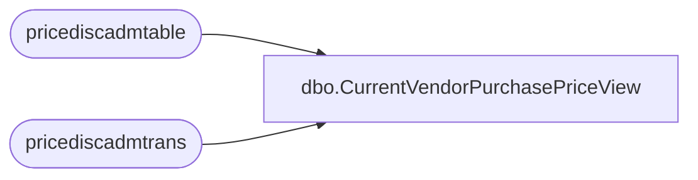

# dbo.CurrentVendorPurchasePriceView

**Database:** LH_D365  
**Server:** 4db76rlxaxcuvmuh5kw37wbnqq-ovsykae43znuhlmnflcdwm4ohu.datawarehouse.fabric.microsoft.com  

## Architecture Diagram



## Table Dependencies

| Referenced Table |
|---|
| pricediscadmtable |
| pricediscadmtrans |

## View Code

```sql
CREATE   VIEW [dbo].[CurrentVendorPurchasePriceView] AS WITH JurisdictionMapping AS (     SELECT         jurisdiction_code,         LegalEntity     FROM     (         VALUES             ('US', '1100'),             ('US', '1200'),             --('US', '1700'), -- removing US 1700 b/c it's not needed             ('CA', '1700'),             ('UK', '2110'),             ('IE', '2110'), -- The IN ('UK', 'IE') becomes two separate rows             ('CN', '3001')     ) AS v (jurisdiction_code, LegalEntity) ) SELECT DISTINCT     CONCAT(PAD.itemrelation,PAD.dataareaid,JM.jurisdiction_code) as product_key,      PAD.accountrelation AS VendorAccount,     PAD.itemrelation AS ItemId,     PAD.amount AS PurchasePrice,     PAD.currency,     PAD.unitid,     PAD.fromdate,     PAD.todate,     PAD.recid AS TradeLineRecId,     PAD.dataareaid --,     --i.inventlocationid AS InventLocationId,     --i.inventlocationid + '-' + i.dataareaid AS LocationKey FROM     pricediscadmtrans AS PAD     INNER JOIN pricediscadmtable AS PDT         ON PAD.journalnum = PDT.journalnum     INNER JOIN     (         SELECT --TOP 1             PAD.accountrelation,             PAD.itemrelation,             PAD.dataareaid,             MAX(PAD.fromdate) AS LatestFromDate,             MAX(PAD.recid) AS LatestRecId         FROM             pricediscadmtrans AS PAD             JOIN pricediscadmtable AS PDT                 ON PAD.journalnum = PDT.journalnum         WHERE             PDT.defaultrelation = 0 -- Purchase price             AND GETDATE() BETWEEN ISNULL(PAD.fromdate, '1900-01-01') AND ISNULL(PAD.todate, '2154-12-20')             --AND PAD.itemrelation LIKE '421648%'  -- Filter for specific ItemId pattern 			--AND PAD.itemrelation LIKE '132419%' 			--AND PAD.dataareaid = '1100'         GROUP BY             PAD.accountrelation,             PAD.itemrelation,             PAD.dataareaid 		--ORDER BY 		--	MAX(PAD.fromdate)     ) AS Latest         ON          Latest.LatestRecId = PAD.recid         AND PAD.accountrelation = Latest.accountrelation          AND PAD.itemrelation = Latest.itemrelation          AND PAD.fromdate = Latest.LatestFromDate 	LEFT JOIN JurisdictionMapping AS JM 		ON PAD.dataareaid = JM.LegalEntity          --Nauman - Please don't uncomment below joins without consulting me     -- LEFT JOIN vendtable v     --     ON PAD.module = 2 AND PAD.accountcode = 0      --     AND PAD.accountrelation = v.accountnum      --     AND PAD.dataareaid = v.dataareaid     -- LEFT JOIN inventlocation i     --     ON v.inventlocation = i.inventlocationid      --     AND v.dataareaid = i.dataareaid      WHERE     PDT.defaultrelation = 0 -- Purchase price only     AND PDT.posted = 1     --AND pd.style_code like '421648%'
```

