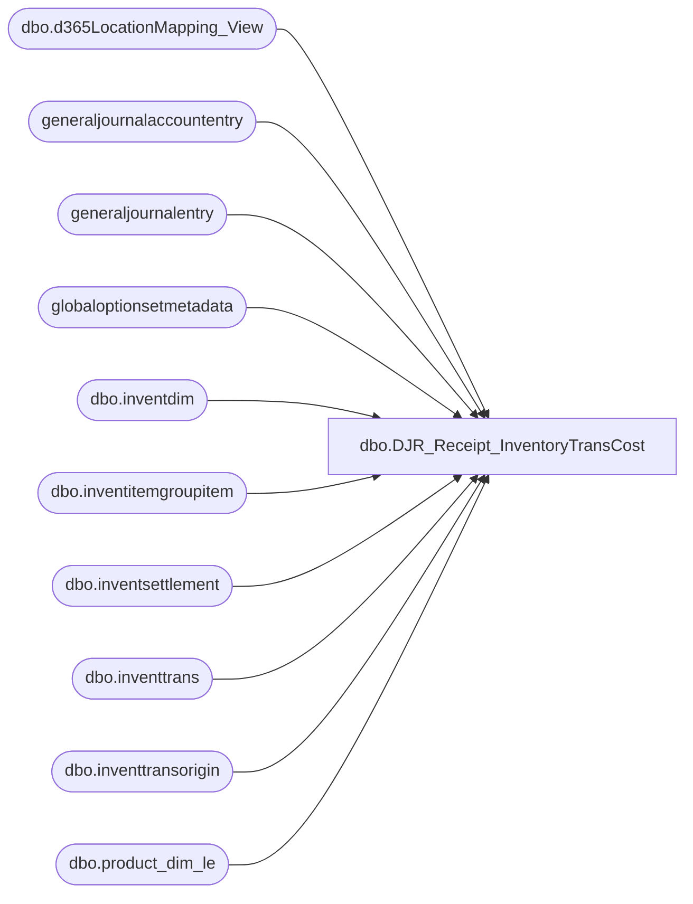

# dbo.DJR_Receipt_InventoryTransCost

**Database:** LH_D365  
**Server:** 4db76rlxaxcuvmuh5kw37wbnqq-ovsykae43znuhlmnflcdwm4ohu.datawarehouse.fabric.microsoft.com  

## Architecture Diagram



## Table Dependencies

| Referenced Table |
|---|
| dbo.d365LocationMapping_View |
| generaljournalaccountentry |
| generaljournalentry |
| globaloptionsetmetadata |
| dbo.inventdim |
| dbo.inventitemgroupitem |
| dbo.inventsettlement |
| dbo.inventtrans |
| dbo.inventtransorigin |
| dbo.product_dim_le |

## View Code

```sql
CREATE   VIEW [dbo].[DJR_Receipt_InventoryTransCost] AS WITH IPR_Cost_of_purchased_materials_received AS      (              select distinct                      gje.subledgervoucher          ,                      gje.accountingdate            ,                      gje.documentdate              ,                      gje.subledgervoucherdataareaid              from                      generaljournalentry gje              join                      generaljournalaccountentry gjae              on                      gjae.generaljournalentry = gje.recid              where                      gje.subledgervoucher like 'IPRR%'              and     gjae.postingtype     = 82              and     gjae.IsDelete is null              and     gje.IsDelete is null              and     (                              gjae.ledgeraccount    LIKE '100500%'                              OR gjae.ledgeraccount LIKE '100530%'                              OR gjae.ledgeraccount LIKE '100531%') 				--and     gje.subledgervoucher in ( 				--'IPRR000051500', 				--'IPRR000051534' , 				--'IPRR000042926', 				--'IPRR000042923', 				--'IPRR000042945', 				--'IPRR000042948', 				--'IPRR000042882', 				--'IPRR000042883', 				--'IPRR000042907', 				--'IPRR000042900', 				--'IPRR000045491', 				--'IPRR000051467', 				--'IPRR000051182', 				--'IPRR000047859', 				--'IPRR000047588', 				--'IPRR000045188', 				--'IPRR000051825', 				--'IPRR000051869', 				--'IPRR000051929', 				--'IPRR000052290', 				--'IPRR000052251' 			--			   )      ) ,      InvSettlements AS      (              SELECT                      [balancesheetposting]                                                 ,                      GOSM_balanceSheetPosting.LocalizedLabel AS [balancesheetposting_label],                      [operationsposting]                                                   ,                      GOSM_operationsposting.LocalizedLabel AS [operationsposting_label]    ,                      [settlemodel]                                                         ,                      GOSM_settlemodel.LocalizedLabel AS [settlemodel_label]                ,                      [voucher]                                                             ,                      [dataareaid]                                                          ,                      [itemid]                                                              ,                      SUM([costamountadjustment]) AS [costamountadjustment]              FROM                      [dbo].[inventsettlement] AS ism              LEFT JOIN                      globaloptionsetmetadata AS GOSM_balanceSheetPosting              ON                      ism.balancesheetposting                = GOSM_balanceSheetPosting.[Option]              AND     GOSM_balanceSheetPosting.EntityName    = 'inventsettlement'              AND     GOSM_balanceSheetPosting.OptionSetName = 'balancesheetposting'              LEFT JOIN                      globaloptionsetmetadata AS GOSM_operationsposting              ON                      ism.[operationsposting]              = GOSM_operationsposting.[Option]              AND     GOSM_operationsposting.EntityName    = 'inventsettlement'              AND     GOSM_operationsposting.OptionSetName = 'operationsposting'              LEFT JOIN                      globaloptionsetmetadata AS GOSM_settlemodel              ON                      ism.[settlemodel]              = GOSM_settlemodel.[Option]              AND     GOSM_settlemodel.EntityName    = 'inventsettlement'              AND     GOSM_settlemodel.OptionSetName = 'settlemodel'              WHERE                      ism.IsDelete IS NULL  					 GROUP BY [balancesheetposting]                                                 ,                      GOSM_balanceSheetPosting.LocalizedLabel,                      [operationsposting]                                                   ,                      GOSM_operationsposting.LocalizedLabel    ,                      [settlemodel]                                                         ,                      GOSM_settlemodel.LocalizedLabel                ,                      [voucher]                                                             ,                      [dataareaid]                                                          ,                      [itemid]                 					 )  					  					 ,      selectedItemGroups AS      (              SELECT                      [itemdataareaid] ,                      [itemid]         ,                      [itemgroupid]              FROM                      [dbo].[inventitemgroupitem]              WHERE                      itemgroupid NOT IN ('COMPEQUIPT' ,                                          'R&D')              AND     IsDelete IS NULL ) 			 ,      report AS      (              SELECT                      pd.product_key                                             ,                      locationMapping.LocationKey                                ,                      it.packingslipid             AS [Inventory Document Number],                      it.voucherphysical           AS [Voucher]                  ,                      it.datefinancial             AS [Accounting Date]          ,                      it.datephysical              AS [Document Date]            ,                      SUM(it.costamountadjustment) AS costamountadjustment       ,                      SUM(it.costamountphysical)   AS costamountphysical         ,                      SUM(it.costamountposted)     AS costamountposted           ,                      id.inventlocationid AS [Location Code]                     ,                      it.itemid           AS [Style]                             ,                      it.dataareaid       AS [Legal Entity]                      ,                      ito.referenceid     AS [PO Number]                         ,                      sIG.itemgroupid                                 FROM                      dbo.inventtrans AS it              LEFT JOIN                      dbo.inventdim AS id              ON                      id.inventdimid = it.inventdimid              AND     id.dataareaid  = it.dataareaid              LEFT JOIN                      dbo.inventtransorigin AS ito              ON                      it.inventtransorigin = ito.recid              AND     ito.dataareaid       = it.dataareaid              LEFT JOIN                      dbo.d365LocationMapping_View AS locationMapping              ON                      id.inventlocationid         = locationMapping.inventlocationid              AND     locationMapping.legalentity = it.dataareaid              LEFT JOIN                      LH_D365.dbo.product_dim_le AS pd              ON                      pd.style_code        = it.itemid              AND     pd.jurisdiction_code = locationMapping.JurisidictionCode              AND     it.dataareaid        = pd.LegalEntity              INNER JOIN                      IPR_Cost_of_purchased_materials_received AS IPR              ON                      it.voucherphysical = IPR.subledgervoucher              AND     it.dataareaid      = IPR.subledgervoucherdataareaid              INNER JOIN                      selectedItemGroups AS sIG              ON                      it.itemid     = sIG.itemid              AND     it.dataareaid = sIG.itemdataareaid              WHERE                      it.IsDelete IS NULL              AND     ito.IsDelete IS NULL              AND     id.IsDelete IS NULL              group by                      pd.product_key              ,                      locationMapping.LocationKey ,                      it.packingslipid            ,                      it.voucherphysical          ,                      it.datefinancial            ,                      it.datephysical             ,                      id.inventlocationid         ,                      it.itemid                   ,                      it.dataareaid               ,                      ito.referenceid             ,                      sIG.itemgroupid 					 ) SELECT         report.[product_key]               ,         report.[LocationKey]               ,         report.[Inventory Document Number] ,         report.[Voucher]                   ,         report.[Accounting Date]           ,         report.[Document Date]             ,         CASE         WHEN                 ISM.settlemodel                   = 7                 AND report.[costamountadjustment] = 0         THEN                 COALESCE(report.costamountphysical, 0)         ELSE                 COALESCE(report.costamountphysical, 0) + COALESCE(ISM.[costamountadjustment], 0)         END AS [Inventory Trans Cost] ,         report.[Location Code]        ,         report.[Style]                ,         report.[Legal Entity]         ,         report.[PO Number] FROM         report LEFT JOIN         InvSettlements AS ISM ON         ISM.dataareaid = report.[Legal Entity] AND     ISM.voucher    = report.Voucher AND     ISM.itemid     = report.Style
```

