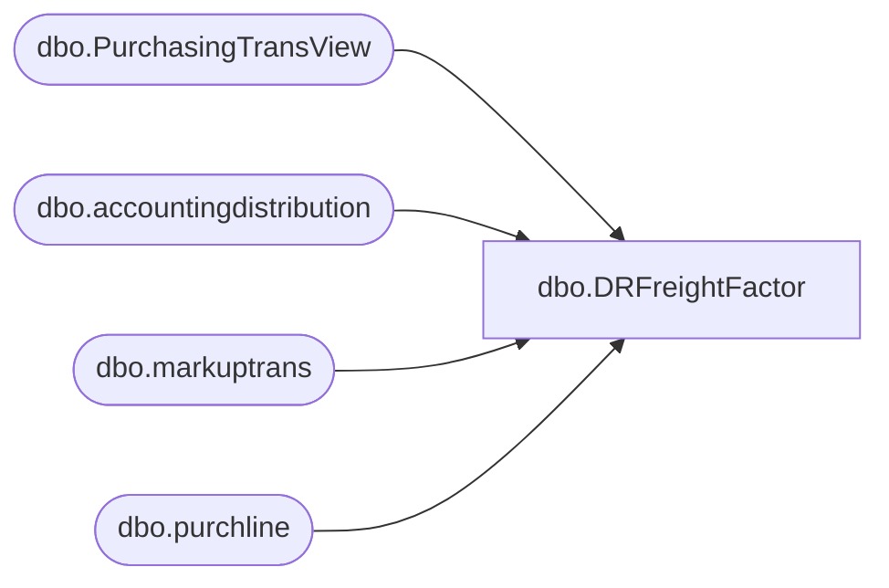

# dbo.DRFreightFactor

**Database:** LH_D365  
**Server:** 4db76rlxaxcuvmuh5kw37wbnqq-ovsykae43znuhlmnflcdwm4ohu.datawarehouse.fabric.microsoft.com  

## Architecture Diagram



## Table Dependencies

| Referenced Table |
|---|
| dbo.PurchasingTransView |
| dbo.accountingdistribution |
| dbo.markuptrans |
| dbo.purchline |

## View Code

```sql
CREATE VIEW [dbo].[DRFreightFactor] AS SELECT     pl.purchid,     p2.Style,	     p2.[Short Desciption], 	p2.[MDSE\Supply], 	p2.LocationKey,     mt.markupcode, 	mt.value,     ad1.transactioncurrencyamount AS ChargeAmount,     ad1.accountingcurrencyamount  AS ChargeAmountAcc, 	mt.transdate AS Transdate FROM dbo.accountingdistribution AS ad INNER JOIN dbo.purchline AS pl     ON pl.sourcedocumentline = ad.sourcedocumentline Inner Join dbo.PurchasingTransView p2 	on p2.[PurchLine RecId] = pl.recid INNER JOIN dbo.accountingdistribution AS ad1      ON ad1.parentdistribution   = ad.recid    AND ad1.sourcedocumentheader  = ad.sourcedocumentheader INNER JOIN dbo.markuptrans AS mt      ON mt.transtableid = pl.tableid    AND mt.transrecid   = pl.recid WHERE ad1.monetaryamount = 5;-- 5 is for charges
```

