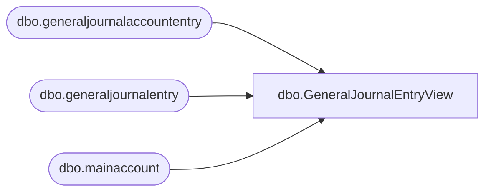

# dbo.GeneralJournalEntryView

**Database:** LH_D365  
**Server:** 4db76rlxaxcuvmuh5kw37wbnqq-ovsykae43znuhlmnflcdwm4ohu.datawarehouse.fabric.microsoft.com  

## Architecture Diagram



## Table Dependencies

| Referenced Table |
|---|
| dbo.generaljournalaccountentry |
| dbo.generaljournalentry |
| dbo.mainaccount |

## View Code

```sql
CREATE   VIEW [dbo].[GeneralJournalEntryView] AS      SELECT         accountingdate,         SUM(accountentry.accountingcurrencyamount) AS amount     FROM         dbo.generaljournalaccountentry AS accountentry         INNER JOIN dbo.generaljournalentry AS journalentry             ON journalentry.recid = accountentry.generaljournalentry         INNER JOIN dbo.mainaccount AS mainaccount             ON mainaccount.recid = accountentry.mainaccount     WHERE         journalentry.subledgervoucher LIKE 'IAV%'         AND mainaccount.mainaccountid = '500840'         AND journalentry.accountingdate >= DATEADD(MONTH, -36, GETDATE())     GROUP BY         journalentry.accountingdate
```

