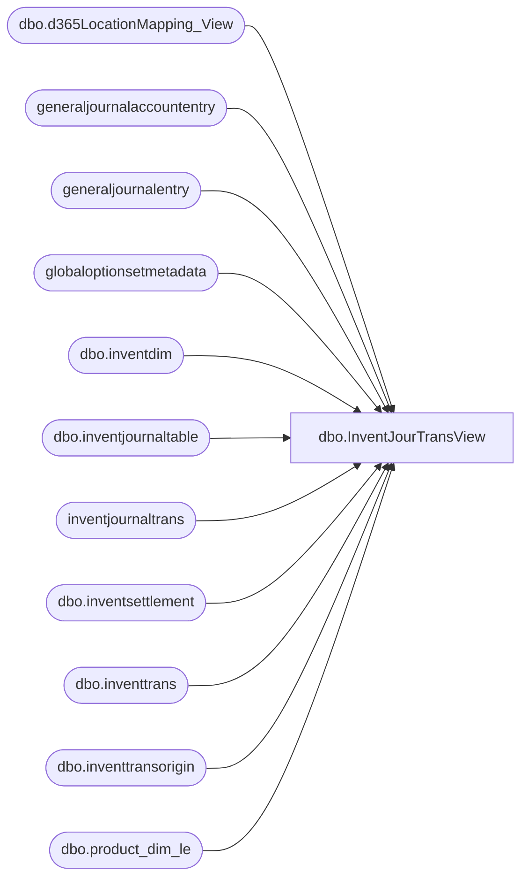

# dbo.InventJourTransView

**Database:** LH_D365  
**Server:** 4db76rlxaxcuvmuh5kw37wbnqq-ovsykae43znuhlmnflcdwm4ohu.datawarehouse.fabric.microsoft.com  

## Architecture Diagram



## Table Dependencies

| Referenced Table |
|---|
| dbo.d365LocationMapping_View |
| generaljournalaccountentry |
| generaljournalentry |
| globaloptionsetmetadata |
| dbo.inventdim |
| dbo.inventjournaltable |
| inventjournaltrans |
| dbo.inventsettlement |
| dbo.inventtrans |
| dbo.inventtransorigin |
| dbo.product_dim_le |

## View Code

```sql
CREATE   VIEW [dbo].[InventJourTransView] AS WITH InventJournal_GL AS      (          select distinct              gje.subledgervoucher ,              gje.subledgervoucherdataareaid, 			  SUM(gjae.accountingcurrencyamount) AS  accountingcurrencyamount          from              generaljournalentry gje          join              generaljournalaccountentry gjae          on              gjae.generaljournalentry = gje.recid          where              (                  gje.subledgervoucher    LIKE 'ADJ%'                  OR gje.subledgervoucher LIKE 'CNT%'                  OR gje.subledgervoucher LIKE 'MOV%')          and gjae.IsDelete is null          and gje.IsDelete is null          and (                  gjae.ledgeraccount  LIKE '100500%') 		 GROUP BY        gje.subledgervoucher ,              gje.subledgervoucherdataareaid      ) ,      InvSettlements AS      (          SELECT              [balancesheetposting]                                                 ,              GOSM_balanceSheetPosting.LocalizedLabel AS [balancesheetposting_label],              [operationsposting]                                                   ,              GOSM_operationsposting.LocalizedLabel   AS [operationsposting_label]  ,              [settlemodel]                                                         ,              GOSM_settlemodel.LocalizedLabel         AS [settlemodel_label]        ,              [voucher]                                                             ,              [dataareaid]                                                          ,              [itemid]                                                              ,              SUM([costamountadjustment])             AS [costamountadjustment]          FROM              [dbo].[inventsettlement] AS ism          LEFT JOIN              globaloptionsetmetadata AS GOSM_balanceSheetPosting          ON              ism.balancesheetposting                = GOSM_balanceSheetPosting.[Option]          AND GOSM_balanceSheetPosting.EntityName    = 'inventsettlement'          AND GOSM_balanceSheetPosting.OptionSetName = 'balancesheetposting'          LEFT JOIN              globaloptionsetmetadata AS GOSM_operationsposting          ON              ism.[operationsposting]              = GOSM_operationsposting.[Option]          AND GOSM_operationsposting.EntityName    = 'inventsettlement'          AND GOSM_operationsposting.OptionSetName = 'operationsposting'          LEFT JOIN              globaloptionsetmetadata AS GOSM_settlemodel          ON              ism.[settlemodel]              = GOSM_settlemodel.[Option]          AND GOSM_settlemodel.EntityName    = 'inventsettlement'          AND GOSM_settlemodel.OptionSetName = 'settlemodel'          WHERE              ism.IsDelete IS NULL          GROUP BY              [balancesheetposting]                  ,              GOSM_balanceSheetPosting.LocalizedLabel,              [operationsposting]                    ,              GOSM_operationsposting.LocalizedLabel  ,              [settlemodel]                          ,              GOSM_settlemodel.LocalizedLabel        ,              [voucher]                              ,              [dataareaid]                           ,              [itemid] ) ,      report AS      (          SELECT              pd.[department_code]                  AS [Department]                    ,              pd.[subclass_code]                    AS [Subclass]                      ,              ijt.[voucher]                         AS [IB Inventory ID]               ,              ijt.journalid                         AS [Inventory Document Number]     ,              id.inventstatusid                     AS [Inventory Status Description]  ,              CASE                  WHEN                      LOWER(id.inventstatusid) LIKE '%avail%'                  THEN '001'                  WHEN                      LOWER(id.inventstatusid) LIKE '%in transit%'                  THEN '002'                  WHEN                      LOWER(id.inventstatusid) LIKE '%reserved%'                  THEN '003'                  WHEN                      LOWER(id.inventstatusid) LIKE '%discrepancy%'                  THEN '004'                  WHEN                      LOWER(id.inventstatusid) LIKE '%layaway%'                  THEN '005'                  WHEN                      LOWER(id.inventstatusid) LIKE '%pending rtv%'                  THEN '006'                  WHEN                      LOWER(id.inventstatusid) LIKE '%pending shrink%'                  THEN '007'                  WHEN                      LOWER(id.inventstatusid) LIKE '%damaged%'                  THEN '008'                  WHEN                      LOWER(id.inventstatusid) LIKE '%reserved cust order%'                  THEN '009'                  WHEN                      LOWER(id.inventstatusid) LIKE '%reserved for ship-p/u%'                  THEN '010'                  WHEN                      LOWER(id.inventstatusid) LIKE '%reserved sale pending%'                  THEN '011'                  WHEN                      LOWER(id.inventstatusid) LIKE '%cust reserve intent%'                  THEN '012'                  WHEN                      LOWER(id.inventstatusid) LIKE '%in transit reserved cust order%'                  THEN '013'                  WHEN                      LOWER(id.inventstatusid) LIKE '%cust order discrep%'                  THEN '100'                  ELSE NULL              END                                   AS [Inventory Status Code]         ,              ISNULL(SUM(ijt.[costamount]), 0)                 AS [Inventory Trans Cost]          ,              ijt.[transdate]                       AS [Inventory Trans Date]          ,              ISNULL(SUM(it.costamountphysical), 0) AS [Inventory Trans Retail]        ,              ISNULL(SUM(it.costamountposted), 0) AS [Inventory Trans Selling Retail],              ijtab.[journalnameid]                 AS [Inventory Trans Type Code]     ,              ijtab.[description]                   AS [Inventory Trans Type Desc]     ,              ISNULL(SUM(ijt.[qty]), 0)                            AS [InventoryTrans Units]          ,              pd.[jurisdiction_code]                AS [Jurisdiction Code]             ,              id.[inventlocationid]                 AS [Location Code]                 ,              ijt.dataareaid                                                           ,              pd.[MDSE\Supply]                                                         ,              NULL                                  AS [Other Location Code]           ,              ijt.[itemid]                          AS [Style Code]                    ,              pd.[style_desc]                       AS [Style Short Description]       ,              ijt.[countingreasoncode]              AS [Trans Reason Code (outer)]     ,              ijtab.journaltype                                                        ,              ijtab.journalnameid                                                      ,              pd.product_key                        AS productkey                      ,              locationMapping.LocationKey                                              ,              SUM([costamountadjustment])           AS [costamountadjustment], 			 CASE WHEN IPR.accountingcurrencyamount = 0 THEN 'True' ELSE 'False' END AS [ZeroBalanceVoucher]          FROM              dbo.inventtrans AS it          LEFT JOIN              dbo.inventdim AS id          ON              id.inventdimid = it.inventdimid          AND id.dataareaid  = it.dataareaid          LEFT JOIN              dbo.inventtransorigin AS ito          ON              it.inventtransorigin = ito.recid          AND ito.dataareaid       = it.dataareaid          LEFT JOIN              dbo.d365LocationMapping_View AS locationMapping          ON              id.inventlocationid         = locationMapping.inventlocationid          AND locationMapping.legalentity = it.dataareaid          LEFT JOIN              LH_D365.dbo.product_dim_le AS pd          ON              pd.style_code        = it.itemid          AND pd.jurisdiction_code = locationMapping.JurisidictionCode          AND it.dataareaid        = pd.LegalEntity          INNER JOIN              InventJournal_GL AS IPR          ON              it.voucherphysical = IPR.subledgervoucher          AND it.dataareaid      = IPR.subledgervoucherdataareaid          INNER JOIN              inventjournaltrans AS ijt          ON              it.dataareaid     = ijt.dataareaid          AND ito.inventtransid = ijt.inventtransid          INNER JOIN              dbo.[inventjournaltable] AS ijtab          ON              ijt.[journalid]  = ijtab.[journalid]          AND ijt.[dataareaid] = ijtab.[dataareaid]          WHERE              it.IsDelete IS NULL          AND ito.IsDelete IS NULL          AND id.IsDelete IS NULL          AND ijt.[transdate] >= DATEADD(MONTH, -24, GETDATE())           AND ijtab.posted    = 1          GROUP BY              pd.[department_code]     ,              pd.[subclass_code]       ,              ijt.[voucher]            ,              ijt.journalid            ,              id.inventstatusid        ,              ijt.[transdate]          ,              ijtab.[journalnameid]    ,              ijtab.[description]      ,              pd.[jurisdiction_code]   ,              id.[inventlocationid]    ,              ijt.dataareaid           ,              pd.[MDSE\Supply]         ,              ijt.[itemid]             ,              pd.[style_desc]          ,              ijt.[countingreasoncode] ,              ijtab.journaltype        ,              pd.product_key           ,              locationMapping.LocationKey, 			 IPR.accountingcurrencyamount) SELECT     report.[Department]                    ,     report.[Subclass]                      ,     report.[IB Inventory ID]               ,     report.[Inventory Document Number]     ,     report.[Inventory Status Description]  ,     report.[Inventory Status Code]         ,     report.[Inventory Trans Cost]          ,     report.[Inventory Trans Date]          ,     CASE         WHEN             ISM.settlemodel                   = 4             AND report.[costamountadjustment] = 0         THEN COALESCE(report.[Inventory Trans Retail], 0)         ELSE COALESCE(report.[Inventory Trans Retail], 0) + COALESCE(ISM.[costamountadjustment], 0)     END AS[Inventory Trans Retail]         ,     CASE         WHEN             ISM.settlemodel                   = 4             AND report.[costamountadjustment] = 0         THEN COALESCE(report.[Inventory Trans Selling Retail], 0)         ELSE COALESCE(report.[Inventory Trans Selling Retail], 0) + COALESCE(ISM.[costamountadjustment], 0)     END AS[Inventory Trans Selling Retail] ,     report.[Inventory Trans Type Code]     ,     report.[Inventory Trans Type Desc]     ,     report.[InventoryTrans Units]          ,     report.[Jurisdiction Code]             ,     report.[Location Code]                 ,     report.[dataareaid]                    ,     report.[MDSE\Supply]                   ,     report.[Other Location Code]           ,     report.[Style Code]                    ,     report.[Style Short Description]       ,     report.[Trans Reason Code (outer)]     ,     report.[journaltype]                   ,     report.[journalnameid]                 ,     report.[productkey]                    ,     report.[LocationKey], 	report.[ZeroBalanceVoucher] FROM     report LEFT JOIN     InvSettlements AS ISM ON     ISM.dataareaid             = report.[dataareaid] AND ISM.voucher                = report.[IB Inventory ID] AND ISM.itemid                 = report.[Style Code] AND ISM.[costamountadjustment] != 0
```

